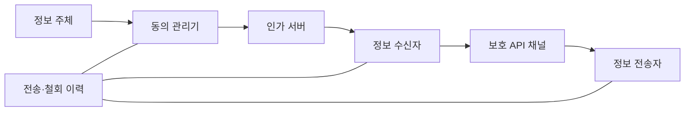
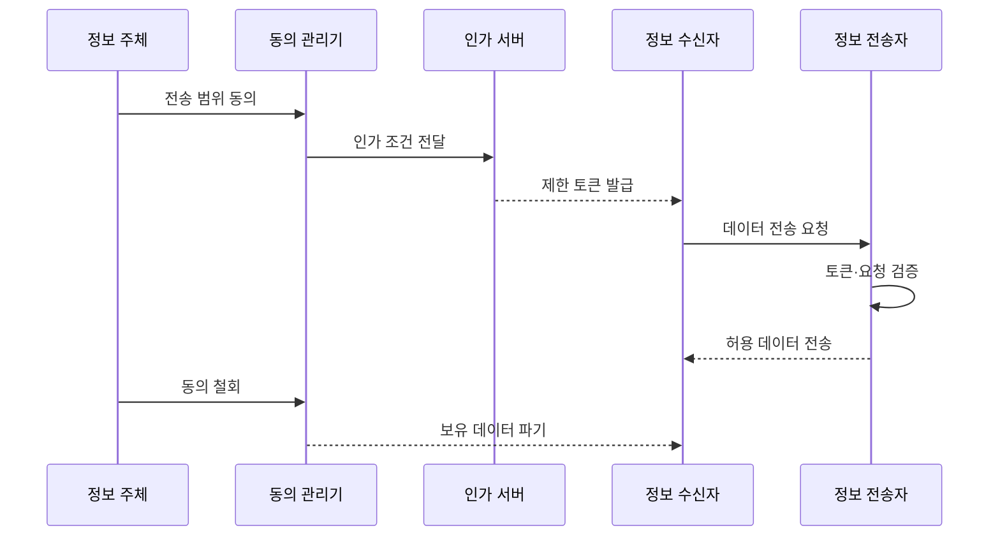

---
sidebar:
  order: 99
  label: "099. 마이데이터 서비스 보안"
  badge: { text: "기출 · 50%", variant: note }
title: "마이데이터 서비스 보안"
date: "2026-07-25T01:05:00+09:00"
tags: ["notes-security"]
weight: 99
extra:
  question_no: "099"
  source_status: "기출"
  source_history: "126회"
  priority: 50
  priority_note: "126회 출제"
---

## 미리 알고가기

- **마이데이터**: 본인이 데이터 전송을 요구하는 서비스
- **API (Application Programming Interface)**: “에이피아이”로 읽으며 영문 머리글자를 묶어 기관 간 요청·응답 연결 규칙을 나타냄
- **접근 토큰**: 허용 범위와 기간을 담은 인가 정보
- **일회성 난수**: 요청 재사용을 판별하는 임시 값
- **정보 전송자**: 보유 데이터를 제공하는 기관
- **정보 수신자**: 전송받은 데이터를 활용하는 기관
- **파생 데이터**: 원본을 가공해 만든 결과 데이터

## Ⅰ. 개요

- **정의/개념**: 동의 범위를 전 과정에 적용하는 전송 보안
- **배경/필요성**: 기관 간 자료 오남용·과잉 전송을 방지

### 쉽게 이해하기 (학습용)

- 허락한 정보만 정한 기관에 정한 기간 동안 보낸다.

## Ⅱ. 특징

- **동의 중심 통제**: 목적·항목·기관·기간을 함께 묶는다.
- **최소 권한 인가**: 짧은 토큰으로 요청 범위를 제한한다.
- **기관 간 신뢰**: 양측 인증과 요청 무결성을 확인한다.
- **철회 전파**: 토큰·원본·파생본의 사용을 함께 끝낸다.

### 쉽게 이해하기 (학습용)

- 동의가 바뀌면 모든 보유본의 권한도 바뀌어야 한다.

## Ⅲ. 아키텍처 및 구성요소

| 구성요소 | 역할 |
|:---|:---|
| 정보 주체 | 전송 목적·항목·기관에 동의 |
| 동의 관리기 | 동의 생성·변경·철회 관리 |
| 인가 서버 | 범위·대상·만료 토큰 발급 |
| 정보 수신자 | 동의 목적에 따라 데이터 활용 |
| 보호 API 채널 | 기관 인증과 전송 무결성 제공 |
| 정보 전송자 | 토큰 검증 후 허용 항목 제공 |
| 전송·철회 이력 | 처리 증적과 이상 행위 기록 |

### 쉽게 이해하기 (학습용)

- 동의 정보가 토큰과 실제 전송 범위를 결정한다.

## Ⅳ. 원리 및 절차 흐름도

| 절차 | 핵심 내용 |
|:---|:---|
| 전송 범위 동의 | 목적·기관·항목·기간 확정 |
| 인가 조건 전달 | 동의 내용을 인가 정책에 반영 |
| 제한 토큰 발급 | 대상·범위·만료를 토큰에 결합 |
| 데이터 전송 요청 | 토큰과 일회성 난수로 요청 |
| 토큰·요청 검증 | 서명·범위·재사용 여부 확인 |
| 허용 데이터 전송 | 동의한 필드만 암호화 전송 |
| 동의 철회 | 이후 전송과 활용 권한 종료 |
| 보유 데이터 파기 | 원본·캐시·파생본 사용 중단 |

> 동의 범위를 전송과 보유 데이터에 연결한다.

### 쉽게 이해하기 (학습용)

- 철회하면 새 전송과 기존 데이터 사용이 모두 멈춘다.

## Ⅴ. 종류 및 비교

| 비교 기준 | 동의·인가 보호 | API 전송 보호 | 저장·철회 보호 |
|:---|:---|:---|:---|
| 핵심 특징 | 범위 제한 토큰 발급 | 기관 인증·요청 검증 | 목적별 격리·파기 |
| 적용 기준 | 권한 생성·변경 시점 | 기관 간 데이터 이동 | 수신 후 활용·종료 |
| 주요 위험 | 계정 탈취·과다 동의 | 토큰 탈취·재전송 | 목적 외 이용·잔존본 |

> 단계별 통제를 하나의 동의 범위로 묶는다.

### 쉽게 이해하기 (학습용)

- 허락·이동·보관 단계마다 다른 위험을 막는다.

## Ⅵ. 실무 사례

- **금융정보 전송**: 토큰 주체와 요청 필드를 대조한다.
- **동의 철회 처리**: 캐시와 파생 데이터까지 삭제한다.

### 쉽게 이해하기 (학습용)

- 다른 사람의 토큰으로 정보를 받지 못하게 한다.
- 원본만 지우고 분석본이 남는 일을 막는다.

## Ⅶ. 결론

- 동의 범위를 토큰·API·보유본에 일관되게 적용

### 쉽게 이해하기 (학습용)

- 동의가 데이터의 전체 생애주기를 지배해야 한다.
