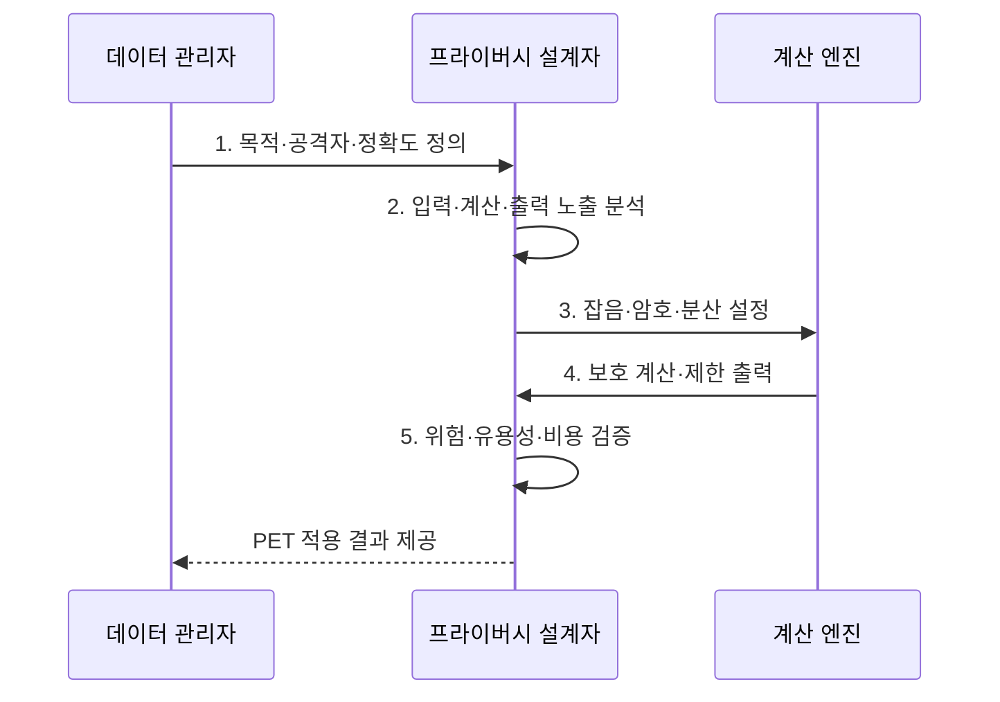

---
sidebar:
  order: 100
  label: "100. 개인정보보호 강화기술 PET"
  badge: { text: "기출 · 85%", variant: note }
title: "개인정보보호 강화기술 PET"
date: "2026-08-02T13:18:00+09:00"
tags: ["notes-security"]
weight: 100
extra:
  question_no: "100"
  source_status: "기출"
  source_history: "134회, 135회, 138회"
  priority: 85
  priority_note: "134·135·138회 출제"
---

## Ⅰ. 개요

핵심 용어

- **개인정보보호 강화기술(PET)**: 데이터 수집·저장·분석·공유 과정에서 원본과 개인 참여 여부의 노출을 줄이는 기술군이다.
- **보호 경계**: 입력·계산 서버·참여 기관·출력 중 누구에게 어떤 정보가 보이지 않아야 하는지를 정한 설계 기준이다.

- 정의/개념: **개인정보 보호 강화 기술(PETs)**은 데이터의 수집·결합·분석·공유 과정에서 원본과 개인 기여의 노출을 최소화하면서 필요한 계산 결과를 얻는 기술군
- 배경/필요성: 원본 결합·공유의 **재식별·유출 위험**

#### 한줄 요약

- 여러 기관이 원본을 한곳에 직접 모으지 않고도 필요한 통계·분석·학습 결과를 얻도록 보호한다.

## Ⅱ. 특징

핵심 용어

- **위협 모델·공모**: 보호 자산과 공격자의 지식·접근 능력, 여러 참여자가 정보를 합칠 가능성을 가정하여 필요한 기술 강도를 정한다.
- **연합학습·TEE**: 원본 데이터를 중앙에 모으지 않고 업데이트를 학습하거나 격리 하드웨어 영역에서 코드와 데이터를 보호한다.

- 입력·계산·출력의 **노출 경계 분리**
- 공격자·공모 가정의 **위협 모델 의존**
- 보호 강도를 높이면 **재식별 위험 감소·정확도나 처리 성능 저하**
- 원본을 분산 보유하는 **연합학습**, 격리 영역에서 실행하는 **TEE**

#### 한줄 요약

- 출력에서 개인을 숨길지 계산 서버에서 원문을 숨길지 기관끼리 입력을 숨길지에 따라 적합한 기술이 달라진다.

## Ⅲ. 구조 및 구성요소

핵심 용어

- **보호 변환·계산 엔진**: 잡음·암호화·비밀 분산을 적용하고 허용된 통계·학습 연산만 원본 노출 없이 수행한다.
- **키·예산 통제**: 암호 키의 접근·수명을 관리하고 반복 질의가 누적 정보 노출 한도를 넘지 않도록 프라이버시 예산을 추적한다.

| 구성요소 | 책임 |
|:---|:---|
| **목적·위협 모델** | 자산·공격자·정확도 **정의** |
| **입력 최소화** | 필요 필드·참여자만 **허용** |
| **보호 변환** | **잡음·암호화·비밀 분산** |
| **보호 계산 엔진** | 허용 통계·학습 **연산 수행** |
| **출력·키·예산 통제** | 조회·키·**누적 노출 관리** |

#### 한줄 요약

- 입력부터 출력까지 누가 무엇을 관찰할 수 있는지를 정하고 각 노출 지점에 맞는 변환·계산·예산 통제를 배치한다.

## Ⅳ. 흐름도

핵심 용어

- **위험·유용성·비용 검증**: 공격자의 추론 가능성, 결과 정확도, 연산·통신 지연을 함께 측정해 운영 가능한 설정을 정하는 과정이다.
- **원본 비노출 계산**: 필요한 결과를 얻는 동안 비신뢰 서버나 다른 참여자가 개인별 입력을 직접 보지 못하게 하는 처리이다.

**동작 원리**

1. **목적·공격자·정확도 정의**: 결과·공모·성능 한도 설정
2. **입력·계산·출력 노출 분석**: 관찰자·신뢰 경계 식별
3. **잡음·암호·분산 설정**: 기술·키·참여 조건 결정
4. **보호 계산·제한 출력**: 원본 노출 없이 허용 연산
5. **위험·유용성·비용 검증**: 추론·정확도·지연 평가

#### 한줄 요약

- 가장 강한 기술을 무조건 고르지 않고 결과가 쓸 만하면서 공격자가 허용 한도 이상 개인을 알아낼 수 없도록 조정한다.

## Ⅴ. 종류 및 비교

핵심 용어

- **DP·HE·MPC**: DP는 출력의 개인 영향, HE는 비신뢰 서버의 평문 접근, MPC는 참여 기관끼리의 원본 입력 노출을 각각 제한한다.
- **프라이버시 예산**: 차등 프라이버시에서 여러 결과를 결합해 개인 참여를 추론하지 못하도록 허용하는 누적 정보 노출 한도이다.

| 개인정보보호 강화기술 | 차등 프라이버시 | 동형암호 | 다자간 계산 |
|:---|:---|:---|:---|
| **적용 기준** | 통계·학습 **결과 공개** | **비신뢰 서버 연산** | 기관 간 **공동 분석** |
| 핵심 특징 | **통제 잡음·노출 예산** | **암호문 상태 연산** | **입력 비밀 분산 계산** |
| **한계** | **정확도 저하·예산 소진** | **높은 연산 비용** | **통신 지연·공모** |

#### 한줄 요약

- 차등 프라이버시는 출력, 동형암호는 계산 서버의 원문, 다자간 계산은 참여 기관끼리의 입력을 중점 보호한다.

## Ⅵ. 실무 고려사항 및 대책

핵심 용어

- **NIST SP 800-226·ISO/IEC 18033-6**: 차등 프라이버시의 구현·평가 위험과 동형암호 메커니즘·키 처리를 각각 제시한다.
- **ISO/IEC 4922-1:2023**: 안전한 다자간 계산의 용어·주체·절차·공모를 포함한 보안 속성을 규정한다.

| 문제 | 대책 | 효과 |
|:---|:---|:---|
| **차등 프라이버시 보장** | **NIST SP 800-226 기반 평가** | 예산·**구현 위험 검증** |
| **암호문 상태 계산** | **ISO/IEC 18033-6:2019 적용** | 동형 연산·**키 처리 일관화** |
| **기관 간 비밀 계산** | **ISO/IEC 4922-1:2023 적용** | 참여자·**공모·절차 명확화** |

#### 한줄 요약

- 반복 통계 공개는 질의마다 소비한 프라이버시 예산을 누적하여 여러 결과의 결합으로 개인 참여 여부가 드러나는 것을 제한한다.

## Ⅶ. 결론

핵심 용어

- **목적 적합 PET 선택**: 가장 강한 기술이 아니라 보호할 경계와 공격 가정에 맞으면서 필요한 결과 품질·지연·비용을 충족하는 기술을 고르는 원칙이다.

- 출력 노출은 **DP**, 비신뢰 연산은 **HE**, 기관 공동 분석은 MPC 선택

#### 한줄 요약

- PET의 성패는 기술 강도가 아니라 보호해야 할 경계와 공격 가정에 맞으면서 필요한 결과 품질을 유지하는 데 달려 있다.
