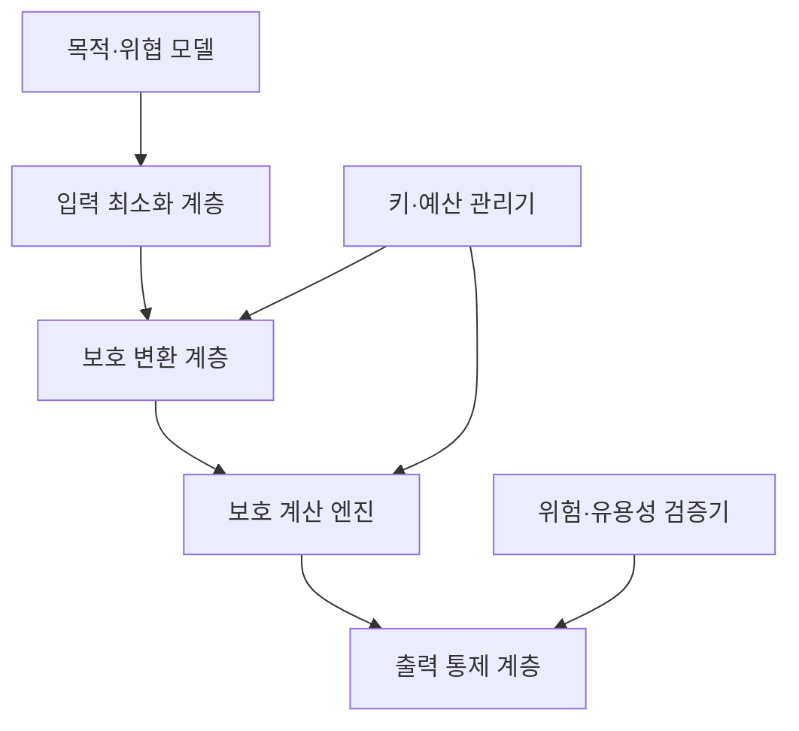
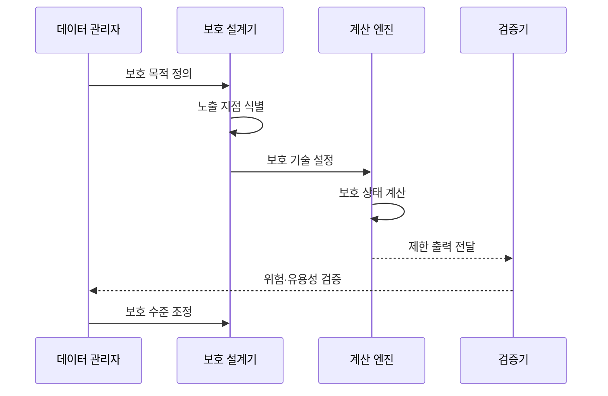

---
sidebar:
  order: 100
  label: "100. 개인정보보호 강화기술 PET"
  badge: { text: "기출 · 85%", variant: note }
title: "개인정보보호 강화기술 PET"
date: "2026-07-25T01:05:00+09:00"
tags: ["notes-security"]
weight: 100
extra:
  question_no: "100"
  source_status: "기출"
  source_history: "134회, 135회, 138회"
  priority: 85
  priority_note: "134·135·138회 출제"
---

## 미리 알고가기

- **PET**: 개인정보 노출을 줄이는 기술군
- **위협 모델**: 보호 대상과 공격 능력의 가정
- **차분 프라이버시**: 출력에서 개인 기여 추론을 제한
- **동형암호**: 암호문을 복호화하지 않고 계산
- **다자간 계산**: 원본을 숨긴 채 공동 계산
- **프라이버시 예산**: 허용할 누적 정보 노출 한도
- **공모**: 참여자가 정보를 합쳐 비밀을 추론
- **PET 읽기와 표기**: “펫”으로 읽으며 Privacy-Enhancing Technologies의 머리글자를 묶어 개인정보보호 강화기술군을 나타냄

## Ⅰ. 개요

- **정의/개념**: 원본 노출을 줄이는 개인정보 보호 기술군
- **배경/필요성**: 자료 활용과 개인정보 노출 위험을 절충

### 쉽게 이해하기 (학습용)

- 원본을 직접 모으지 않고 필요한 결과만 얻는다.

## Ⅱ. 특징

- **노출 경계 분리**: 입력·계산·출력 위험을 구분한다.
- **위협별 선택**: 공격자 위치와 공모 가능성을 반영한다.
- **유용성 상충**: 보호 강도가 정확도·성능에 영향을 준다.
- **누적 위험**: 반복 출력과 메타데이터까지 통제한다.

### 쉽게 이해하기 (학습용)

- 숨길 지점에 따라 필요한 보호 기술이 달라진다.

## Ⅲ. 아키텍처 및 구성요소

| 구성요소 | 역할 |
|:---|:---|
| 목적·위협 모델 | 보호 대상·공격자·정확도 정의 |
| 입력 최소화 계층 | 필요한 필드와 참여자만 허용 |
| 보호 변환 계층 | 잡음·암호화·비밀 분산 적용 |
| 보호 계산 엔진 | 허용된 통계·학습 연산 수행 |
| 출력 통제 계층 | 반복 조회와 결과 공개 제한 |
| 키·예산 관리기 | 암호 키와 누적 노출량 관리 |
| 위험·유용성 검증기 | 추론 위험과 정확도 평가 |

### 쉽게 이해하기 (학습용)

- 입력부터 출력까지 다른 노출 지점을 보호한다.

## Ⅳ. 원리 및 절차 흐름도

| 절차 | 핵심 내용 |
|:---|:---|
| 보호 목적 정의 | 결과·공격자·정확도 한도 설정 |
| 노출 지점 식별 | 입력·계산·출력 관찰자 확인 |
| 보호 기술 설정 | 잡음·키·참여자 조건 결정 |
| 보호 상태 계산 | 원본 노출 없이 허용 연산 수행 |
| 제한 출력 전달 | 공개 범위와 반복 조회 제한 |
| 위험·유용성 검증 | 추론·공모·성능·정확도 평가 |
| 보호 수준 조정 | 위험과 유용성에 맞춰 재설정 |

> 위협 모델과 노출 지점으로 기술을 선택한다.

### 쉽게 이해하기 (학습용)

- 결과가 쓸 만하면서 개인을 드러내지 않아야 한다.

## Ⅴ. 종류 및 비교

| 비교 기준 | 차분 프라이버시 | 동형암호 | 다자간 계산 |
|:---|:---|:---|:---|
| 핵심 특징 | 출력에 잡음 추가 | 암호문 상태 계산 | 입력을 나눠 공동 계산 |
| 적용 기준 | 통계·학습 결과 공개 | 비신뢰 서버 연산 | 기관 간 공동 분석 |
| 주요 위험 | 정확도 저하·예산 소진 | 높은 연산 비용 | 통신 지연·공모 |

> 보호할 노출 지점으로 PET를 고른다.

### 쉽게 이해하기 (학습용)

- 출력·계산값·기관 입력 중 숨길 대상을 고른다.

## Ⅵ. 실무 사례

- **통계 공개**: 반복 질의의 프라이버시 예산을 합산한다.
- **기관 공동 분석**: 공모 범위와 중도 이탈을 가정한다.

### 쉽게 이해하기 (학습용)

- 여러 결과를 합쳐 개인을 찾지 못하게 한다.
- 참여 기관이 빠져도 계산이 끝나는지 확인한다.

## Ⅶ. 결론

- 위협 모델·노출 지점으로 PET와 보호 수준 선택

### 쉽게 이해하기 (학습용)

- 강한 보호보다 맞는 경계와 쓸 수 있는 결과가 중요하다.
