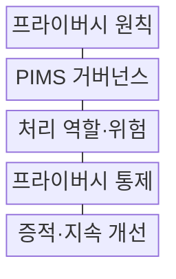
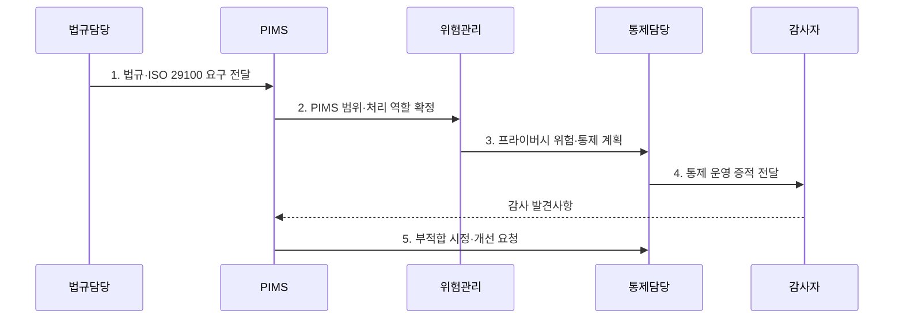

---
sidebar:
  order: 101
  label: "101. ISO 29100·ISO 27701 (ISO 29100 ISO 27701)"
  badge:
    text: "기출 · 30%"
    variant: note
title: "ISO 29100·ISO 27701 (ISO 29100 ISO 27701)"
date: "2026-07-31T02:04:09+09:00"
tags:
  - "notes-security"
weight: 101
extra:
  question_no: "101"
  source_status: "기출"
  source_history: "126회"
  priority: 30
  priority_note: "126회 기출이나 ISO 프라이버시 표준 중복도가 높음"
---

## 미리 알고가기

- **국제표준화기구(International Organization for Standardization, ISO)**: 제품·서비스·경영체계의 국제표준을 개발하는 비정부 국제기구이다.
- **국제전기기술위원회(International Electrotechnical Commission, IEC)**: ISO와 함께 정보보호·전기·전자 분야의 국제 표준을 제정하는 기관이다.
- **개인식별정보(Personally Identifiable Information, PII)**: 단독 또는 다른 정보와 결합하여 특정 개인을 식별할 수 있는 정보이다.
- **프라이버시 정보 관리체계(Privacy Information Management System, PIMS)**: 개인정보 위험과 통제를 조직적으로 수립·운영·점검·개선하는 관리체계이다.
- **PII 컨트롤러(PII Controller)**: 개인정보 처리 목적과 수단을 결정하고 처리에 책임지는 주체이다.
- **PII 프로세서(PII Processor)**: 컨트롤러의 지시에 따라 개인정보를 대신 처리하는 주체이다.
- **ISO/IEC 29100:2024**: 프라이버시 공통 용어·행위자·원칙을 정의하는 프라이버시 프레임워크이다.
- **ISO/IEC 27701:2025**: 조직이 단독으로 적용할 수 있는 PIMS 요구사항과 지침을 규정한 국제표준이다.

## Ⅰ. 개요

- 정의/개념: 29100 **공통 프레임워크**, 27701 **독립 PIMS**
- 배경/필요성: 공통 원칙만으로는 역할별 **통제 운영·감사 증적 확보 불가**

### 쉽게 이해하기 (학습용)

- 29100은 공통 언어, 27701은 이를 운영하는 경영체계이다.

## Ⅱ. 특징

- 29100의 **프라이버시 원칙·공통 용어**
- 27701의 **독립 PIMS 생명주기 요구**
- 컨트롤러·프로세서별 **책임성 통제**

### 쉽게 이해하기 (학습용)

- 표준 인증과 국가별 개인정보 법률 준수는 별도로 확인한다.

## Ⅲ. 구조 및 구성요소

| 구성요소 | 책임 |
|:---|:---|
| 프라이버시 원칙 | **처리 목적·보호 기준** 제시 |
| PIMS 거버넌스 | **범위·정책·책임** 설정 |
| 처리 역할·위험 | 역할별 **프라이버시 위험** 평가 |
| 프라이버시 통제 | 생명주기 **보호조치** 실행 |
| 증적·지속 개선 | **감사·시정 결과** 관리 |

### 쉽게 이해하기 (학습용)

- 원칙을 책임·통제·감사 증거로 이어 운영한다.

## Ⅳ. 흐름도

**동작 원리**

1. **법규·ISO 29100 요구 전달**: 법규·계약과 공통 원칙 제공
2. **PIMS 범위·처리 역할 확정**: 활동·역할·정보 경계 확정
3. **프라이버시 위험·통제 계획**: 위험 처리와 통제 결정
4. **통제 운영 증적 전달**: 통제 결과와 작동 근거 제공
5. **부적합 시정·개선 요청**: 원인 시정과 PIMS 범위 갱신 지시

### 쉽게 이해하기 (학습용)

- 원칙을 데이터 흐름의 통제와 감사 증거로 구체화한다.

## Ⅴ. 종류 및 비교

| 프라이버시 표준 | ISO/IEC 29100:2024 | ISO/IEC 27701:2025 |
|:---|:---|:---|
| 적용 기준 | **공통 용어·원칙** 정렬 | **PIMS 수립·운영·개선** |
| 핵심 특징 | **프라이버시 원칙·용어** | **독립 PIMS 요구사항·지침** |
| 한계 | **실행 통제** 부족 | 법률 준수 **자동 보장 불가** |

### 쉽게 이해하기 (학습용)

- 29100은 프레임워크, 27701은 운영·증명 체계이다.

## Ⅵ. 실무 고려사항 및 대책

| 고려사항 | 대책 | 효과 |
|:---|:---|:---|
| **공통 용어·원칙** | **ISO/IEC 29100:2024 적용** | 이해관계자 **기준 통일** |
| **PIMS 수립·개선** | **ISO/IEC 27701:2025 적용** | **책임·통제 증적** 확보 |
| **인증기관 신뢰** | **ISO/IEC 27706:2025 확인** | **감사·인증 역량** 검증 |

### 쉽게 이해하기 (학습용)

- SaaS도 원칙, 역할, 통제, 감사 증거를 하나의 PIMS로 관리한다.

## Ⅶ. 결론

- 공통 원칙은 **29100**, PIMS 운영·증적은 **27701**, 법률 준수는 별도 검증

### 쉽게 이해하기 (학습용)

- 같은 프라이버시 언어로 책임과 통제 증거를 설명한다.
