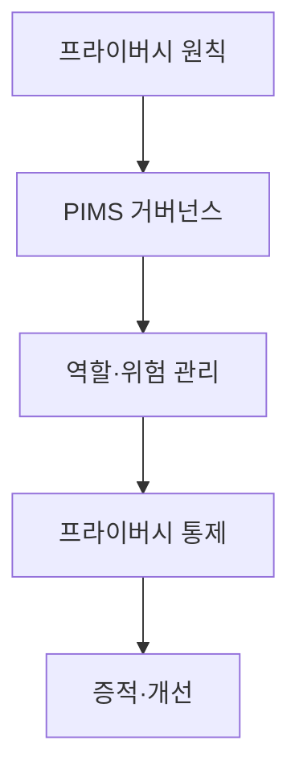
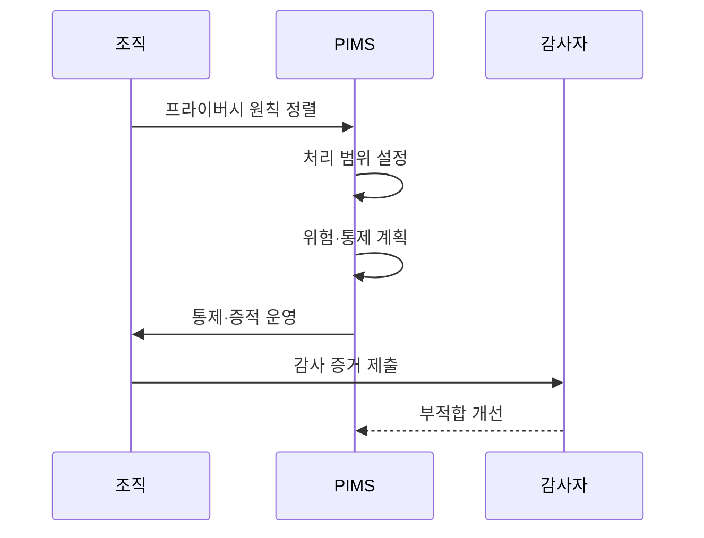

---
sidebar:
  order: 101
  label: "101. ISO 29100·ISO 27701 (ISO 29100 ISO 27701)"
  badge:
    text: "기출 · 30%"
    variant: note
title: "ISO 29100·ISO 27701 (ISO 29100 ISO 27701)"
date: "2026-07-25T01:05:00+09:00"
tags:
  - "notes-security"
weight: 101
extra:
  question_no: "101"
  source_status: "기출"
  source_history: "126회"
  priority: 30
  priority_note: "126회 기출이나 ISO 프라이버시 표준 중복도가 높음"
---

## 미리 알고가기

- **국제표준화기구(International Organization for Standardization, ISO)**: “아이에스오”로 읽고 영문 명칭을 가리키는 약칭으로, ISO 29100은 프라이버시 원칙과 공통 용어의 틀을 제공함
- **국제전기기술위원회(International Electrotechnical Commission, IEC)**: “아이이시”로 읽고 영문 머리글자로 표기하며, ISO와 함께 정보보호 관리체계 표준을 제정함
- **개인식별정보(Personally Identifiable Information, PII)**: “피아이아이”로 읽고 영문 머리글자로 표기하며, 특정 개인을 식별하거나 식별할 수 있는 정보를 뜻함
- **프라이버시 정보 관리체계(Privacy Information Management System, PIMS)**: “핌스”로 읽고 영문 머리글자로 표기하며, 개인정보 위험과 통제 증거를 지속해서 관리하는 체계임
- **PII 컨트롤러**: 개인정보 처리 목적과 수단을 결정하고 그 처리에 책임지는 주체임
- **PII 프로세서**: 컨트롤러의 지시에 따라 개인정보를 대신 처리하는 주체임
- **서비스형 소프트웨어(Software as a Service, SaaS)**: “사스”로 읽고 영문 머리글자로 표기하며, 공급자가 운영하는 소프트웨어를 인터넷으로 이용하는 방식임

## Ⅰ. 개요

- **정의/개념**: 29100은 공통 틀, 27701은 PIMS 요구
- **배경/필요성**: 법적 요구를 감사 가능한 통제 체계로 연결함

### 쉽게 이해하기 (학습용)
- 29100은 프라이버시 공통 언어, 27701은 이를 운영하는 경영 체계임

## Ⅱ. 특징

- 29100은 프라이버시 원칙·역할 해석을 제공한다.
- 27701은 PIMS 수립·개선 요구를 제공한다.
- 27701은 ISO/IEC 27001·27002를 확장한다.
- 인증은 법률 준수를 자동 보증하지 않는다.

### 쉽게 이해하기 (학습용)

- 표준 인증과 각 국가의 개인정보 법률 준수 여부는 따로 확인함

## Ⅲ. 아키텍처 및 구성요소

| 설계 요소 | 설명 |
|:---|:---|
| 프라이버시 원칙 | 처리 목적과 보호 기준 제시 |
| PIMS 거버넌스 | 범위·정책·책임 설정 |
| 역할·위험 관리 | 처리 역할별 위험 평가 |
| 프라이버시 통제 | 생명주기 보호조치 실행 |
| 증적·개선 | 감사·시정 결과 관리 |

### 쉽게 이해하기 (학습용)
- 원칙을 책임·통제·감사 증거로 이어 운영함

## Ⅳ. 원리 및 절차 흐름도

| 절차 | 설명 |
|:---|:---|
| 프라이버시 원칙 정렬 | 법규·계약과 공통 원칙 매핑 |
| 처리 범위 설정 | 활동·역할·정보 경계 확정 |
| 위험·통제 계획 | 위험 처리와 통제 결정 |
| 통제·증적 운영 | 권리·위탁 처리 결과 기록 |
| 감사 증거 제출 | 통제 작동 근거를 평가 |
| 부적합 개선 | 원인 시정과 범위 갱신 |

> 요약: 프라이버시 원칙을 통제·증거로 운영함

### 쉽게 이해하기 (학습용)
- 법규를 데이터 흐름에 맞춰 통제하고 감사함

## Ⅴ. 종류 및 비교

| 비교 기준 | ISO/IEC 29100 | ISO/IEC 27701 |
|:---|:---|:---|
| 핵심 특징 | 프라이버시 원칙·용어 | PIMS 요구사항·통제 |
| 적용 기준 | 공통 원칙 정렬 | 책임·통제 운영 증명 |
| 주요 위험 | 실행 통제 부족 | 법률 준수 오인 |

> 요약: 29100은 원칙, 27701은 통제 운용임

### 쉽게 이해하기 (학습용)
- 29100은 원칙, 27701은 운영 및 증명임

## Ⅵ. 실무 사례

- SaaS 정책은 29100 원칙으로 27701 통제 설계
- 위탁 공급망은 처리 역할별 책임·증거 감사

### 쉽게 이해하기 (학습용)
- 공통 원칙을 실제 서비스의 접근 규칙과 기록으로 바꿈
- 개인정보 목적을 정한 곳과 대신 처리한 곳의 책임을 나눠 감사함

## Ⅶ. 결론

- 29100 원칙을 27701 통제·증적으로 구현

### 쉽게 이해하기 (학습용)
- 동일 언어로 책임과 통제 증거를 설명함
