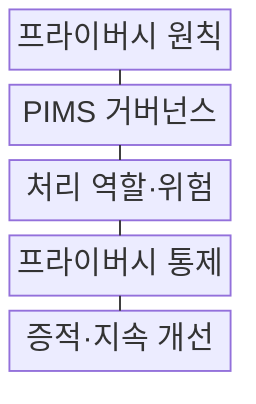
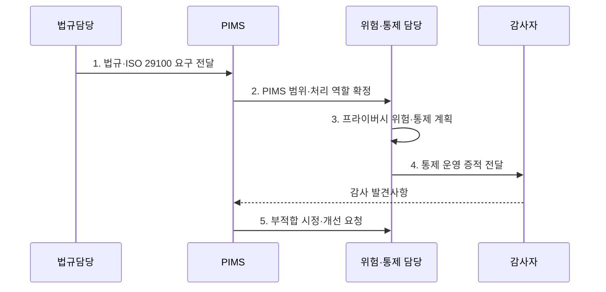

---
sidebar:
  order: 101
  label: "101. ISO 29100·ISO 27701 (ISO 29100 ISO 27701)"
  badge:
    text: "기출 · 30%"
    variant: note
title: "ISO 29100·ISO 27701 (ISO 29100 ISO 27701)"
date: "2026-08-02T13:20:00+09:00"
tags:
  - "notes-security"
weight: 101
extra:
  question_no: "101"
  source_status: "기출"
  source_history: "126회"
  priority: 30
  priority_note: "126회 기출이나 ISO 프라이버시 표준 중복도가 높음"
---

## Ⅰ. 개요

핵심 용어

- **ISO/IEC 29100·27701**: 29100은 프라이버시 공통 원칙과 용어를, 27701은 이를 조직에서 운영·감사·개선하는 PIMS 요구사항을 제공한다.
- **PIMS**: 개인정보 위험과 통제를 범위·책임·운영·점검·개선의 경영 주기로 관리하는 체계이다.

- 정의/개념: 29100 **공통 프레임워크**, 27701 **독립 PIMS**
- 배경/필요성: 공통 원칙만으로는 역할별 **통제 운영과 감사 증적을 체계적으로 확보하기 어려움**

#### 한줄 요약

- 29100은 공통 언어, 27701은 이를 운영하는 경영체계이다.

## Ⅱ. 특징

핵심 용어

- **프라이버시 원칙·책임성**: 개인정보 처리의 공통 기준을 정하고 조직이 역할별 통제 수행과 증거로 준수 책임을 설명하게 한다.
- **컨트롤러·프로세서**: 컨트롤러는 처리 목적과 수단을 결정하고 프로세서는 그 지시에 따라 개인정보를 대신 처리한다.

- 29100의 **프라이버시 원칙·공통 용어**
- 27701의 **독립 PIMS 생명주기 요구**
- 컨트롤러·프로세서별 **책임성 통제**

#### 한줄 요약

- 표준 인증과 국가별 개인정보 법률 준수는 별도로 확인한다.

## Ⅲ. 구조 및 구성요소

핵심 용어

- **PIMS 거버넌스**: 개인정보 처리 범위·정책·역할·자원을 정하고 프라이버시 위험과 통제 운영을 감독하는 구조이다.
- **통제 증적·지속 개선**: 처리 기록·승인·감사 결과로 보호조치의 작동을 입증하고 부적합 원인을 시정하는 과정이다.

| 구성요소 | 책임 |
|:---|:---|
| 프라이버시 원칙 | **처리 목적·보호 기준** 제시 |
| PIMS 거버넌스 | **범위·정책·책임** 설정 |
| 처리 역할·위험 | 역할별 **프라이버시 위험** 평가 |
| 프라이버시 통제 | 생명주기 **보호조치** 실행 |
| 증적·지속 개선 | **감사·시정 결과** 관리 |

#### 한줄 요약

- 원칙을 책임·통제·감사 증거로 이어 운영한다.

## Ⅳ. 흐름도

핵심 용어

- **처리 역할·정보 경계**: 각 활동의 컨트롤러·프로세서 책임과 PIMS가 관리할 서비스·조직·데이터 범위를 확정한 것이다.
- **법규·표준 요구 연결**: 국가별 법적 의무와 ISO 공통 원칙을 위험·통제·감사 자료에 매핑하는 활동이다.

**동작 원리**

1. **법규·ISO 29100 요구 전달**: 법규·계약과 공통 원칙 제공
2. **PIMS 범위·처리 역할 확정**: 활동·역할·정보 경계 확정
3. **프라이버시 위험·통제 계획**: 위험 처리와 통제 결정
4. **통제 운영 증적 전달**: 통제 결과와 작동 근거 제공
5. **부적합 시정·개선 요청**: 원인 시정과 PIMS 범위 갱신 지시

#### 한줄 요약

- 원칙을 데이터 흐름의 통제와 감사 증거로 구체화한다.

## Ⅴ. 종류 및 비교

핵심 용어

- **29100 프레임워크·27701 PIMS**: 전자는 공통 언어와 원칙을 제시하고 후자는 독립적으로 수립·운영·개선할 관리체계 요구를 제시한다.

| 프라이버시 표준 | ISO/IEC 29100:2024 | ISO/IEC 27701:2025 |
|:---|:---|:---|
| 적용 기준 | **공통 용어·원칙** 정렬 | **PIMS 수립·운영·개선** |
| 핵심 특징 | **프라이버시 원칙·용어** | **독립 PIMS 요구사항·지침** |
| 한계 | **실행 통제** 부족 | 법률 준수 **자동 보장 불가** |

#### 한줄 요약

- 29100은 프레임워크, 27701은 운영·증명 체계이다.

## Ⅵ. 실무 고려사항 및 대책

핵심 용어

- **ISO/IEC 29100:2024·27701:2025**: 프라이버시 공통 기준과 독립 PIMS의 책임·통제·증적 요구를 각각 규정한다.
- **ISO/IEC 27706:2025**: PIMS 감사·인증기관의 역량과 인증 활동의 일관성 요구사항을 규정한다.

| 문제 | 대책 | 효과 |
|:---|:---|:---|
| **공통 용어·원칙** | **ISO/IEC 29100:2024 적용** | 이해관계자 **기준 통일** |
| **PIMS 수립·개선** | **ISO/IEC 27701:2025 적용** | **책임·통제 증적** 확보 |
| **인증기관 신뢰** | **ISO/IEC 27706:2025 확인** | **감사·인증 역량** 검증 |

#### 한줄 요약

- SaaS도 원칙, 역할, 통제, 감사 증거를 하나의 PIMS로 관리한다.

## Ⅶ. 결론

핵심 용어

- **표준과 법률의 분리 검증**: PIMS 표준 인증이 특정 국가의 개인정보 법률 준수를 자동 보장하지 않으므로 관할 의무를 별도로 확인하는 원칙이다.

- 공통 원칙은 **29100**, PIMS 운영·증적은 **27701**, 법률 준수는 별도 검증

#### 한줄 요약

- 같은 프라이버시 언어로 책임과 통제 증거를 설명한다.
