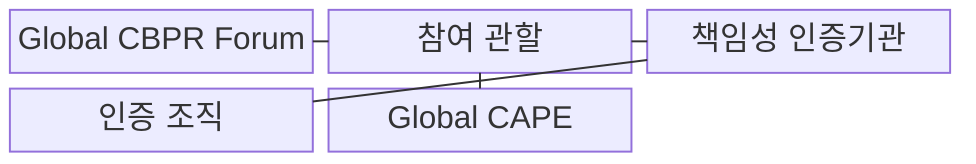
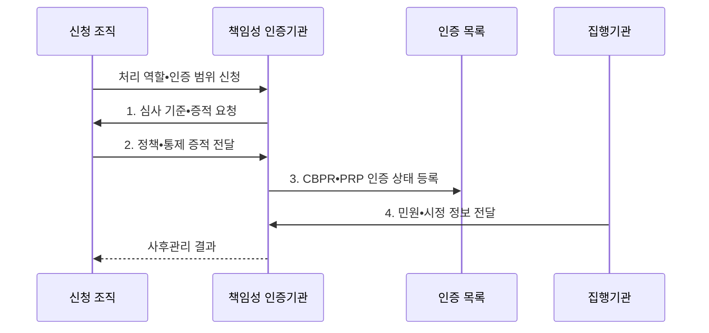

---
sidebar:
  order: 102
  label: "102. CBPR 국경 간 개인정보 규칙 (CBPR Cross-Border Privacy Rules)"
  badge:
    text: "기출 • 30%"
    variant: note
title: "CBPR 국경 간 개인정보 규칙 (CBPR Cross-Border Privacy Rules)"
date: "2026-08-04T14:45:00+09:00"
tags:
  - "notes-security"
weight: 102
extra:
  question_no: "102"
  source_status: "기출"
  source_history: "131회"
  priority: 30
  priority_note: "131회 기출이나 국내 중심 시험의 독립 반복성은 낮음"
---

## Ⅰ. 개요

핵심 용어

- **Global CBPR(Global Cross-Border Privacy Rules)** 은 국경 간 개인정보를 처리하는 컨트롤러의 책임성을 제3자가 인증하는 체계다.
- **국경 간 책임성**: 여러 관할로 개인정보를 이전•처리해도 역할별 보호조치와 민원•시정 책임을 계속 입증하는 능력이다.

- 정의/개념: **Global CBPR** 은 국경 간 개인정보를 처리하는 조직의 보호조치와 책임성을 제3자가 검증하는 인증 체계
- 배경/필요성: 내부 정책만으로는 상이한 관할에서 **국경 간 책임성 입증 곤란**

#### 한줄 요약

- 제3자 인증으로 보호 역량을 보이되 현지법은 별도로 준수한다.

## Ⅱ. 특징

핵심 용어

- **CBPR(Cross-Border Privacy Rules)** 은 개인정보 컨트롤러의 책임성 체계를 인증한다.
- **PRP(Privacy Recognition for Processors)** 는 개인정보 프로세서의 위탁 처리 통제를 인증한다.
- **공개 명부** 는 인증 조직의 역할•범위•상태•유효기간을 공개한 목록이다.
- **민원** 은 정보주체가 인증 조직의 개인정보 처리에 제기한 이의와 구제 요구다.
- **시정** 은 인증 결함과 민원 원인을 개선하고 결과를 검증하는 사후조치다.

- 공인 책임성 인증기관의 **제3자 검증**
- 컨트롤러•프로세서별 **CBPR•PRP 구분**
- 공개 명부•민원•시정 기반 **책임성 운영**

#### 한줄 요약

- 목적 결정자와 위탁 처리자는 서로 다른 인증을 검토한다.

## Ⅲ. 구조 및 구성요소

핵심 용어

- **Global CBPR Forum** 은 프로그램 요구사항과 운영 규칙을 관리하는 국제 협력체다.
- **책임성 인증기관** 은 조직의 심사•인증•민원•사후관리를 수행하는 공인기관이다.
- **Global CAPE(Cooperation Arrangement for Privacy Enforcement)**: 참여 개인정보 감독기관이 국경 간 민원•조사•집행 정보를 공유하고 협력하는 체계이다.

| 구성요소 | 책임 |
|:---|:---|
| Global CBPR Forum | **인증 요구사항•운영 규칙** 관리 |
| 참여 관할 | **제도 참여•집행•국제 협력** 담당 |
| 책임성 인증기관 | **조직 심사•인증•민원 관리** 수행 |
| 인증 조직 | **역할별 요구사항•시정조치** 운영 |
| Global CAPE | 감독기관 간 **집행 협력** |

#### 한줄 요약

- 포럼의 규칙에 따라 공인기관이 조직을 심사하고 감독기관이 협력한다.

## Ⅳ. 흐름도

핵심 용어

- **역할별 인증 범위**: 신청 조직이 컨트롤러 또는 프로세서로 수행하는 처리 활동과 서비스•관할•유효기간을 특정한 심사 경계이다.
- **사후관리**: 인증 뒤 민원•조사•시정조치와 조직•처리 변경을 확인하여 인증 상태를 유지•변경•취소하는 활동이다.

**동작 원리**

1. **심사 기준•증적 요청**: 역할별 프로그램 요구와 증명 범위 제공
2. **정책•통제 증적 전달**: 개인정보 보호조치와 운영 근거 제출
3. **CBPR•PRP 인증 상태 등록**: 역할•범위•유효기간을 목록에 공개
4. **민원•시정 정보 전달**: 조사 결과와 사후관리 요구를 인증기관에 제공

#### 한줄 요약

- 역할과 범위를 심사받고 인증 후에도 민원과 시정을 관리한다.

## Ⅴ. 종류 및 비교

핵심 용어

- **관할 법률**: 실제 국외 이전의 적법 근거와 정보주체 권리를 판단한다.

| 규율 요소 | 담당 역할 | 판단 범위 |
|:---|:---|:---|
| **Global CBPR** | **컨트롤러 책임성 체계 인증** | 인증 범위의 처리 관행과 통제 역량 |
| **Global PRP** | **프로세서 위탁 처리 통제 인증** | 프로세서의 계약•보안•감독 역량 |
| **관할 법률** | **이전 적법성•정보주체 권리 판정** | 국가별 이전 근거•통지•구제 요건 |

#### 한줄 요약

- 역할별 인증은 보호 역량을 보일 뿐 각국의 이전법을 대신하지 않는다.

## Ⅵ. 실무 고려사항 및 대책

핵심 용어

- **컨트롤러 책임성** 은 처리 목적•수단을 결정하는 조직의 CBPR 범위와 통제 증거를 확인하는 기준이다.
- **프로세서 책임성** 은 위탁 지시에 따라 처리하는 조직의 PRP 범위와 통제 증거를 확인하는 기준이다.
- **국가 간 집행 협력**: Global CAPE 참여와 관할 감독기관의 민원•조사 공조 절차를 확인하는 활동이다.

| 문제 | 대책 | 효과 |
|:---|:---|:---|
| **컨트롤러 책임성** | **Global CBPR 인증 확인** | 처리체계 **신뢰 확보** |
| **프로세서 위탁통제** | **Global PRP 인증 확인** | 위탁 처리 **역량 검증** |
| **국가 간 집행** | **Global CAPE 협력 확인** | **민원•조사 공조** 강화 |

#### 한줄 요약

- 인증 범위와 실제 이전 국가•처리자•법적 근거를 대조한다.

## Ⅶ. 결론

핵심 용어

- **인증 검증** 은 CBPR•PRP의 역할•범위•유효기간과 실제 처리 관계를 대조하는 절차다.
- **이전법 검증** 은 실제 이전 국가•처리자•법적 근거를 관할 법률과 대조하는 절차다.

- 컨트롤러는 **CBPR**, 프로세서는 **PRP**, 이전 적법성은 관할 법률로 별도 검증

#### 한줄 요약

- 인증과 실제 이전 국가의 법률을 함께 확인한다.
