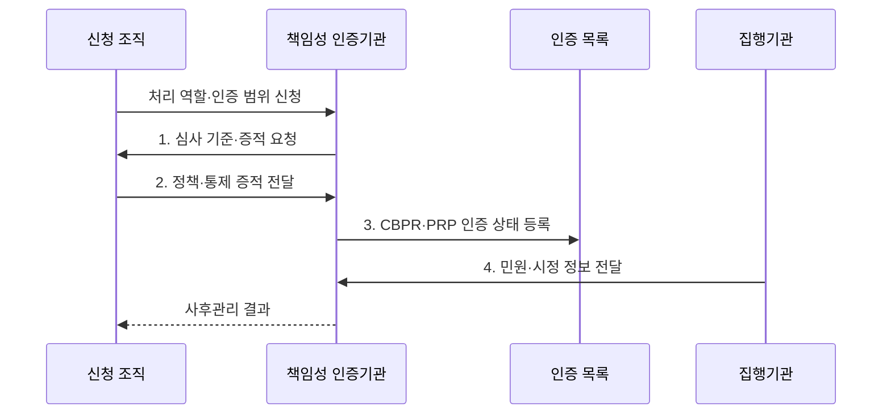

---
sidebar:
  order: 102
  label: "102. CBPR 국경 간 개인정보 규칙 (CBPR Cross-Border Privacy Rules)"
  badge:
    text: "기출 · 30%"
    variant: note
title: "CBPR 국경 간 개인정보 규칙 (CBPR Cross-Border Privacy Rules)"
date: "2026-08-02T13:22:00+09:00"
tags:
  - "notes-security"
weight: 102
extra:
  question_no: "102"
  source_status: "기출"
  source_history: "131회"
  priority: 30
  priority_note: "131회 기출이나 국내 중심 시험의 독립 반복성은 낮음"
---

## Ⅰ. 개요

핵심 용어

- **Global CBPR**: 국경 간 개인정보를 처리하는 컨트롤러의 보호조치와 책임성을 제3자가 인증하는 체계이다.
- **국경 간 책임성**: 여러 관할로 개인정보를 이전·처리해도 역할별 보호조치와 민원·시정 책임을 계속 입증하는 능력이다.

- 정의/개념: 국경 간 개인정보 처리의 **책임성 인증**
- 배경/필요성: 내부 정책만으로는 상이한 관할에서 **국경 간 책임성 입증 곤란**

#### 한줄 요약

- 제3자 인증으로 보호 역량을 보이되 현지법은 별도로 준수한다.

## Ⅱ. 특징

핵심 용어

- **CBPR·PRP**: CBPR은 처리 목적과 수단을 정하는 컨트롤러, PRP는 그 지시에 따라 위탁 처리하는 프로세서의 책임성을 인증한다.
- **공개 명부·민원·시정**: 인증 범위와 상태를 공개하고 정보주체 민원과 결함 시정 결과를 사후관리하는 운영 구조이다.

- 공인 책임성 인증기관의 **제3자 검증**
- 컨트롤러·프로세서별 **CBPR·PRP 구분**
- 공개 명부·민원·시정 기반 **책임성 운영**

#### 한줄 요약

- 목적 결정자와 위탁 처리자는 서로 다른 인증을 검토한다.

## Ⅲ. 구조 및 구성요소

핵심 용어

- **Global CBPR Forum·책임성 인증기관**: 포럼은 프로그램 요구와 규칙을 관리하고 공인기관은 조직 심사·인증·민원·사후관리를 수행한다.
- **Global CAPE**: 참여 개인정보 감독기관이 국경 간 민원·조사·집행 정보를 공유하고 협력하는 체계이다.

| 구성요소 | 책임 |
|:---|:---|
| Global CBPR Forum | **인증 요구사항·운영 규칙** 관리 |
| 참여 관할 | **제도 참여·집행·국제 협력** 담당 |
| 책임성 인증기관 | **조직 심사·인증·민원 관리** 수행 |
| 인증 조직 | **역할별 요구사항·시정조치** 운영 |
| Global CAPE | 감독기관 간 **집행 협력** |

#### 한줄 요약

- 포럼의 규칙에 따라 공인기관이 조직을 심사하고 감독기관이 협력한다.

## Ⅳ. 흐름도

핵심 용어

- **역할별 인증 범위**: 신청 조직이 컨트롤러 또는 프로세서로 수행하는 처리 활동과 서비스·관할·유효기간을 특정한 심사 경계이다.
- **사후관리**: 인증 뒤 민원·조사·시정조치와 조직·처리 변경을 확인하여 인증 상태를 유지·변경·취소하는 활동이다.

**동작 원리**

1. **심사 기준·증적 요청**: 역할별 프로그램 요구와 증명 범위 제공
2. **정책·통제 증적 전달**: 개인정보 보호조치와 운영 근거 제출
3. **CBPR·PRP 인증 상태 등록**: 역할·범위·유효기간을 목록에 공개
4. **민원·시정 정보 전달**: 조사 결과와 사후관리 요구를 인증기관에 제공

#### 한줄 요약

- 역할과 범위를 심사받고 인증 후에도 민원과 시정을 관리한다.

## Ⅴ. 종류 및 비교

핵심 용어

- **CBPR·PRP·관할 법률**: 역할별 인증은 보호 역량을 입증하지만 실제 이전의 적법 근거와 정보주체 권리는 각 국가 법률로 판단한다.

| 국경 간 개인정보 규율 | Global CBPR | Global PRP | 관할 법률 |
|:---|:---|:---|:---|
| 적용 기준 | **컨트롤러 처리체계** 입증 | **프로세서 위탁통제** 입증 | 이전 **적법성 판단** |
| 핵심 특징 | **컨트롤러 책임성 인증** | **프로세서 책임성 인증** | **이전 요건·정보주체 권리** 규정 |
| 한계 | **인증 범위 밖 처리** | 위탁 계약 **책임 대체 불가** | **국가별 요건** 누락 |

#### 한줄 요약

- 역할별 인증은 보호 역량을 보일 뿐 각국의 이전법을 대신하지 않는다.

## Ⅵ. 실무 고려사항 및 대책

핵심 용어

- **컨트롤러·프로세서 책임성**: 실제 처리 목적·지시 관계에 맞는 CBPR 또는 PRP 인증 범위와 통제 증거를 확인하는 기준이다.
- **국가 간 집행 협력**: Global CAPE 참여와 관할 감독기관의 민원·조사 공조 절차를 확인하는 활동이다.

| 문제 | 대책 | 효과 |
|:---|:---|:---|
| **컨트롤러 책임성** | **Global CBPR 인증 확인** | 처리체계 **신뢰 확보** |
| **프로세서 위탁통제** | **Global PRP 인증 확인** | 위탁 처리 **역량 검증** |
| **국가 간 집행** | **Global CAPE 협력 확인** | **민원·조사 공조** 강화 |

#### 한줄 요약

- 인증 범위와 실제 이전 국가·처리자·법적 근거를 대조한다.

## Ⅶ. 결론

핵심 용어

- **인증·이전법 병행 검증**: CBPR·PRP 인증 범위와 실제 이전 국가·처리자·법적 근거를 모두 대조해야 한다는 원칙이다.

- 컨트롤러는 **CBPR**, 프로세서는 **PRP**, 이전 적법성은 관할 법률로 별도 검증

#### 한줄 요약

- 인증과 실제 이전 국가의 법률을 함께 확인한다.
