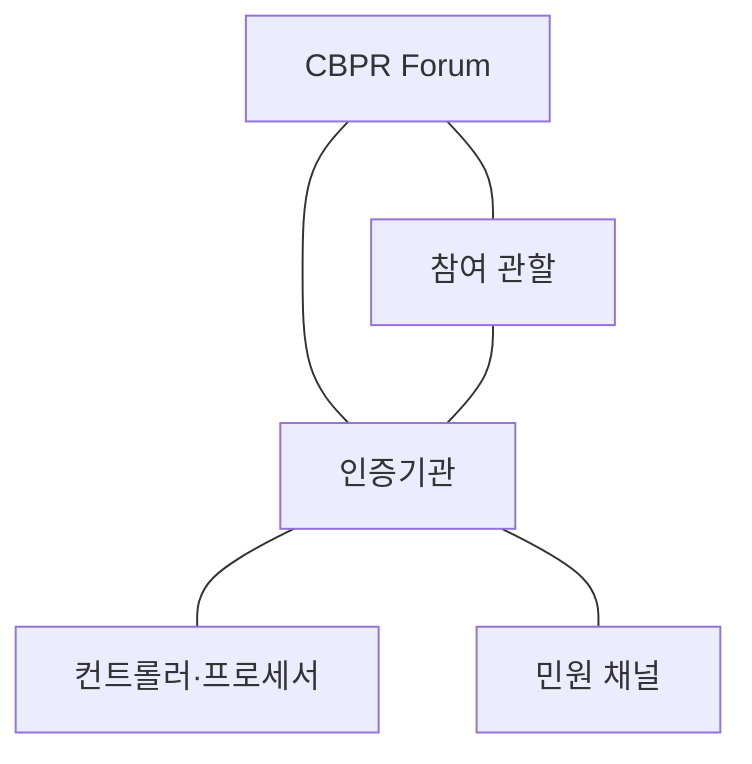
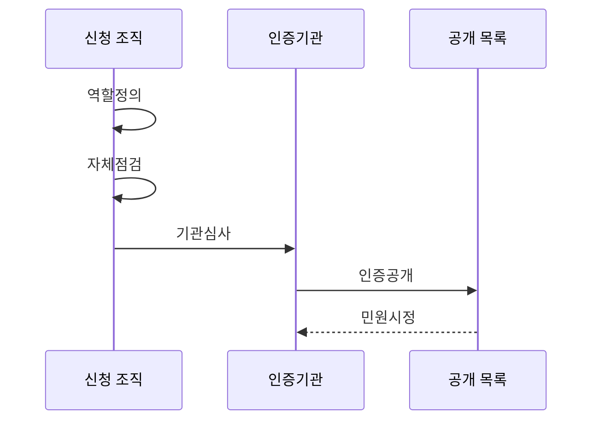

---
sidebar:
  order: 102
  label: "102. CBPR 국경 간 개인정보 규칙 (CBPR Cross-Border Privacy Rules)"
  badge:
    text: "기출 · 30%"
    variant: note
title: "CBPR 국경 간 개인정보 규칙 (CBPR Cross-Border Privacy Rules)"
date: "2026-07-27T23:59:59+09:00"
tags:
  - "notes-security"
weight: 102
extra:
  question_no: "102"
  source_status: "기출"
  source_history: "131회"
  priority: 30
  priority_note: "131회 기출이나 국내 중심 시험의 독립 반복성은 낮음"
---

## 미리 알고가기

- **글로벌 국경 간 개인정보보호 규칙(Global Cross-Border Privacy Rules, Global CBPR)**: 국경 간 개인정보를 처리하는 컨트롤러의 보호조치와 책임성을 인증하는 체계이다.
- **글로벌 프로세서 개인정보보호 인정(Global Privacy Recognition for Processors, Global PRP)**: 컨트롤러의 위탁을 받아 개인정보를 처리하는 프로세서의 보호조치와 책임성을 인증하는 체계이다.
- **컨트롤러**: 개인정보 처리 목적과 수단을 결정하는 조직
- **프로세서**: 컨트롤러의 지시에 따라 개인정보를 처리하는 조직
- **책임성 인증기관**: 조직의 요구사항 준수 여부를 심사하고 인증·민원·사후관리를 수행하는 기관
- **참여 관할**: CBPR 체계에 참여해 국내 집행과 국제 협력을 담당하는 국가·지역
- **인증 디렉터리**: 인증된 조직과 유효 범위를 공개하는 목록
- **SaaS (Software as a Service)**: 공급자가 운영하는 소프트웨어를 인터넷으로 이용하는 서비스

## Ⅰ. 개요

- 정의: 국경 간 개인정보 처리의 **책임성 인증**
- 기존 한계: 국가별 제도의 **보호 수준 입증 곤란**

### 쉽게 이해하기 (학습용)
- 제3자 심사로 보호 체계를 인증받고 법적 근거는 별도 준수함

## Ⅱ. 특징

- 공인 책임성 인증기관의 **제3자 검증**
- 컨트롤러·프로세서별 **CBPR·PRP 구분**
- 공개 명부·민원·시정 기반 **책임성 운영**

### 쉽게 이해하기 (학습용)

- 목적을 정하는 조직과 위탁받아 처리하는 조직은 서로 다른 인증을 검토함

## Ⅲ. 아키텍처 및 구성요소

| 설계 요소 | 설명 |
|:---|:---|
| CBPR Forum | 프로그램 요구사항 및 운영 규칙 관리 |
| 참여 관할 | 제도 참여 및 집행·국제 협력 담당 |
| 인증기관 | 조직 심사·인증 및 민원 관리 수행 |
| 컨트롤러·프로세서 | 범위 내 요구사항 및 시정조치 운영 |
| 민원 채널 | 권리 불만 접수 및 관련 기관 연결 |

### 쉽게 이해하기 (학습용)
- 국제 운영 규칙과 국내 집행 사이에서 인증기관이 조직을 심사함

## Ⅳ. 원리 및 절차 흐름도

| 절차 | 설명 |
|:---|:---|
| 역할정의 | 처리 역할·서비스·관할 범위 설정 |
| 자체점검 | 요구사항과 현지법 준수 매핑 |
| 기관심사 | 인증기관이 운영 증거 평가 |
| 인증공개 | 적합 범위를 인증 목록에 공개 |
| 민원시정 | 민원·변경사항을 통제에 반영 |

> 요약: 인증기관이 책임성을 심사하고 민원을 관리함

### 쉽게 이해하기 (학습용)
- 신청 조직은 역할과 범위를 정해 증거를 내고 인증 후 민원도 고침

## Ⅴ. 종류 및 비교

| 국경 간 개인정보 규율 | Global CBPR | Global PRP | 관할 법률 |
|:---|:---|:---|:---|
| 적용 기준 | 컨트롤러의 처리 체계를 입증할 때 | 프로세서의 위탁 통제를 입증할 때 | 각 국가에서 이전 적법성을 판단할 때 |
| 핵심 특징 | 컨트롤러 책임성 인증 | 프로세서 책임성 인증 | 이전 요건·정보주체 권리 규정 |
| 한계 | 인증 범위 밖 처리 | 위탁 계약 책임 대체 불가 | 국가별 요건 누락 |

> 요약: CBPR·PRP 인증과 관할 법률을 별도 확인함

### 쉽게 이해하기 (학습용)

- 역할별 인증은 보호 역량을 보일 뿐 각 국가의 이전 법률을 대신하지 않음

## Ⅵ. 실무 사례

1. SaaS 국외이전의 **CBPR 인증 범위·법적 근거 대조**

### 쉽게 이해하기 (학습용)
- 국외 SaaS 도입 시 CBPR 인증의 조직·서비스 범위와 실제 이전 국가·처리자·법적 근거를 대조하고 차이를 별도 보호조치로 보완한다.

## Ⅶ. 결론

- 국가 간 개인정보 이전의 신뢰 차이를 줄이기 위해 처리 역할·인증 범위·이전 경로·관할 법률을 검토하여, 적용 가능한 이전 근거와 함께 CBPR을 활용해야 한다.

### 쉽게 이해하기 (학습용)
- 역할별 인증 범위와 실제 이전 국가의 법률을 함께 확인함
