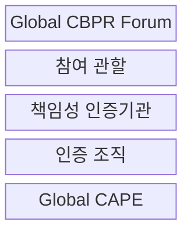
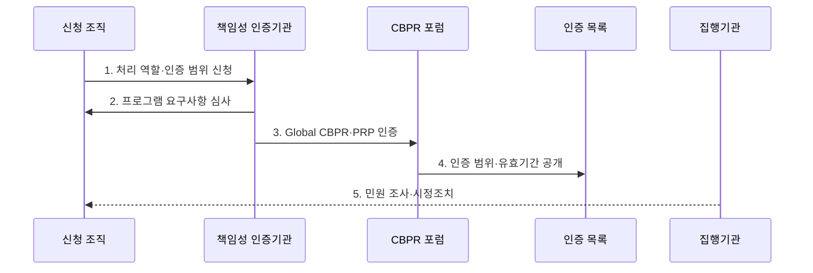

---
sidebar:
  order: 102
  label: "102. CBPR 국경 간 개인정보 규칙 (CBPR Cross-Border Privacy Rules)"
  badge:
    text: "기출 · 30%"
    variant: note
title: "CBPR 국경 간 개인정보 규칙 (CBPR Cross-Border Privacy Rules)"
date: "2026-07-27T23:59:59+09:00"
tags:
  - "notes-security"
weight: 102
extra:
  question_no: "102"
  source_status: "기출"
  source_history: "131회"
  priority: 30
  priority_note: "131회 기출이나 국내 중심 시험의 독립 반복성은 낮음"
---

## 미리 알고가기

- **글로벌 국경 간 개인정보보호 규칙(Global Cross-Border Privacy Rules, Global CBPR)**: 국경 간 개인정보를 처리하는 컨트롤러의 보호조치와 책임성을 인증하는 체계이다.
- **글로벌 프로세서 개인정보보호 인정(Global Privacy Recognition for Processors, Global PRP)**: 컨트롤러의 위탁을 받아 개인정보를 처리하는 프로세서의 보호조치와 책임성을 인증하는 체계이다.
- **컨트롤러(Data Controller)**: 개인정보 처리 목적과 수단을 결정하는 조직이다.
- **프로세서(Data Processor)**: 컨트롤러의 지시에 따라 개인정보를 처리하는 조직이다.
- **책임성 인증기관(Accountability Agent, AA)**: 프로그램 요구사항을 심사하고 인증·민원·사후관리를 수행하는 포럼 공인기관이다.
- **글로벌 개인정보 집행 협력체계(Global Cooperation Arrangement for Privacy Enforcement, Global CAPE)**: 참여 개인정보 감독기관의 국경 간 집행 협력체계이다.
- **글로벌 CBPR 포럼(Global CBPR Forum)**: 2022년 출범하여 Global CBPR·PRP 인증체계를 운영하는 정부 간 포럼이다.

## Ⅰ. 개요

- 정의: 국경 간 개인정보 처리의 **책임성 인증**
- 목적: 상이한 국가 법률 사이의 **상호운용성 확보**

### 쉽게 이해하기 (학습)

- 제3자 인증으로 보호 역량을 보이되 현지법은 별도로 준수한다.

## Ⅱ. 특징

- 공인 책임성 인증기관의 **제3자 검증**
- 컨트롤러·프로세서별 **CBPR·PRP 구분**
- 공개 명부·민원·시정 기반 **책임성 운영**

### 쉽게 이해하기 (학습)

- 목적 결정자와 위탁 처리자는 서로 다른 인증을 검토한다.

## Ⅲ. 구조 및 구성요소

| 설계 요소 | 설명 |
|:---|:---|
| Global CBPR Forum | 인증 요구사항·운영 규칙 관리 |
| 참여 관할 | 제도 참여 및 집행·국제 협력 담당 |
| 책임성 인증기관 | 조직 심사·인증·민원 관리 수행 |
| 인증 조직 | 역할별 요구사항·시정조치 운영 |
| Global CAPE | 감독기관 간 집행 협력 |

### 쉽게 이해하기 (학습)

- 포럼의 규칙에 따라 공인기관이 조직을 심사하고 감독기관이 협력한다.

## Ⅳ. 흐름도

| 절차 | 설명 |
|:---|:---|
| 1. 처리 역할·인증 범위 신청 | 서비스·관할·처리 역할 확정 |
| 2. 프로그램 요구사항 심사 | 정책·통제·운영 증거 평가 |
| 3. Global CBPR·PRP 인증 | 컨트롤러·프로세서별 인증 |
| 4. 인증 범위·유효기간 공개 | 공식 디렉터리에 상태 공개 |
| 5. 민원 조사·시정조치 | 민원·변경사항을 통제에 반영 |

### 쉽게 이해하기 (학습)

- 역할과 범위를 심사받고 인증 후에도 민원과 시정을 관리한다.

## Ⅴ. 종류 및 비교

| 국경 간 개인정보 규율 | Global CBPR | Global PRP | 관할 법률 |
|:---|:---|:---|:---|
| 적용 기준 | 컨트롤러 처리체계 입증 | 프로세서 위탁통제 입증 | 이전 적법성 판단 |
| 핵심 특징 | 컨트롤러 책임성 인증 | 프로세서 책임성 인증 | 이전 요건·정보주체 권리 규정 |
| 한계 | 인증 범위 밖 처리 | 위탁 계약 책임 대체 불가 | 국가별 요건 누락 |

### 쉽게 이해하기 (학습)

- 역할별 인증은 보호 역량을 보일 뿐 각국의 이전법을 대신하지 않는다.

## Ⅵ. 실무 고려사항 및 대책

| 고려사항 | 대책 | 효과 |
|:---|:---|:---|
| 컨트롤러 책임성 | **Global CBPR 인증 확인** | 처리체계 신뢰 확보 |
| 프로세서 위탁통제 | **Global PRP 인증 확인** | 위탁 처리 역량 검증 |
| 국가 간 집행 | **Global CAPE 협력 확인** | 민원·조사 공조 강화 |

### 쉽게 이해하기 (학습)

- 인증 범위와 실제 이전 국가·처리자·법적 근거를 대조한다.

## Ⅶ. 결론

- **처리 역할·인증 범위·관할 법률**로 CBPR 활용을 결정한다.

### 쉽게 이해하기 (학습)

- 인증과 실제 이전 국가의 법률을 함께 확인한다.
