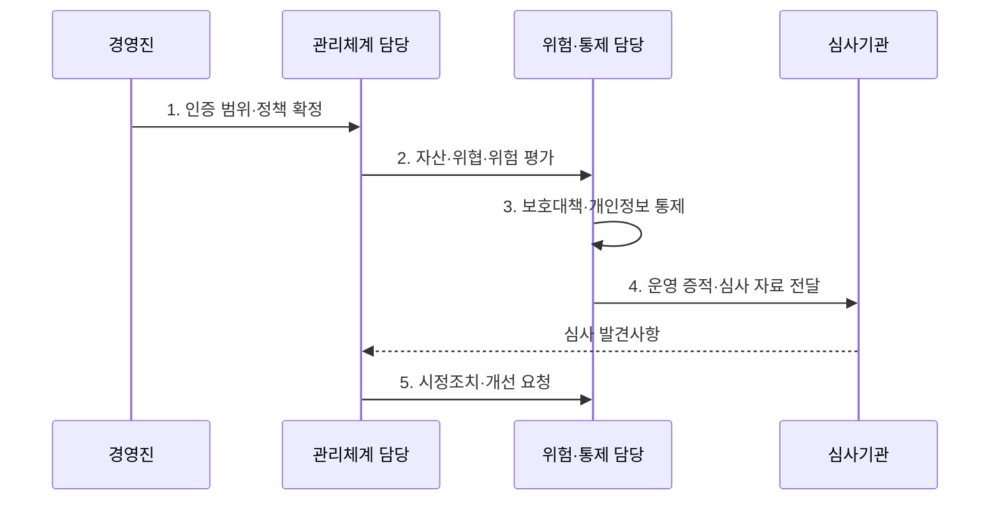

---
sidebar:
  order: 103
  label: "103. 정보보호 관리체계 ISMS-P (ISMS-P)"
  badge:
    text: "기출 · 85%"
    variant: note
title: "정보보호 관리체계 ISMS-P (ISMS-P)"
date: "2026-08-02T13:24:00+09:00"
tags:
  - "notes-security"
weight: 103
extra:
  question_no: "103"
  source_status: "기출"
  source_history: "126회, 134회, 138회"
  priority: 85
  priority_note: "126·134·138회 반복된 관리체계 최우선 주제임"
---

## Ⅰ. 개요

핵심 용어

- **ISMS(Information Security Management System)·ISMS-P(Information Security Management System-Personal Information)**: ISMS는 정보보호 위험과 통제를 관리하고 ISMS-P는 여기에 개인정보 처리단계별 보호 요구사항을 결합한 인증 체계이다.
- **통합 관리체계**: 서비스 위험과 개인정보 수집·이용·제공·위탁·보유·파기의 책임을 하나의 범위에서 운영·심사하는 체계이다.

- 정의/개념: **ISMS-P**는 정보보호와 개인정보보호 요구사항을 함께 심사하는 통합 관리체계 인증
- 배경/필요성: 분리된 보안·개인정보 점검으로는 서비스 위험과 **처리 책임 연결 곤란**

#### 한줄 요약

- 서비스 전체에서 위험 판단, 통제 운영, 개선 여부를 확인한다.

## Ⅱ. 특징

핵심 용어

- **인증 범위·위험평가**: 심사할 서비스·조직·시스템 경계를 확정하고 그 안의 자산·위협·취약점·개인정보 흐름을 평가한다.
- **운영 증적**: 정책과 통제가 실제 작동했음을 보여 주는 로그·승인·점검·시정 기록이다.
- **3개 영역·102개 기준**: 관리체계 수립·운영 16개, 보호대책 64개, 개인정보 처리단계 22개 요구사항으로 구성된 ISMS-P 심사 구조이다.

- 3개 영역·102개 기준의 **통합 심사**
- 위험평가 기반 **관리·물리·기술 통제**
- 로그·승인·점검 기록 기반 **운영 증적**

#### 한줄 요약

- 일상 업무 기록을 심사 증거로 지속 관리한다.

## Ⅲ. 구조 및 구성요소

핵심 용어

- **보호대책 요구사항**: 평가한 위험을 낮추기 위해 관리적·물리적·기술적 통제의 설계·운영 기준을 제시한 영역이다.
- **개인정보 처리단계**: 개인정보의 수집·이용·제공·위탁·보유·파기 각 과정에서 근거·권한·기록·종료를 통제하는 영역이다.

| 구성요소 | 책임 |
|:---|:---|
| 관리체계 수립·운영 | **범위·조직·정책·자원** 설정 |
| 위험관리 | **자산·위협·취약점 평가**와 처리 계획 수립 |
| 보호대책 요구사항 | **64개 관리·물리·기술 통제** |
| 개인정보 처리단계 | **22개 생명주기 보호 요구** |
| 감사·지속 개선 | **운영 기록·시정·재검증** 반복 |

#### 한줄 요약

- 서비스 경계 안의 위험과 개인정보 흐름을 통제로 묶어 개선한다.

## Ⅳ. 흐름도

핵심 용어

- **심사 발견사항·시정조치**: 통제의 부적합과 운영 결함을 증거로 확인하고 근본 원인을 제거해 재발을 막는 개선 과정이다.
- **위험-통제-증적 연결**: 식별 위험과 선택한 보호대책, 실제 운영 결과를 일대일로 추적하여 심사 가능하게 하는 구조이다.

**동작 원리**

1. **인증 범위·정책 확정**: 서비스·조직·시스템 경계 설정
2. **자산·위협·위험 평가**: 위험 식별·분석·처리 계획 수립
3. **보호대책·개인정보 통제**: 기준별 통제 수행·결과 기록
4. **운영 증적·심사 자료 전달**: 서면·현장심사용 통제 근거 제공
5. **시정조치·개선 요청**: 결함 원인 제거와 통제 갱신 지시

#### 한줄 요약

- 위험 평가 결과와 실제 통제 기록을 심사하고 결함을 고친다.

## Ⅴ. 종류 및 비교

핵심 용어

- **ISMS·ISMS-P 기준**: ISMS는 정보보호 관리체계와 보호대책을, ISMS-P는 개인정보 처리단계 보호 요구까지 함께 심사한다.

| 국내 관리체계 인증 | ISMS | ISMS-P |
|:---|:---|:---|
| 적용 기준 | **정보보호 위험·통제** 인증 | **개인정보 생명주기** 통합 인증 |
| 핵심 특징 | **2개 영역·80개 기준** | **3개 영역·102개 기준** |
| 한계 | **개인정보 기준** 별도 확인 | 범위 밖 서비스 **보장 불가** |

#### 한줄 요약

- ISMS-P는 ISMS에 개인정보 처리단계 22개 기준을 더한다.

## Ⅵ. 실무 고려사항 및 대책

핵심 용어

- **정보통신망법 제47조·개인정보 보호법 제32조의2**: 정보보호 및 개인정보보호 관리체계 인증의 법적 근거와 유효기간을 규정한다.
- **ISMS-P 세부 기준**: 인증 범위 안에서 관리체계·보호대책·개인정보 처리단계별 통제 누락을 확인하는 심사 기준이다.

| 문제 | 대책 | 효과 |
|:---|:---|:---|
| **정보보호 인증 근거** | **정보통신망법 제47조 적용** | **법정 의무·대상** 확인 |
| **개인정보 인증 근거** | **개인정보보호법 §32-2 적용** | **인증·유효기간** 확인 |
| **세부 심사 기준** | **ISMS-P 102개 기준 점검** | **통제 누락** 방지 |

#### 한줄 요약

- 클라우드·외부 API·위탁 조직까지 실제 서비스 경계를 추적한다.

## Ⅶ. 결론

핵심 용어

- **인증 범위 한계**: 인증은 명시된 서비스·조직·시스템과 기간의 통제 운영만 보장하므로 범위 밖 클라우드·위탁·API는 별도 확인해야 한다.

- 정보보호 통제는 **ISMS**, 개인정보 처리단계 포함 시 **ISMS-P** 선택

#### 한줄 요약

- 인증 범위의 위험과 개인정보 흐름을 기록으로 계속 개선한다.
