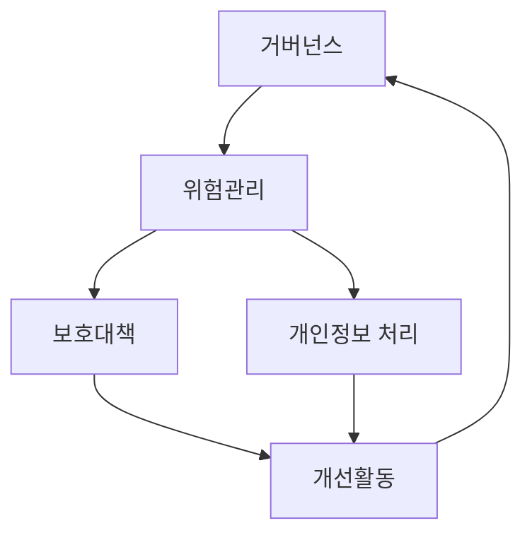
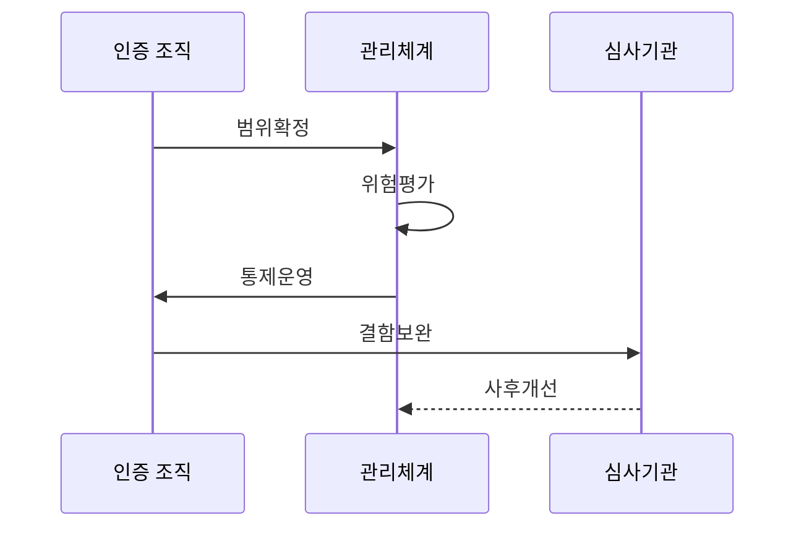

---
sidebar:
  order: 103
  label: "103. 정보보호 관리체계 ISMS-P (ISMS-P)"
  badge:
    text: "기출 · 85%"
    variant: note
title: "정보보호 관리체계 ISMS-P (ISMS-P)"
date: "2026-07-27T23:59:59+09:00"
tags:
  - "notes-security"
weight: 103
extra:
  question_no: "103"
  source_status: "기출"
  source_history: "126회, 134회, 138회"
  priority: 85
  priority_note: "126·134·138회 반복된 관리체계 최우선 주제임"
---

## 미리 알고가기

- **정보보호 관리체계(Information Security Management System, ISMS)**: 정보보호 위험을 식별하고 통제를 수립·운영·점검·개선하는 관리체계이다.
- **정보보호 및 개인정보보호 관리체계(Personal Information & Information Security Management System, ISMS-P)**: 정보보호 관리체계에 개인정보 처리단계별 보호 요구사항을 결합한 인증 체계이다.
- **인증 범위**: 심사할 서비스·조직·시스템 경계
- **보호대책**: 식별한 정보보호 위험을 낮추기 위해 적용하는 관리적·물리적·기술적 통제
- **개인정보 처리단계**: 개인정보의 수집·이용·제공·위탁·보유·파기 과정
- **증적**: 정책과 통제가 실제로 운영됐음을 보여주는 로그·승인·점검 기록
- **내부감사**: 조직이 관리체계의 준수와 효과를 스스로 독립적으로 점검하는 활동
## Ⅰ. 개요

- 정의: 정보보호·개인정보보호 **통합 관리체계 인증**
- 기존 한계: 분리된 통제의 **위험·처리단계 누락**

### 쉽게 이해하기 (학습용)
- 서비스 전체에서 위험판단·통제운영·개선을 확인함

## Ⅱ. 특징

- 관리체계·보호대책·개인정보의 **통합 기준**
- 위험평가 기반 **관리·물리·기술 통제**
- 로그·승인·점검 기록 기반 **운영 증적**

### 쉽게 이해하기 (학습용)
- 일상 업무 기록을 자연스러운 심사 증거로 운영함

## Ⅲ. 아키텍처 및 구성요소

| 설계 요소 | 설명 |
|:---|:---|
| 거버넌스 | 서비스·조직·시스템 인증 범위 설정 |
| 위험관리 | 자산·위협·취약점 평가 및 처리 계획 수립 |
| 보호대책 | 관리적·물리적·기술적 통제 실행 |
| 개인정보 처리 | 수집부터 파기까지 생명주기 통제 |
| 개선활동 | 운영 기록·내부감사·시정 및 재검증 반복 |

### 쉽게 이해하기 (학습용)
- 정한 서비스 경계 안의 위험과 개인정보 흐름을 통제로 묶어 개선함

## Ⅳ. 원리 및 절차 흐름도

| 절차 | 설명 |
|:---|:---|
| 범위확정 | 의무 대상과 서비스 경계 설정 |
| 위험평가 | 자산·위협·개인정보 흐름 분석 |
| 통제운영 | 보호대책·생명주기 결과 기록 |
| 결함보완 | 심사 결함 원인 시정·증명 |
| 사후개선 | 변경·사고에 따라 통제 갱신 |

> 요약: 범위 내 위험·통제 증적을 심사·개선함

### 쉽게 이해하기 (학습용)
- 위험 평가 결과와 통제 증적을 심사함

## Ⅴ. 종류 및 비교

| 국내 관리체계 인증 | ISMS | ISMS-P |
|:---|:---|:---|
| 적용 기준 | 정보보호 위험·통제 운영을 인증할 때 | 개인정보 생명주기까지 함께 인증할 때 |
| 핵심 특징 | 정보보호 관리체계 인증 | 개인정보 처리단계 통합 |
| 한계 | 개인정보 요구 별도 확인 | 처리 흐름의 인증 범위 누락 |

> 요약: ISMS-P는 개인정보 생명주기를 통합함

### 쉽게 이해하기 (학습용)

- ISMS-P는 정보보호 통제에 개인정보 수집부터 파기까지의 책임을 더함

## Ⅵ. 실무 사례

1. 결제 서비스의 **클라우드·위탁 경로까지 인증 범위 포함**

### 쉽게 이해하기 (학습용)
- 결제 서비스의 개인정보 흐름과 실제 운영 책임을 따라 클라우드·외부 API·위탁 운영 조직까지 ISMS-P 인증 범위에 포함한다.

## Ⅶ. 결론

- 정보보호와 개인정보 통제의 범위 공백을 막기 위해 서비스 흐름·자산·위탁·위험·운영 증적을 검토하여, 실제 업무 경계에 맞는 ISMS-P를 지속 개선해야 한다.

### 쉽게 이해하기 (학습용)
- 인증 범위의 실제 위험과 개인정보 흐름을 기록으로 계속 개선함
