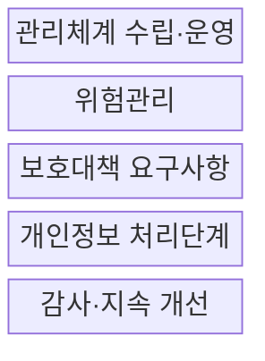
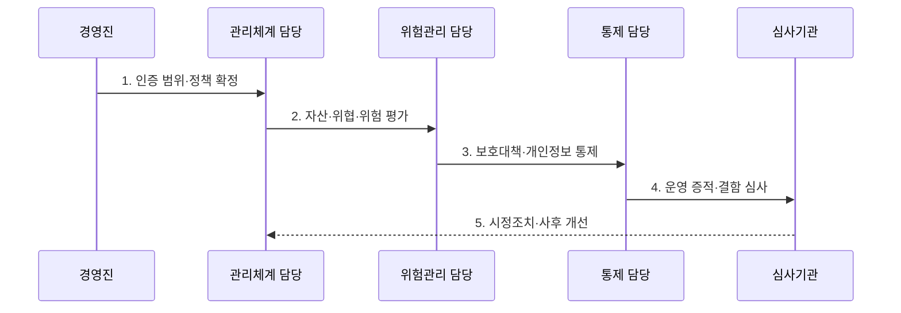

---
sidebar:
  order: 103
  label: "103. 정보보호 관리체계 ISMS-P (ISMS-P)"
  badge:
    text: "기출 · 85%"
    variant: note
title: "정보보호 관리체계 ISMS-P (ISMS-P)"
date: "2026-07-27T23:59:59+09:00"
tags:
  - "notes-security"
weight: 103
extra:
  question_no: "103"
  source_status: "기출"
  source_history: "126회, 134회, 138회"
  priority: 85
  priority_note: "126·134·138회 반복된 관리체계 최우선 주제임"
---

## 미리 알고가기

- **정보보호 관리체계(Information Security Management System, ISMS)**: 정보보호 위험을 식별하고 통제를 수립·운영·점검·개선하는 관리체계이다.
- **정보보호 및 개인정보보호 관리체계(Personal Information & Information Security Management System, ISMS-P)**: 정보보호 관리체계에 개인정보 처리단계별 보호 요구사항을 결합한 인증 체계이다.
- **인증 범위(Scope)**: 심사 대상 서비스·조직·시스템의 경계이다.
- **보호대책(Security Control)**: 식별한 정보보호 위험을 낮추는 관리적·물리적·기술적 통제이다.
- **개인정보 처리단계**: 개인정보의 수집·이용·제공·위탁·보유·파기 과정이다.
- **운영 증적(Evidence)**: 정책과 통제의 실제 운영을 보여주는 로그·승인·점검 기록이다.
- **정보통신망법 제47조**: 정보보호 관리체계 인증의 법률 근거이다.
- **개인정보 보호법 제32조의2**: 개인정보 보호 인증과 3년 유효기간의 법률 근거이다.

## Ⅰ. 개요

- 정의: 정보보호·개인정보보호 **통합 관리체계 인증**
- 목적: 위험과 개인정보 처리의 **통합 책임성 확보**

### 쉽게 이해하기 (학습)

- 서비스 전체에서 위험 판단, 통제 운영, 개선 여부를 확인한다.

## Ⅱ. 특징

- 3개 영역·102개 기준의 **통합 심사**
- 위험평가 기반 **관리·물리·기술 통제**
- 로그·승인·점검 기록 기반 **운영 증적**

### 쉽게 이해하기 (학습)

- 일상 업무 기록을 심사 증거로 지속 관리한다.

## Ⅲ. 구조 및 구성요소

| 설계 요소 | 설명 |
|:---|:---|
| 관리체계 수립·운영 | 범위·조직·정책·자원 설정 |
| 위험관리 | 자산·위협·취약점 평가 및 처리 계획 수립 |
| 보호대책 요구사항 | 64개 관리·물리·기술 통제 |
| 개인정보 처리단계 | 22개 생명주기 보호 요구 |
| 감사·지속 개선 | 운영 기록·시정·재검증 반복 |

### 쉽게 이해하기 (학습)

- 서비스 경계 안의 위험과 개인정보 흐름을 통제로 묶어 개선한다.

## Ⅳ. 흐름도

| 절차 | 설명 |
|:---|:---|
| 1. 인증 범위·정책 확정 | 서비스·조직·시스템 경계 설정 |
| 2. 자산·위협·위험 평가 | 위험 식별·분석·처리 계획 수립 |
| 3. 보호대책·개인정보 통제 | 기준별 통제 수행·결과 기록 |
| 4. 운영 증적·결함 심사 | 서면·현장심사로 적합성 검증 |
| 5. 시정조치·사후 개선 | 결함 원인 제거·통제 갱신 |

### 쉽게 이해하기 (학습)

- 위험 평가 결과와 실제 통제 기록을 심사하고 결함을 고친다.

## Ⅴ. 종류 및 비교

| 국내 관리체계 인증 | ISMS | ISMS-P |
|:---|:---|:---|
| 적용 기준 | 정보보호 위험·통제 인증 | 개인정보 생명주기 통합 인증 |
| 핵심 특징 | 2개 영역·80개 기준 | 3개 영역·102개 기준 |
| 한계 | 개인정보 기준 별도 확인 | 범위 밖 서비스 보장 불가 |

### 쉽게 이해하기 (학습)

- ISMS-P는 ISMS에 개인정보 처리단계 22개 기준을 더한다.

## Ⅵ. 실무 고려사항 및 대책

| 고려사항 | 대책 | 효과 |
|:---|:---|:---|
| 정보보호 인증 근거 | **정보통신망법 제47조 적용** | 법정 의무·대상 확인 |
| 개인정보 인증 근거 | **개인정보보호법 §32-2 적용** | 인증·유효기간 확인 |
| 세부 심사 기준 | **ISMS-P 102개 기준 점검** | 통제 누락 방지 |

### 쉽게 이해하기 (학습)

- 클라우드·외부 API·위탁 조직까지 실제 서비스 경계를 추적한다.

## Ⅶ. 결론

- **서비스 경계·위험·정보 흐름**으로 인증 범위를 결정한다.

### 쉽게 이해하기 (학습)

- 인증 범위의 위험과 개인정보 흐름을 기록으로 계속 개선한다.
