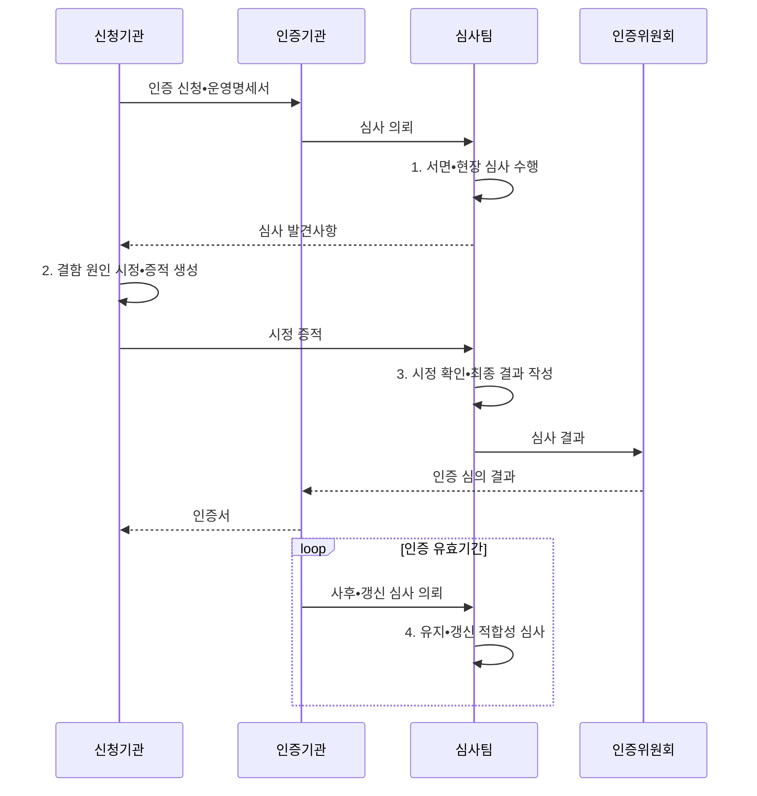

---
sidebar:
  order: 104
  label: "104. ISMS-P 인증 심사 절차 (ISMS-P Certification)"
  badge:
    text: "기출 • 70%"
    variant: note
title: "ISMS-P 인증 심사 절차 (ISMS-P Certification)"
date: "2026-08-05T01:46:59+09:00"
tags:
  - "notes-security"
weight: 104
extra:
  question_no: "104"
  source_status: "기출"
  source_history: "138회"
  priority: 70
  priority_note: "138회 최신 기출이며 인증 준비•심사 절차가 명확함"
---

## Ⅰ. 개요

핵심 용어

- **ISMS-P(Information Security Management System-Personal Information) 인증 심사**: 정보보호와 개인정보 보호 관리체계가 문서뿐 아니라 실제 범위에서 지속 작동하는지를 독립적으로 심사•의결하는 절차이다.
- **운영 적합성**: 정책•통제 설계와 일상 운영 기록, 현장 상태가 인증 기준에 맞고 서로 일치하는 성질이다.

- 정의/개념: **ISMS-P 인증 심사** 는 관리체계의 운영 적합성을 독립적으로 심사•의결하는 절차
- 배경/필요성: 내부 자체 점검만으로는 통제의 **실제 작동•지속성 독립 입증 곤란**

#### 한줄 요약

- 문서에 적힌 보호 절차가 현장에서 실제 작동하는지 확인한다.

## Ⅱ. 특징

핵심 용어

- **운영 증적** 은 로그•승인•점검 기록으로 통제 작동을 입증하는 자료다.
- **결함 시정** 은 심사 결함의 원인을 제거하고 이행 근거를 다시 검증하는 활동이다.
- **사후심사** 는 인증 취득 뒤 정기적으로 변경과 통제 지속성을 확인하는 심사다.
- **유효기간** 은 발급된 인증서의 효력이 유지되는 기간이다.

- 문서•현장 기반 **운영 증적 심사**
- 결함 원인 시정과 **이행 증거 확인**
- 3년 유효기간 중 **매년 1회 이상 사후심사**

#### 한줄 요약

- 취득 후에도 매년 심사하여 지속 운영을 검증한다.

## Ⅲ. 구조 및 구성요소

핵심 용어

- **인증기관** 은 인증 신청•위원회 운영•인증서 발급을 담당한다.
- **인증심사기관** 은 심사 계약•심사팀 구성•서면•현장 심사를 수행한다.
- **운영명세서** 는 인증 범위•조직•자산•통제 현황을 정리한 문서다.
- **인증위원회** 는 심사 결과를 독립 검토해 인증 여부를 의결한다.

| 구성요소 | 책임 |
|:---|:---|
| 신청기관 | **인증 범위•운영명세서** 제출 |
| 인증기관 | **심사 접수•위원회 운영•인증서 발급** |
| 인증심사기관 | **심사 계약•심사팀 구성•결과 보고** |
| 심사팀•운영 증적 | **서면•현장 증거•결함** 확인 |
| 인증위원회 | **인증 여부 심의•의결** |

#### 한줄 요약

- 심사팀이 운영 증거를 확인하고 위원회가 인증을 의결한다.

## Ⅳ. 흐름도

핵심 용어

- **심사 발견사항** 은 서면•현장에서 확인한 통제의 부적합과 운영 결함이다.
- **시정 증적** 은 발견사항의 원인•보완조치•완료 근거를 연결한 자료다.
- **인증 심의** 는 독립된 위원회가 심사 결과와 시정 확인을 검토하는 절차다.
- **인증 의결** 은 위원회가 검토 결과에 따라 인증 여부를 결정하는 절차다.

**동작 원리**

1. **서면•현장 심사 수행**: 확정 범위의 통제 운영과 부적합 확인
2. **결함 원인 시정•증적 생성**: 보완조치의 이행 근거 준비
3. **시정 확인•최종 결과 작성**: 적합성•결함•시정 효과 판정
4. **유지•갱신 적합성 심사**: 운영 변화와 인증 기준 준수 확인

#### 한줄 요약

- 신청, 심사, 결함 보완, 위원회 의결, 사후관리 순으로 진행한다.

## Ⅴ. 종류 및 비교

핵심 용어

- **최초심사** 는 인증을 처음 취득할 때 전체 기준 적합성을 확인하는 심사다.
- **갱신심사** 는 인증 만료 전에 전체 기준을 재평가해 연장 여부를 판단하는 심사다.

| ISMS-P 심사 유형 | 최초심사 | 사후심사 | 갱신심사 |
|:---|:---|:---|:---|
| 적용 기준 | **최초 인증 취득** | 유효기간 중 **정기 점검** | 만료 전 **유효기간 연장** |
| 핵심 특징 | 전체 기준 **최초 적합성** | 매년 1회 이상 **지속성** | 전체 기준 **재심사** |
| 한계 | **문서•실제 운영 불일치** | **변경•사고 미반영** | **누적 결함•형식적 연장** |

#### 한줄 요약

- 세 심사는 시점과 범위가 다르지만 모두 실제 운영 증거를 본다.

## Ⅵ. 실무 고려사항 및 대책

핵심 용어

- **시행령** 은 ISMS-P 서면•현장 심사 절차와 유효기간을 규정하는 하위 법규다.
- **인증 고시** 는 ISMS-P 세부 심사 기준과 사후관리 요건을 규정한다.
- **변경 관리**: 자산•위탁 조직•클라우드•서비스 범위가 바뀔 때 운영명세서와 통제 증적을 함께 갱신하는 활동이다.

| 문제 | 대책 | 효과 |
|:---|:---|:---|
| **개인정보 인증절차** | **시행령 §34-2 절차 준수** | 서면•현장심사 **적법성** 확보 |
| **인증 세부기준** | **ISMS-P 인증고시 적용** | 심사 기준 **일관성** 확보 |
| **유효기간•지속성** | **3년•연 1회 사후심사** | **형식적 인증** 방지 |

#### 한줄 요약

- 자산•위탁 조직 변경 시 운영명세서와 관련 증적도 갱신한다.

## Ⅶ. 결론

핵심 용어

- **인증 지속성**: 인증서 취득 후에도 변경•사고•결함을 운영 기록과 시정조치에 반영하고 사후•갱신심사로 효과를 증명하는 능력이다.

- 최초 취득은 **최초심사**, 유효기간 중은 **사후심사**, 만료 전은 **갱신심사** 수행

#### 한줄 요약

- 취득 뒤에도 운영 기록을 남기고 결함 원인을 고쳐 유지한다.
