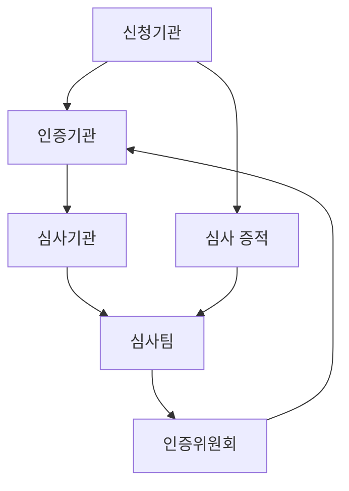
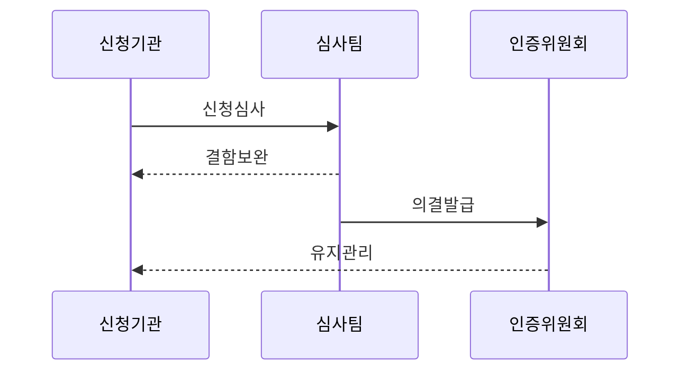

---
sidebar:
  order: 104
  label: "104. ISMS-P 인증 심사 절차 (ISMS-P Certification)"
  badge:
    text: "기출 · 70%"
    variant: note
title: "ISMS-P 인증 심사 절차 (ISMS-P Certification)"
date: "2026-07-27T23:59:59+09:00"
tags:
  - "notes-security"
weight: 104
extra:
  question_no: "104"
  source_status: "기출"
  source_history: "138회"
  priority: 70
  priority_note: "138회 최신 기출이며 인증 준비·심사 절차가 명확함"
---

## 미리 알고가기

- **정보보호 및 개인정보보호 관리체계(Personal Information & Information Security Management System, ISMS-P)**: 정보보호와 개인정보 처리단계별 보호조치를 통합하여 인증하는 관리체계이다.
- **한국인터넷진흥원(Korea Internet & Security Agency, KISA)**: ISMS-P 제도 운영과 인터넷·정보보호 정책의 기술적 지원을 수행하는 기관이다.
- **인증기관**: 심사 접수·위원회 운영·인증서 발급
- **인증심사기관**: 심사 계약·심사팀 운영
- **심사팀**: 문서·현장 증거 및 결함 확인
- **인증위원회**: 인증 여부 의결
- **운영명세서**: 인증 범위·조직·자산·통제 운영 현황을 심사용으로 정리한 문서
- **결함**: 인증 기준을 충족하지 못해 원인 제거와 이행 증명이 필요한 사항
- **사후심사**: 인증 유효기간 중 관리체계가 계속 운영되는지 정기적으로 확인하는 심사
- **갱신심사**: 인증 만료 전에 전체 적합성을 다시 확인해 유효기간 연장을 판단하는 심사
## Ⅰ. 개요

- 정의: 관리체계의 **운영 적합성 심사·의결 절차**
- 기존 한계: 자체 점검만으로 **통제 작동 입증 곤란**

### 쉽게 이해하기 (학습용)
- 조직 보호 절차의 준수 상태를 확인함

## Ⅱ. 특징

- 문서·현장 기반 **운영 증적 심사**
- 결함 원인 시정과 **이행 증거 확인**
- 3년 유효기간 중 **매년 1회 이상 사후심사**

### 쉽게 이해하기 (학습용)
- 매년 심사로 지속적인 운영을 검증함

## Ⅲ. 아키텍처 및 구성요소

| 설계 요소 | 설명 |
|:---|:---|
| 신청기관 | 인증범위 및 운영명세서 제출 |
| 인증기관 | 심사 접수·위원회 운영 및 인증서 발급 |
| 심사기관 | 심사 계약·심사팀 구성 및 결과 보고 |
| 심사팀 | 문서·현장 심사 및 결함 확인 |
| 심사 증적 | 로그·기록 등 운영 입증 증거 |
| 인증위원회 | 인증 여부 심의 및 의결 |

### 쉽게 이해하기 (학습용)
- 신청기관의 운영 증거를 심사팀이 확인하고 위원회가 인증을 의결함

## Ⅳ. 원리 및 절차 흐름도

| 절차 | 설명 |
|:---|:---|
| 신청심사 | 범위·문서 확인과 현장 심사 |
| 결함보완 | 원인 시정과 이행 증거 제출 |
| 의결발급 | 위원회가 인증 여부 의결 |
| 유지관리 | 정기 사후·갱신 심사 수행 |

> 요약: 심사팀이 결함을 확인하고 위원회가 의결함

### 쉽게 이해하기 (학습용)
- 심사 이후 보완 과정을 거쳐 인증됨

## Ⅴ. 종류 및 비교

| ISMS-P 심사 유형 | 최초심사 | 사후심사 | 갱신심사 |
|:---|:---|:---|:---|
| 적용 기준 | 인증을 처음 취득할 때 | 인증 유효기간 중 정기 점검할 때 | 인증 만료 전 유효기간을 연장할 때 |
| 핵심 특징 | 전체 기준 최초 적합성 확인 | 관리체계 지속 운영 확인 | 전체 기준 재심사·연장 판단 |
| 한계 | 문서·실제 운영 불일치 | 변경·사고 미반영 | 누적 결함·형식적 연장 |

> 요약: 인증은 취득·유지·갱신 과정으로 구분함

### 쉽게 이해하기 (학습용)

- 최초·사후·갱신 심사는 시점과 확인 범위가 다르지만 모두 운영 증거를 봄

## Ⅵ. 실무 사례

1. 자산 변경의 **인증 범위·운영명세서 즉시 반영**

### 쉽게 이해하기 (학습용)
- 클라우드 자산과 위탁 조직이 바뀌면 인증 범위와 운영명세서를 갱신하고 관련 위험·통제·운영 증적을 다시 연결한다.

## Ⅶ. 결론

- 일회성 심사 준비의 한계를 극복하기 위해 인증 범위 최신성·통제 증적·결함 원인·시정 효과를 검토하여, ISMS-P 인증의 지속 적합성을 입증해야 한다.

### 쉽게 이해하기 (학습용)
- 취득 뒤에도 운영 기록을 남기고 결함 원인을 고쳐 인증을 유지함
