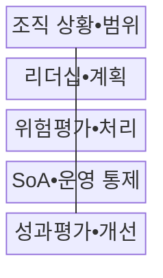
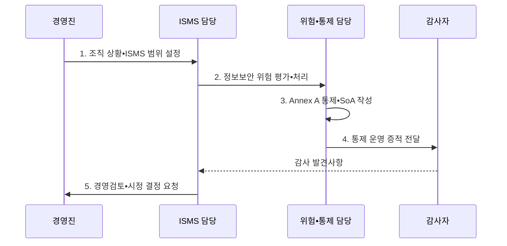

---
sidebar:
  order: 105
  label: "105. ISO/IEC 27001 정보보안 경영 시스템 (ISO 27001)"
  badge:
    text: "기출 • 70%"
    variant: note
title: "ISO/IEC 27001 정보보안 경영 시스템 (ISO 27001)"
date: "2026-08-03T14:24:00+09:00"
tags:
  - "notes-security"
weight: 105
extra:
  question_no: "105"
  source_status: "기출"
  source_history: "137회"
  priority: 70
  priority_note: "137회 기출이며 국제 보안경영 체계 비교에 유용함"
---

## Ⅰ. 개요

핵심 용어

- **ISO/IEC 27001•ISMS**: 정보보안 위험과 통제를 조직 상황•리더십•계획•운영•평가•개선의 경영 주기로 관리하는 인증 요구표준과 체계이다.
- **위험 기반 통제**: 통제 목록을 일괄 적용하지 않고 조직의 자산•위협•업무 영향을 평가한 결과로 선택•제외 근거를 정하는 방식이다.

- 정의/개념: **ISO/IEC 27001** 은 위험 기반 정보보안 경영시스템(ISMS)의 인증 요구사항을 규정한 국제표준
- 배경/필요성: 통제 목록 적용만으로는 경영목표•위험과 **보호조치 근거 연결 곤란**

#### 한줄 요약

- 위험을 평가해 통제를 선택하고 운영 결과를 계속 개선한다.

## Ⅱ. 특징

핵심 용어

- **SoA(Statement of Applicability, 적용성 선언서)**: 각 정보보안 통제의 적용•제외 여부와 위험 처리 근거, 현재 구현 상태를 기록한 문서이다.
- **내부감사•경영검토**: 통제 효과와 부적합을 독립적으로 점검하고 경영진이 목표•자원•시정 방향을 결정하는 개선 절차이다.

- 조직 상황•이해관계자 기반 **ISMS 범위**
- 위험평가•처리 기반 **통제 선택•SoA**
- 내부감사•경영검토 기반 **지속 개선**

#### 한줄 요약

- SoA에 통제의 적용•제외 사유와 구현 상태를 기록한다.

## Ⅲ. 구조 및 구성요소

핵심 용어

- **조직 상황•범위**: 이해관계자 요구, 내부•외부 이슈, 서비스•조직•정보 경계를 반영해 ISMS 적용 대상을 정한 것이다.
- **성과평가•시정조치**: 지표•감사•경영검토로 통제 결과를 평가하고 부적합의 원인을 제거해 재발을 방지한다.

| 구성요소 | 책임 |
|:---|:---|
| 조직 상황•범위 | **이해관계자 요구•ISMS 경계** 설정 |
| 리더십•계획 | **정책•역할•정보보호 목표** 승인 |
| 위험평가•처리 | **위험 기준•처리 계획** 수립 |
| SoA•운영 통제 | **통제 선택 근거•운영 결과** 기록 |
| 성과평가•개선 | **감사•경영검토•시정조치** 수행 |

#### 한줄 요약

- 범위와 목표를 정하고 위험에 맞는 통제를 운영•평가한다.

## Ⅳ. 흐름도

핵심 용어

- **Annex A•운영 증적**: 위험 처리 때 참고하는 통제 목록과 선택한 통제가 실제 작동했음을 보여 주는 로그•승인•지표 자료이다.
- **위험-SoA-운영 연결**: 평가한 위험, 선택•제외한 통제 근거, 구현 상태와 결과를 일관되게 추적하는 구조이다.

**동작 원리**

1. **조직 상황•ISMS 범위 설정**: 이해관계자•경계•요구사항 확정
2. **정보보안 위험 평가•처리**: 위험 기준•우선순위•대응 결정
3. **Annex A 통제•SoA 작성**: 적용•제외 근거와 상태 기록
4. **통제 운영 증적 전달**: 지표•로그•승인 기록을 감사자에게 제공
5. **경영검토•시정 결정 요청**: 통제 효과•부적합•개선안을 경영진에 상신

#### 한줄 요약

- SoA의 통제 선택 근거와 실제 운영 결과를 감사로 검증한다.

## Ⅴ. 종류 및 비교

핵심 용어

- **ISO/IEC 27001•27002**: 27001은 ISMS 인증 요구사항을 규정하고 27002는 조직•인적•물리•기술의 93개 통제 구현 지침을 제공한다.

| 표준 | 역할 | 연계 방식 |
|:---|:---|:---|
| **국제표준화기구•국제전기기술위원회(International Organization for Standardization/International Electrotechnical Commission, ISO/IEC) 27001:2022** | **정보보호 관리체계 요구사항•인증 기준** | 위험 처리 결과에 따라 부속서 A 통제 선택 |
| **ISO/IEC 27002:2022** | **조직•인적•물리•기술 통제 구현 지침** | 선택한 통제의 목적•속성•구현 방법 보완 |

#### 한줄 요약

- 27001은 인증 요구사항, 27002는 통제 구현 지침이다.

## Ⅵ. 실무 고려사항 및 대책

핵심 용어

- **ISO/IEC 27001:2022•27002:2022**: 위험 기반 경영시스템 인증 요구와 부속서 A에 대응하는 통제 목적•구현 지침을 각각 제공한다.
- **Amd 1:2024**: 조직 상황과 이해관계자 요구를 평가할 때 기후변화의 관련성을 고려하도록 추가한 개정이다.

| 문제 | 대책 | 효과 |
|:---|:---|:---|
| **ISMS 인증 요구** | **ISO/IEC 27001:2022 적용** | 위험 기반 **운영 증명** |
| **통제 설계•구현** | **ISO/IEC 27002:2022 참조** | **93개 통제** 구체화 |
| **기후변화 관련성** | **27001 Amd 1:2024 검토** | **조직 상황** 누락 방지 |

#### 한줄 요약

- 외부 사업자와 데이터 흐름도 범위•위험평가•SoA에 연결한다.

## Ⅶ. 결론

핵심 용어

- **ISMS 운영 증명**: 위험별 통제 선택 근거와 실제 수행 결과, 감사•경영검토•시정 이력을 계속 설명할 수 있는 상태이다.

- ISMS 인증은 **27001**, 통제 구현은 **27002**, 위험별 선택 근거는 SoA에 기록

#### 한줄 요약

- 위험별 통제 선택 근거와 실제 운영 결과를 계속 증명한다.
