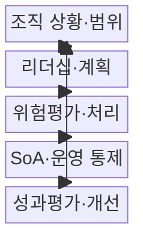
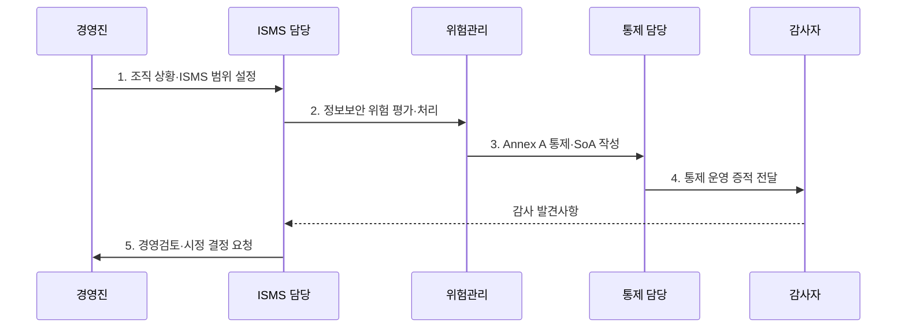

---
sidebar:
  order: 105
  label: "105. ISO/IEC 27001 정보보안 경영 시스템 (ISO 27001)"
  badge:
    text: "기출 · 70%"
    variant: note
title: "ISO/IEC 27001 정보보안 경영 시스템 (ISO 27001)"
date: "2026-07-31T02:05:58+09:00"
tags:
  - "notes-security"
weight: 105
extra:
  question_no: "105"
  source_status: "기출"
  source_history: "137회"
  priority: 70
  priority_note: "137회 기출이며 국제 보안경영 체계 비교에 유용함"
---

## 미리 알고가기

- **국제표준화기구(International Organization for Standardization, ISO)**: 산업·기술·경영 분야의 국제 표준을 제정하는 비정부 국제기구이다.
- **국제전기기술위원회(International Electrotechnical Commission, IEC)**: ISO와 함께 정보보안·전기·전자 분야의 국제 표준을 제정하는 기관이다.
- **정보보안 경영시스템(Information Security Management System, ISMS)**: 정보보안 위험과 통제를 조직적으로 수립·운영·점검·개선하는 경영체계이다.
- **적용성 선언서(Statement of Applicability, SoA)**: 각 보안 통제의 적용·제외 여부와 그 근거 및 구현 상태를 기록한 문서이다.
- **ISO/IEC 27001:2022**: ISMS 수립·운영·평가·개선을 위한 인증 요구사항을 규정한 국제표준이다.
- **ISO/IEC 27002:2022**: 조직·인적·물리·기술의 4개 주제와 93개 정보보안 통제 구현 지침을 제공하는 국제표준이다.
- **부속서 A(Annex A)**: 위험 처리 시 참조하는 93개 정보보안 통제 목록이다.
- **개정 1(Amendment 1, Amd 1)**: ISO/IEC 27001:2022에 기후변화 고려사항을 추가한 2024년 개정이다.

## Ⅰ. 개요

- 정의/개념: 위험 기반 **정보보안 경영시스템 요구표준**
- 배경/필요성: 통제 목록 적용만으로는 경영목표·위험과 **보호조치 근거 연결 곤란**

### 쉽게 이해하기 (학습용)

- 위험을 평가해 통제를 선택하고 운영 결과를 계속 개선한다.

## Ⅱ. 특징

- 조직 상황·이해관계자 기반 **ISMS 범위**
- 위험평가·처리 기반 **통제 선택·SoA**
- 내부감사·경영검토 기반 **지속 개선**

### 쉽게 이해하기 (학습용)

- SoA에 통제의 적용·제외 사유와 구현 상태를 기록한다.

## Ⅲ. 구조 및 구성요소

| 구성요소 | 책임 |
|:---|:---|
| 조직 상황·범위 | **이해관계자 요구·ISMS 경계** 설정 |
| 리더십·계획 | **정책·역할·정보보호 목표** 승인 |
| 위험평가·처리 | **위험 기준·처리 계획** 수립 |
| SoA·운영 통제 | **통제 선택 근거·운영 결과** 기록 |
| 성과평가·개선 | **감사·경영검토·시정조치** 수행 |

### 쉽게 이해하기 (학습용)

- 범위와 목표를 정하고 위험에 맞는 통제를 운영·평가한다.

## Ⅳ. 흐름도

**동작 원리**

1. **조직 상황·ISMS 범위 설정**: 이해관계자·경계·요구사항 확정
2. **정보보안 위험 평가·처리**: 위험 기준·우선순위·대응 결정
3. **Annex A 통제·SoA 작성**: 적용·제외 근거와 상태 기록
4. **통제 운영 증적 전달**: 지표·로그·승인 기록을 감사자에게 제공
5. **경영검토·시정 결정 요청**: 통제 효과·부적합·개선안을 경영진에 상신

### 쉽게 이해하기 (학습용)

- SoA의 통제 선택 근거와 실제 운영 결과를 감사로 검증한다.

## Ⅴ. 종류 및 비교

| ISO 정보보안 표준 | ISO/IEC 27001:2022 | ISO/IEC 27002:2022 |
|:---|:---|:---|
| 적용 기준 | **ISMS 구축·인증** | **통제 구현 지침** 활용 |
| 핵심 특징 | **조항 4~10·Annex A** | **4개 주제·93개 통제** |
| 한계 | 통제 목록의 **형식적 적용** | 독립 **인증표준 아님** |

### 쉽게 이해하기 (학습용)

- 27001은 인증 요구사항, 27002는 통제 구현 지침이다.

## Ⅵ. 실무 고려사항 및 대책

| 고려사항 | 대책 | 효과 |
|:---|:---|:---|
| **ISMS 인증 요구** | **ISO/IEC 27001:2022 적용** | 위험 기반 **운영 증명** |
| **통제 설계·구현** | **ISO/IEC 27002:2022 참조** | **93개 통제** 구체화 |
| **기후변화 관련성** | **27001 Amd 1:2024 검토** | **조직 상황** 누락 방지 |

### 쉽게 이해하기 (학습용)

- 외부 사업자와 데이터 흐름도 범위·위험평가·SoA에 연결한다.

## Ⅶ. 결론

- ISMS 인증은 **27001**, 통제 구현은 **27002**, 위험별 선택 근거는 SoA에 기록

### 쉽게 이해하기 (학습용)

- 위험별 통제 선택 근거와 실제 운영 결과를 계속 증명한다.
