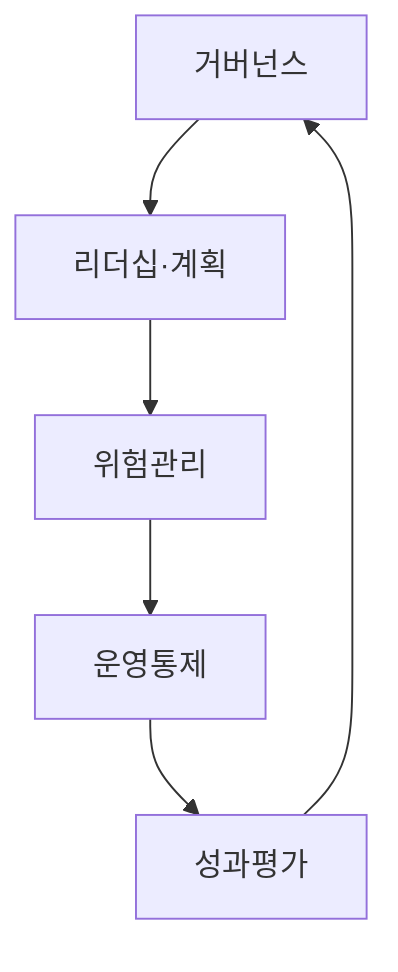
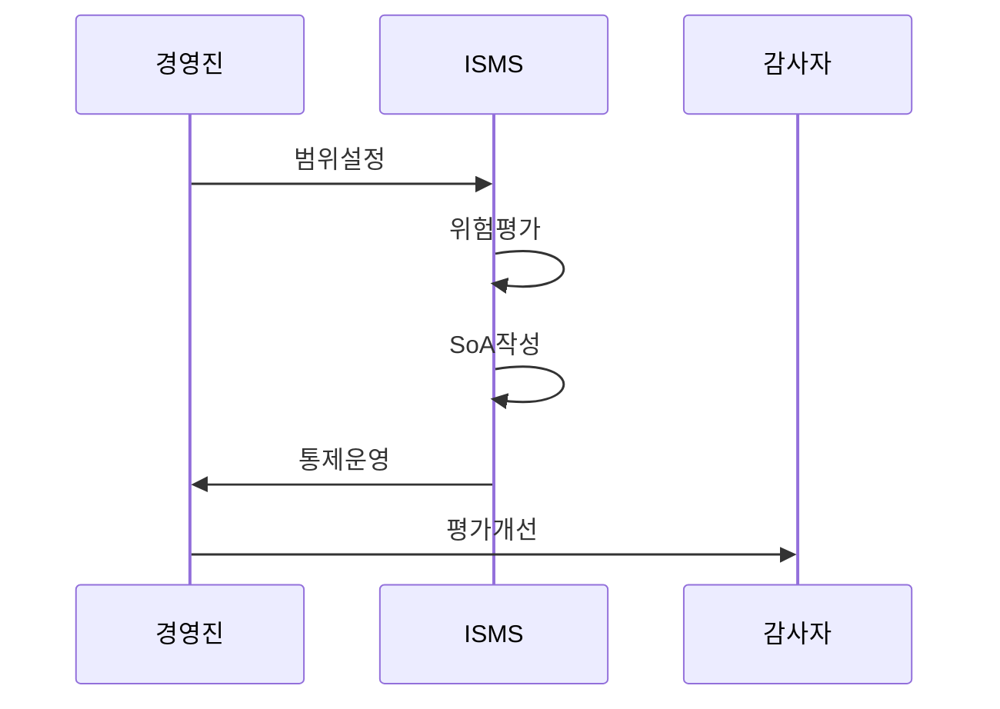

---
sidebar:
  order: 105
  label: "105. ISO/IEC 27001 정보보안 경영 시스템 (ISO 27001)"
  badge:
    text: "기출 · 70%"
    variant: note
title: "ISO/IEC 27001 정보보안 경영 시스템 (ISO 27001)"
date: "2026-07-27T23:59:59+09:00"
tags:
  - "notes-security"
weight: 105
extra:
  question_no: "105"
  source_status: "기출"
  source_history: "137회"
  priority: 70
  priority_note: "137회 기출이며 국제 보안경영 체계 비교에 유용함"
---

## 미리 알고가기

- **국제표준화기구(International Organization for Standardization, ISO)**: “아이에스오”로 읽고 국제 표준을 제정하는 기구의 영문 명칭을 약칭한 표기임
- **국제전기기술위원회(International Electrotechnical Commission, IEC)**: “아이이시”로 읽고 영문 머리글자로 표기하며, ISO와 함께 정보보안 표준을 제정함
- **정보보안 경영시스템(Information Security Management System, ISMS)**: “아이에스엠에스”로 읽고 영문 머리글자로 표기하며, 정보보안 위험과 통제를 운영·개선하는 경영체계임
- **적용성 선언서(Statement of Applicability, SoA)**: “에스오에이”로 읽고 영문 머리글자로 표기하며, 각 통제의 적용·제외 여부와 근거를 기록함
- **부속서 A (Annex A)**: 위험 처리에 참고하도록 제시한 정보보안 통제 목록
- **내부감사**: 조직이 ISMS 요구사항 준수와 효과를 독립적으로 점검하는 활동
- **경영검토**: 경영진이 성과·변경·감사 결과를 보고 개선 결정을 내리는 활동
- **부적합**: 표준 요구사항을 충족하지 못해 원인 분석과 시정이 필요한 상태
## Ⅰ. 개요

- 정의: 위험 기반 **정보보안 경영시스템 요구표준**
- 기존 한계: 개별 통제의 **경영·위험 연계 부족**

### 쉽게 이해하기 (학습용)
- 위험 평가 후 통제를 선택·운영·개선함

## Ⅱ. 특징

- 조직 상황·이해관계자 기반 **ISMS 범위**
- 위험평가·처리 기반 **통제 선택·SoA**
- 내부감사·경영검토 기반 **지속 개선**

### 쉽게 이해하기 (학습용)
- SoA에 통제 선택 및 제외 사유 기록함

## Ⅲ. 아키텍처 및 구성요소

| 설계 요소 | 설명 |
|:---|:---|
| 거버넌스 | 이해관계자 요구 및 ISMS 범위 설정 |
| 리더십·계획 | 정책·역할 및 정보보호 목표 승인 |
| 위험관리 | 위험 평가 및 통제 처리 계획 수립 |
| 운영통제 | SoA 작성 및 운영 결과 기록·추적 |
| 성과평가 | 내부감사·경영검토 및 시정조치 수행 |

### 쉽게 이해하기 (학습용)
- 조직 범위와 목표를 정한 뒤 위험에 맞는 통제를 운영하고 평가함

## Ⅳ. 원리 및 절차 흐름도

| 절차 | 설명 |
|:---|:---|
| 범위설정 | 조직 상황과 위험 기준 수립 |
| 위험평가 | 분석과 처리 우선순위 결정 |
| SoA작성 | 통제 선택·제외 사유 기록 |
| 통제운영 | 자원 배정과 실행 결과 기록 |
| 평가개선 | 감사·검토로 부적합 시정 |

> 요약: SoA로 위험 기반 통제 운영 근거를 증명함

### 쉽게 이해하기 (학습용)
- 위험 통제 기록을 감사로 검증함

## Ⅴ. 종류 및 비교

| ISO 정보보안 표준 | ISO/IEC 27001 | ISO/IEC 27002 |
|:---|:---|:---|
| 적용 기준 | ISMS 구축·인증 기준이 필요할 때 | 위험에 맞는 통제 구현법을 고를 때 |
| 핵심 특징 | ISMS 필수 요구사항 | 통제 목적·구현 지침 |
| 한계 | 부속서 통제의 체크리스트화 | 지침을 인증 요구로 오인 |

> 요약: 27001은 요구, 27002는 지침임

### 쉽게 이해하기 (학습용)

- 27001은 인증 요구사항, 27002는 통제 구현 지침을 제공함

## Ⅵ. 실무 사례

1. 위탁 서비스의 **ISMS 범위·의존성 반영**

### 쉽게 이해하기 (학습용)
- 핵심 서비스를 운영하는 외부 사업자와 데이터 흐름을 ISMS 범위와 위험평가에 포함하고 필요한 통제와 책임을 SoA에 기록한다.

## Ⅶ. 결론

- 형식적 통제 목록 운영을 극복하기 위해 조직 상황·위험·통제 선택 근거·운영 증적·개선 결과를 검토하여, ISO 27001 기반 ISMS의 효과성을 입증해야 한다.

### 쉽게 이해하기 (학습용)
- 위험별 통제 선택 근거와 실제 운영 결과를 계속 증명함
