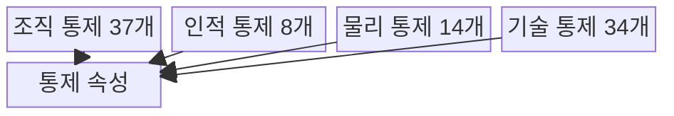
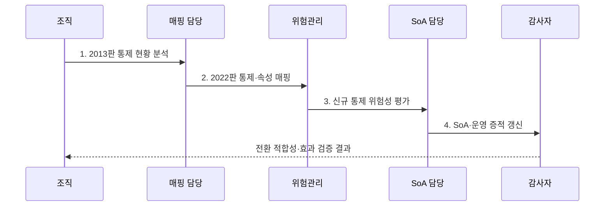

---
sidebar:
  order: 106
  label: "106. ISO/IEC 27001:2022 주요 개정 (ISO 27001 2022)"
  badge:
    text: "기출 · 50%"
    variant: note
title: "ISO/IEC 27001:2022 주요 개정 (ISO 27001 2022)"
date: "2026-07-31T02:06:23+09:00"
tags:
  - "notes-security"
weight: 106
extra:
  question_no: "106"
  source_status: "기출"
  source_history: "137회"
  priority: 50
  priority_note: "137회 개정 기출이나 버전 단독 반복은 감점함"
---

## 미리 알고가기

- **국제표준화기구(International Organization for Standardization, ISO)**: 산업·기술·경영 분야의 국제 표준을 제정하는 비정부 국제기구이다.
- **국제전기기술위원회(International Electrotechnical Commission, IEC)**: ISO와 함께 정보보안·전기·전자 분야의 국제 표준을 제정하는 기관이다.
- **정보보안 경영시스템(Information Security Management System, ISMS)**: 정보보안 위험과 통제를 조직적으로 수립·운영·점검·개선하는 경영체계이다.
- **적용성 선언서(Statement of Applicability, SoA)**: 각 보안 통제의 적용·제외 여부와 그 근거 및 구현 상태를 기록한 문서이다.
- **부속서 A(Annex A)**: ISO/IEC 27001:2022에서 조직이 위험 처리에 참고할 93개 보안 통제를 제시한 부속서이다.
- **ISO/IEC 27002:2022**: 부속서 A와 대응하는 93개 정보보안 통제의 목적·속성·구현 지침을 제공하는 국제표준이다.
- **통제 속성(Control Attribute)**: 통제를 유형·보안속성·사이버보안 개념·운영능력·보안영역으로 분류하는 태그이다.

## Ⅰ. 개요

- 정의/개념: 부속서 A를 **4개 주제·93개 통제**로 개편
- 배경/필요성: 2013판 도메인만으로는 클라우드·위협정보 등 **신규 위험 반영 곤란**

### 쉽게 이해하기 (학습용)

- 유사 통제를 합치고 최근 보안 환경에 필요한 통제를 추가했다.

## Ⅱ. 특징

- 14개 도메인에서 **4개 통제 주제**로 재구성
- 114개에서 **93개 통제**로 통합·개편
- 위협정보·클라우드 등 **11개 신규 통제**

### 쉽게 이해하기 (학습용)

- 통제 수 감소는 단순 삭제가 아니라 통합·재구성 결과이다.

## Ⅲ. 구조 및 구성요소

| 구성요소 | 책임 |
|:---|:---|
| 조직 통제 37개 | **정책·자산·공급망·사고** 관리 |
| 인적 통제 8개 | **채용·책임·교육·원격근무** |
| 물리 통제 14개 | **경계·출입·장비·매체** 보호 |
| 기술 통제 34개 | **인증·로깅·개발·데이터** 보호 |
| 통제 속성 | **다차원 통제 분류·검색** 지원 |

### 쉽게 이해하기 (학습용)

- 93개 통제를 조직·사람·시설·기술의 네 주제로 묶었다.

## Ⅳ. 흐름도

**동작 원리**

1. **2013판 통제 현황 분석**: 기존 SoA·운영 통제 식별
2. **2022판 통제·속성 매핑**: 병합·분할·신규 관계 기록
3. **신규 통제 위험성 평가**: 적용 필요성과 우선순위 판단
4. **SoA·운영 증적 갱신**: 적용·제외 근거·상태 기록

### 쉽게 이해하기 (학습용)

- 번호만 바꾸지 않고 위험·SoA·실제 운영을 함께 맞춘다.

## Ⅴ. 종류 및 비교

| ISO/IEC 27001 판본 | 2022판 | 2013판 |
|:---|:---|:---|
| 적용 기준 | **신규 위험·통제 재매핑** | **기존 통제·SoA 운영** |
| 핵심 특징 | **4개 주제·93개 통제** | **14개 도메인·114개 통제** |
| 한계 | 번호 치환 시 **통제 목적 누락** | **최신 위협 통제** 누락 |

### 쉽게 이해하기 (학습용)

- 2022판은 통제 구조와 번호가 달라 기존 SoA를 재검토해야 한다.

## Ⅵ. 실무 고려사항 및 대책

| 고려사항 | 대책 | 효과 |
|:---|:---|:---|
| **통제 구조 전환** | **27002:2022의 93개 통제 매핑** | **SoA 누락** 방지 |
| **최신 기술 위험** | **위협정보·클라우드 통제 평가** | **신규 위험** 대응 |
| **조직 상황 변화** | **27001 Amd 1:2024 검토** | **기후변화 관련성** 반영 |

### 쉽게 이해하기 (학습용)

- 위협정보·클라우드·데이터 마스킹 통제의 필요성을 평가한다.

## Ⅶ. 결론

- 번호 치환 대신 **신규 위험 재평가** 후 **SoA·운영 증적** 갱신

### 쉽게 이해하기 (학습용)

- 새 번호보다 바뀐 위험과 통제의 실제 연결 여부가 중요하다.
