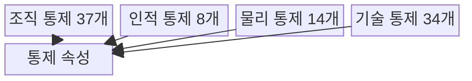
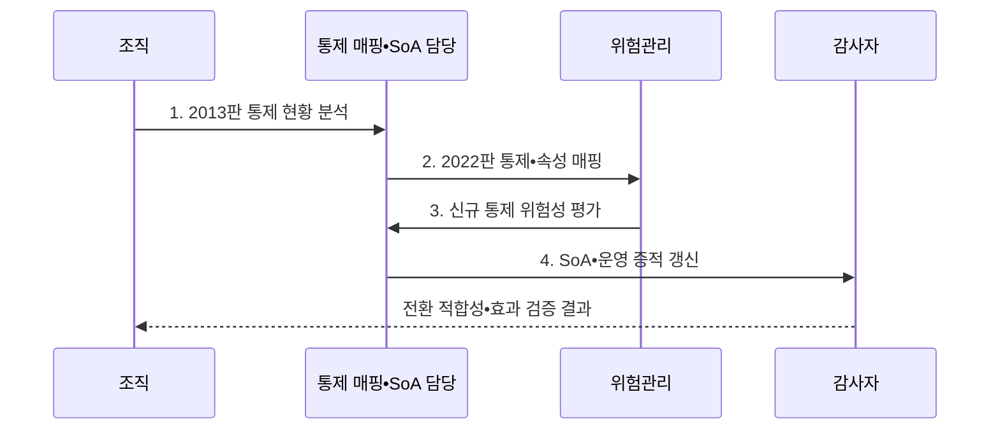

---
sidebar:
  order: 106
  label: "106. ISO/IEC 27001:2022 주요 개정 (ISO 27001 2022)"
  badge:
    text: "기출 • 50%"
    variant: note
title: "ISO/IEC 27001:2022 주요 개정 (ISO 27001 2022)"
date: "2026-08-03T08:48:47+09:00"
tags:
  - "notes-security"
weight: 106
extra:
  question_no: "106"
  source_status: "기출"
  source_history: "137회"
  priority: 50
  priority_note: "137회 개정 기출이나 버전 단독 반복은 감점함"
---

## Ⅰ. 개요

핵심 용어

- **ISO/IEC 27001:2022 개정**: 부속서 A 통제를 14개 도메인•114개에서 조직•인적•물리•기술 4개 주제•93개로 통합•재구성한 개정이다.
- **신규 위험 반영**: 위협정보•클라우드•데이터 마스킹 등 변화한 보안 환경을 위험평가와 통제 선택에 새로 반영하는 목적이다.

- 정의/개념: **ISO/IEC 27001:2022 개정** 은 부속서 A를 4개 주제•93개 통제로 통합•재구성한 개정
- 배경/필요성: 2013판 도메인만으로는 클라우드•위협정보 등 **신규 위험 반영 곤란**

#### 한줄 요약

- 유사 통제를 합치고 최근 보안 환경에 필요한 통제를 추가했다.

## Ⅱ. 특징

핵심 용어

- **4개 주제•93개 통제**: 조직 37개, 인적 8개, 물리 14개, 기술 34개로 통제를 재편하고 유사 항목을 통합한 구조이다.
- **11개 신규 통제**: 위협정보•클라우드 서비스•업무 연속성 보안•구성 관리•정보 삭제 등 최신 위험을 다루는 추가 통제이다.

- 14개 도메인에서 **4개 통제 주제** 로 재구성
- 114개에서 **93개 통제** 로 통합•개편
- 위협정보•클라우드 등 **11개 신규 통제**

#### 한줄 요약

- 통제 수 감소는 단순 삭제가 아니라 통합•재구성 결과이다.

## Ⅲ. 구조 및 구성요소

핵심 용어

- **조직•인적•물리•기술 통제**: 정책•사람•시설•시스템의 책임과 보호조치를 네 개 주제로 분류한 부속서 A 구조이다.
- **통제 속성**: 통제를 유형•보안속성•사이버보안 개념•운영능력•보안영역으로 다차원 분류하는 태그이다.

| 구성요소 | 책임 |
|:---|:---|
| 조직 통제 37개 | **정책•자산•공급망•사고** 관리 |
| 인적 통제 8개 | **채용•책임•교육•원격근무** |
| 물리 통제 14개 | **경계•출입•장비•매체** 보호 |
| 기술 통제 34개 | **인증•로깅•개발•데이터** 보호 |
| 통제 속성 | **다차원 통제 분류•검색** 지원 |

#### 한줄 요약

- 93개 통제를 조직•사람•시설•기술의 네 주제로 묶었다.

## Ⅳ. 흐름도

핵심 용어

- **2013-2022 통제 매핑**: 기존 통제의 병합•분할•신규 관계와 통제 목적 변화를 기록하여 누락 없이 전환하는 활동이다.
- **SoA(Statement of Applicability)•운영 증적 갱신**: 새 통제 번호뿐 아니라 적용성 선언서의 적용•제외 위험 근거, 구현 상태, 실제 수행 자료를 함께 바꾸는 과정이다.

**동작 원리**

1. **2013판 통제 현황 분석**: 기존 SoA•운영 통제 식별
2. **2022판 통제•속성 매핑**: 병합•분할•신규 관계 기록
3. **신규 통제 위험성 평가**: 적용 필요성과 우선순위 판단
4. **SoA•운영 증적 갱신**: 적용•제외 근거•상태 기록

#### 한줄 요약

- 번호만 바꾸지 않고 위험•SoA•실제 운영을 함께 맞춘다.

## Ⅴ. 종류 및 비교

핵심 용어

- **2013판•2022판**: 2013판은 14개 도메인•114개 통제, 2022판은 4개 주제•93개 통제와 신규 위험 항목을 사용한다.

| ISO/IEC 27001 판본 | 2022판 | 2013판 |
|:---|:---|:---|
| 적용 기준 | **신규 위험•통제 재매핑** | **기존 통제•SoA 운영** |
| 핵심 특징 | **4개 주제•93개 통제** | **14개 도메인•114개 통제** |
| 한계 | 번호 치환 시 **통제 목적 누락** | **최신 위협 통제** 누락 |

#### 한줄 요약

- 2022판은 통제 구조와 번호가 달라 기존 SoA를 재검토해야 한다.

## Ⅵ. 실무 고려사항 및 대책

핵심 용어

- **ISO/IEC 27002:2022**: 부속서 A의 93개 통제 목적•속성•구현 지침을 제공하여 SoA 재매핑과 운영 설계를 지원한다.
- **Amd 1:2024**: 조직 상황과 이해관계자 요구에서 기후변화 관련성을 검토하도록 ISO 관리체계 표준에 추가한 개정이다.

| 문제 | 대책 | 효과 |
|:---|:---|:---|
| **통제 구조 전환** | **27002:2022의 93개 통제 매핑** | **SoA 누락** 방지 |
| **최신 기술 위험** | **위협정보•클라우드 통제 평가** | **신규 위험** 대응 |
| **조직 상황 변화** | **27001 Amd 1:2024 검토** | **기후변화 관련성** 반영 |

#### 한줄 요약

- 위협정보•클라우드•데이터 마스킹 통제의 필요성을 평가한다.

## Ⅶ. 결론

핵심 용어

- **목적 기반 전환**: 통제 번호만 치환하지 않고 바뀐 위험•통제 목적•SoA 근거•운영 증적을 함께 재평가하는 원칙이다.

- 번호 치환 대신 **신규 위험 재평가** 후 **SoA•운영 증적** 갱신

#### 한줄 요약

- 새 번호보다 바뀐 위험과 통제의 실제 연결 여부가 중요하다.
