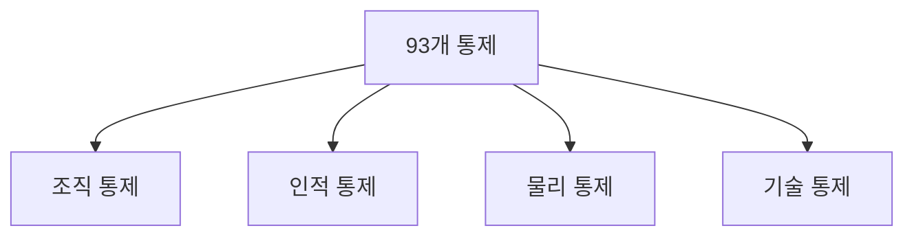
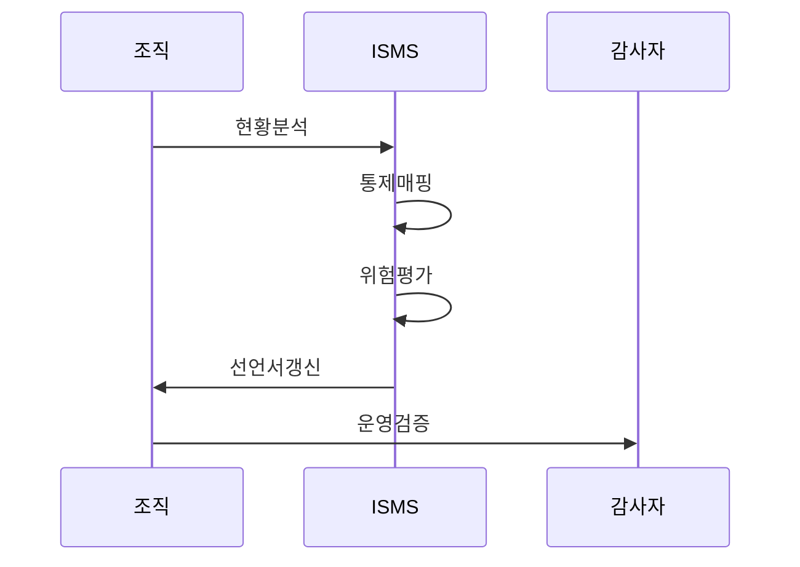

---
sidebar:
  order: 106
  label: "106. ISO/IEC 27001:2022 주요 개정 (ISO 27001 2022)"
  badge:
    text: "기출 · 50%"
    variant: note
title: "ISO/IEC 27001:2022 주요 개정 (ISO 27001 2022)"
date: "2026-07-27T23:59:59+09:00"
tags:
  - "notes-security"
weight: 106
extra:
  question_no: "106"
  source_status: "기출"
  source_history: "137회"
  priority: 50
  priority_note: "137회 개정 기출이나 버전 단독 반복은 감점함"
---

## 미리 알고가기

- **국제표준화기구(International Organization for Standardization, ISO)**: “아이에스오”로 읽고 국제 표준을 제정하는 기구의 영문 명칭을 약칭한 표기임
- **국제전기기술위원회(International Electrotechnical Commission, IEC)**: “아이이시”로 읽고 영문 머리글자로 표기하며, ISO와 함께 정보보안 표준을 제정함
- **정보보안 경영시스템(Information Security Management System, ISMS)**: “아이에스엠에스”로 읽고 영문 머리글자로 표기하며, 정보보안 위험과 통제를 운영·개선하는 경영체계임
- **적용성 선언서(Statement of Applicability, SoA)**: “에스오에이”로 읽고 영문 머리글자로 표기하며, 통제 적용·제외 여부와 근거를 기록함
- **부속서 A(Annex A)**: “아넥스 에이”로 읽으며, A는 표준의 첫 번째 부속서를 가리키고 2022판의 93개 참조 통제를 제시함

## Ⅰ. 개요

- 정의: 부속서 A를 **4개 주제·93개 통제**로 개편
- 기존 한계: 2013판의 **최신 기술 위험 반영 부족**

### 쉽게 이해하기 (학습용)

- 유사 통제 통합 및 최근 환경 통제 추가

## Ⅱ. 특징

- 14개 도메인에서 **4개 통제 주제**로 재구성
- 114개에서 **93개 통제**로 통합·개편
- 위협정보·클라우드 등 **11개 신규 통제**

### 쉽게 이해하기 (학습용)

- 숫자가 줄었어도 통제가 삭제된 것만은 아니며 여러 통제가 합쳐지거나 최신 내용으로 바뀜

## Ⅲ. 아키텍처 및 구성요소

| 설계 요소 | 설명 |
|:---|:---|
| 조직 통제 | 정책·자산·공급망 등 37개 통제 |
| 인적 통제 | 채용·책임·교육 등 8개 통제 |
| 물리 통제 | 경계·출입·장비 등 14개 통제 |
| 기술 통제 | 인증·로깅·개발 등 34개 통제 |

### 쉽게 이해하기 (학습용)

- 93개 통제는 담당 조직, 사람, 시설, 기술이라는 운영 대상에 따라 네 묶음으로 나뉨

## Ⅳ. 원리 및 절차 흐름도

| 절차 | 설명 |
|:---|:---|
| 현황분석 | 기존 SoA·운영 통제와 대조 |
| 통제매핑 | 병합·분할·신규 관계 기록 |
| 위험평가 | 신규 통제 적용 여부 판단 |
| 선언서갱신 | 적용·제외 근거와 상태 갱신 |
| 운영검증 | 책임·증거·구현 효과 확인 |

> 요약: 새 구조로 위험·SoA·운영을 재정렬함

### 쉽게 이해하기 (학습용)

- 번호만 바꾸지 말고 새 위험을 다시 평가해 SoA와 실제 운영을 함께 맞춰야 함

## Ⅴ. 종류 및 비교

| ISO/IEC 27001 판본 | 2022판 | 2013판 |
|:---|:---|:---|
| 적용 기준 | 재매핑·신규 위험 평가 | 기존 통제 번호·SoA 기준 |
| 핵심 특징 | 4개 주제·93개 통제 | 14개 도메인·114개 통제 |
| 한계 | 번호 치환 시 통제 목적 누락 | 최신 위협 통제 누락 |

### 쉽게 이해하기 (학습용)

- 2022판에서는 통제를 찾는 분류 방식과 번호가 바뀌어 기존 SoA를 그대로 쓸 수 없음

## Ⅵ. 실무 사례

1. 병합·분할 통제의 **목적·증적 재검증**
2. 신규 통제의 **위험평가·SoA 갱신**
3. 2024 개정의 **기후변화 관련성 검토**

### 쉽게 이해하기 (학습용)

- 병합·분할된 통제는 번호가 아니라 목적과 운영 증거를 다시 연결함
- 신규 통제는 조직 위험에 필요한지 평가한 뒤 SoA에 근거를 남김
- 기후변화가 ISMS에 관련되는지 검토하고 판단 근거를 기록함

## Ⅶ. 결론

- **위험·SoA·운영 증적**을 2022 구조로 전환

### 쉽게 이해하기 (학습용)

- 새 표준을 적용했다는 표시는 문서 번호가 아니라 바뀐 위험과 통제가 실제로 연결되는지로 판단함
