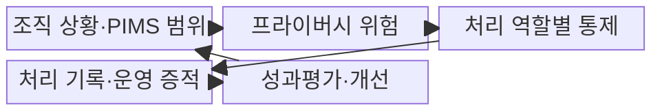
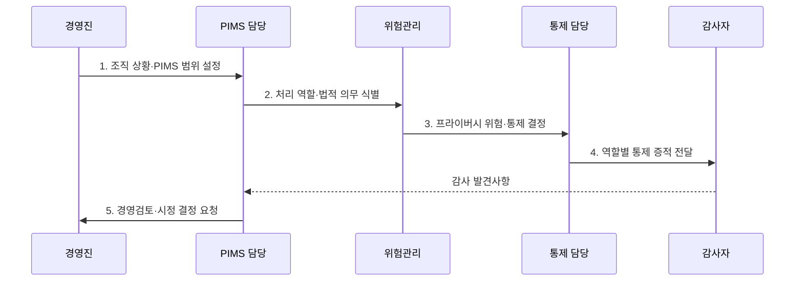

---
sidebar:
  order: 107
  label: "107. ISO/IEC 27701 개인정보 경영 시스템 (ISO 27701)"
  badge:
    text: "기출 · 30%"
    variant: note
title: "ISO/IEC 27701 개인정보 경영 시스템 (ISO 27701)"
date: "2026-07-31T02:06:45+09:00"
tags:
  - "notes-security"
weight: 107
extra:
  question_no: "107"
  source_status: "기출"
  source_history: "126회"
  priority: 30
  priority_note: "126회 기출이며 167·170과 비교할 때 가치가 있음"
---

## 미리 알고가기

- **국제표준화기구(International Organization for Standardization, ISO)**: 산업·기술·경영 분야의 국제 표준을 제정하는 비정부 국제기구이다.
- **국제전기기술위원회(International Electrotechnical Commission, IEC)**: ISO와 함께 정보보호·전기·전자 분야의 국제 표준을 제정하는 기관이다.
- **프라이버시 정보 관리체계(Privacy Information Management System, PIMS)**: 개인정보 위험과 통제 증거를 조직적으로 수립·운영·점검·개선하는 관리체계이다.
- **개인식별정보(Personally Identifiable Information, PII)**: 단독 또는 다른 정보와 결합하여 특정 개인을 식별할 수 있는 정보이다.
- **PII 컨트롤러(PII Controller)**: 개인정보 처리 목적과 수단을 결정하고 처리에 책임지는 주체이다.
- **PII 프로세서(PII Processor)**: 컨트롤러의 지시에 따라 개인정보를 대신 처리하는 주체이다.
- **ISO/IEC 27701:2025**: 단독 구축·인증할 수 있는 PIMS 요구사항과 지침을 규정한 제2판 국제표준이다.
- **ISO/IEC 27706:2025**: PIMS 감사·인증기관의 역량과 일관성 요구사항을 규정한 국제표준이다.

> **키워드:** ISO/IEC 27701 개인정보 경영 시스템 (ISO 27701)

## Ⅰ. 개요

- 정의/개념: 개인정보 처리 위험의 **독립 PIMS 요구표준**
- 배경/필요성: 일반 ISMS만으로는 정보주체 영향과 **처리 역할별 책임 입증 곤란**

### 쉽게 이해하기 (학습용)

- 안전한 보관뿐 아니라 처리 목적과 역할별 책임까지 관리한다.

## Ⅱ. 특징

- 2025판의 **독립 구축·인증 가능한 PIMS**
- 컨트롤러·프로세서별 **책임·통제 구분**
- 감사·경영검토 기반 **지속적 개선**

### 쉽게 이해하기 (학습용)

- 목적 결정자와 위탁 처리자의 책임을 구분해 운영한다.

## Ⅲ. 구조 및 구성요소

| 구성요소 | 책임 |
|:---|:---|
| 조직 상황·PIMS 범위 | **처리 활동·법적 요구** 반영 |
| 프라이버시 위험 | **정보주체 영향** 식별·평가·처리 |
| 처리 역할별 통제 | 역할별 **책임·보호조치** 적용 |
| 처리 기록·운영 증적 | **목적·제공·보유·권리 기록** |
| 성과평가·개선 | **감사·경영검토·시정조치** 반복 |

### 쉽게 이해하기 (학습용)

- 처리 목록에서 역할과 위험을 찾아 통제하고 결과를 감사한다.

## Ⅳ. 흐름도

**동작 원리**

1. **조직 상황·PIMS 범위 설정**: 서비스·처리 활동 경계 설정
2. **처리 역할·법적 의무 식별**: 목적·위탁 관계로 책임 구분
3. **프라이버시 위험·통제 결정**: 정보주체 영향·대책 평가
4. **역할별 통제 증적 전달**: 권리·제공·보유 결과를 감사자에게 제공
5. **경영검토·시정 결정 요청**: 부적합 원인·절차 개선안을 경영진에 상신

### 쉽게 이해하기 (학습용)

- 처리 목적과 역할을 알아야 책임과 보호조치를 정확히 정한다.

## Ⅴ. 종류 및 비교

| ISO 관리체계 | ISO/IEC 27701:2025 | ISO/IEC 27001:2022 |
|:---|:---|:---|
| 적용 기준 | **개인정보 처리 책임** 관리 | **정보보안 위험** 관리 |
| 핵심 특징 | **독립 PIMS 요구사항** | **ISMS 인증 요구사항** |
| 한계 | 법률 준수를 **인증으로 오인** | **개인정보 처리 책임** 누락 |

### 쉽게 이해하기 (학습용)

- 27001은 정보보안, 27701은 개인정보 처리 책임에 초점을 둔다.

## Ⅵ. 실무 고려사항 및 대책

| 고려사항 | 대책 | 효과 |
|:---|:---|:---|
| **독립 PIMS 구축** | **ISO/IEC 27701:2025 적용** | **책임·통제 증적** 확보 |
| **공통 원칙·용어** | **ISO/IEC 29100:2024 연계** | 처리 기준 **일관성** 확보 |
| **인증기관 역량** | **ISO/IEC 27706:2025 확인** | **감사·인증 신뢰** 확보 |

### 쉽게 이해하기 (학습용)

- SaaS 계약의 처리 역할과 실제 처리·권리 대응 기록을 맞춘다.

## Ⅶ. 결론

- 정보보안 위험은 **27001**, PII 역할·생명주기는 **27701**, 법률 준수는 별도 검증

### 쉽게 이해하기 (학습용)

- 개인정보 보호 선언을 실제 역할·처리 기록으로 증명한다.
