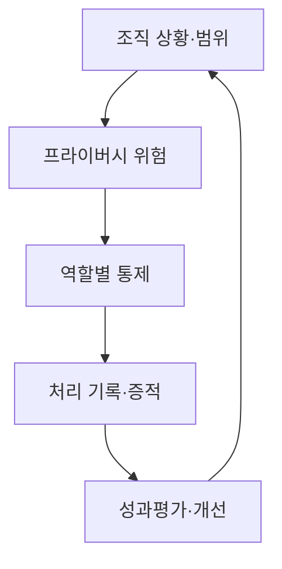
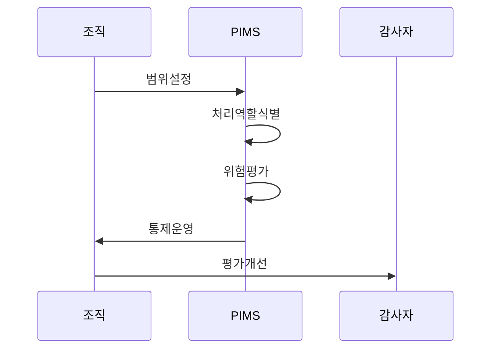

---
sidebar:
  order: 107
  label: "107. ISO/IEC 27701 개인정보 경영 시스템 (ISO 27701)"
  badge:
    text: "기출 · 30%"
    variant: note
title: "ISO/IEC 27701 개인정보 경영 시스템 (ISO 27701)"
date: "2026-07-27T23:59:59+09:00"
tags:
  - "notes-security"
weight: 107
extra:
  question_no: "107"
  source_status: "기출"
  source_history: "126회"
  priority: 30
  priority_note: "126회 기출이며 167·170과 비교할 때 가치가 있음"
---

## 미리 알고가기

- **국제표준화기구(International Organization for Standardization, ISO)**: 산업·기술·경영 분야의 국제 표준을 제정하는 비정부 국제기구이다.
- **국제전기기술위원회(International Electrotechnical Commission, IEC)**: ISO와 함께 정보보호·전기·전자 분야의 국제 표준을 제정하는 기관이다.
- **프라이버시 정보 관리체계(Privacy Information Management System, PIMS)**: 개인정보 위험과 통제 증거를 조직적으로 수립·운영·점검·개선하는 관리체계이다.
- **개인식별정보(Personally Identifiable Information, PII)**: 단독 또는 다른 정보와 결합하여 특정 개인을 식별할 수 있는 정보이다.
- **PII 컨트롤러(Controller)**: 개인정보 처리 목적과 수단을 결정하고 그 처리에 책임지는 주체임
- **PII 프로세서(Processor)**: 컨트롤러의 지시에 따라 개인정보를 대신 처리하는 주체임

## Ⅰ. 개요

- 정의/개념: 개인정보 처리 위험을 관리하는 PIMS 요구사항 표준
- **배경/필요성**: 정보보호 관리체계만으로 처리 역할별 프라이버시 책임 구체화 곤란

### 쉽게 이해하기 (학습용)

- 개인정보를 안전하게 보관하는 것에 더해 왜 처리하고 누구에게 어떤 책임이 있는지 관리함

## Ⅱ. 특징

- 2025판은 독립 구축 가능한 PIMS 요구사항이다.
- 처리 역할별 책임과 목적·권리·보유 통제를 구분한다.
- 표준 적합성은 국가별 법적 의무를 대신하지 않는다.

### 쉽게 이해하기 (학습용)

- 같은 개인정보라도 목적을 정한 조직과 위탁 처리 조직이 져야 할 책임은 다름

## Ⅲ. 아키텍처 및 구성요소

| 설계 요소 | 설명 |
|:---|:---|
| 조직 상황·범위 | 처리 활동·법적 요구를 반영한 경계 |
| 프라이버시 위험 | 정보주체 영향을 식별·평가·처리 |
| 역할별 통제 | 처리 역할별 책임 통제 적용 |
| 처리 기록·증적 | 목적·제공·보유·권리 대응 기록 |
| 성과평가·개선 | 감사·경영검토·시정조치 반복 |

### 쉽게 이해하기 (학습용)

- 개인정보 처리 목록에서 역할과 위험을 찾아 통제를 적용하고 그 결과를 감사하는 구조임

## Ⅳ. 원리 및 절차 흐름도

| 절차 | 설명 |
|:---|:---|
| 범위설정 | 서비스·개인정보·처리 활동 경계 설정 |
| 처리역할식별 | 목적·수단·위탁 관계로 책임 구분 |
| 위험평가 | 정보주체 영향과 처리 위험 평가 |
| 통제운영 | 권리·제공·보유·파기 결과 기록 |
| 평가개선 | 감사 결과로 부적합·절차 개선 |

> 요약: 처리 역할·위험을 통제·증거·개선으로 연결함

### 쉽게 이해하기 (학습용)

- 어떤 정보를 왜 처리하는지부터 파악해야 책임과 보호 조치를 정확히 정할 수 있음

## Ⅴ. ISO 관리체계 비교

| 판단 기준 | ISO/IEC 27701:2025 | ISO/IEC 27001:2022 |
|:---|:---|:---|
| 적용 기준 | 개인정보 처리 책임을 관리할 때 | 정보보안 위험을 관리할 때 |
| 핵심 특징 | 개인정보 처리·프라이버시 위험 관리 | 기밀성·무결성·가용성 위험 관리 |
| 한계 | 법률 준수를 인증으로 오인 | 개인정보 처리 책임 누락 |

### 쉽게 이해하기 (학습용)

- 27001은 정보보호 전반, 27701은 개인정보 처리의 정당성과 책임까지 관리함

## Ⅵ. 실무 사례

1. SaaS의 **컨트롤러·프로세서 역할과 처리 기록 일치**

### 쉽게 이해하기 (학습용)

- SaaS 계약에 개인정보 처리 목적을 정하는 컨트롤러와 위탁 처리하는 프로세서의 책임을 구분하고 실제 처리 기록과 권리 대응 증적을 일치시킨다.

## Ⅶ. 결론

- 개인정보 처리 책임의 불명확성을 극복하기 위해 컨트롤러·프로세서 역할·법적 의무·위험·처리 증적을 검토하여, ISO 27701 기반 PIMS로 책임과 개선을 연결해야 한다.

### 쉽게 이해하기 (학습용)

- 개인정보 보호 선언을 실제 역할과 처리 기록, 권리 대응 결과로 증명하게 하는 표준임
