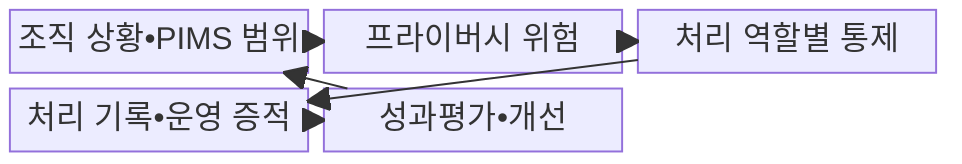
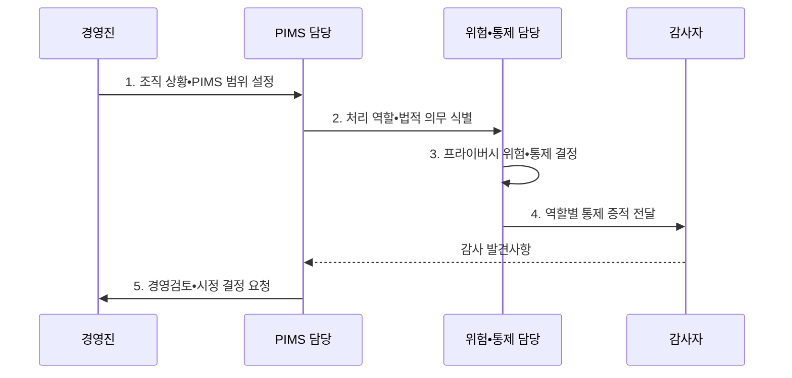

---
sidebar:
  order: 107
  label: "107. ISO/IEC 27701 개인정보 경영 시스템 (ISO 27701)"
  badge:
    text: "기출 • 30%"
    variant: note
title: "ISO/IEC 27701 개인정보 경영 시스템 (ISO 27701)"
date: "2026-08-03T08:48:47+09:00"
tags:
  - "notes-security"
weight: 107
extra:
  question_no: "107"
  source_status: "기출"
  source_history: "126회"
  priority: 30
  priority_note: "126회 기출이며 167•170과 비교할 때 가치가 있음"
---

## Ⅰ. 개요

핵심 용어

- **ISO/IEC 27701•PIMS(Privacy Information Management System)**: 개인정보 처리 목적•역할•위험•통제 증거를 조직적으로 수립•운영•평가•개선하는 독립 개인정보 관리체계 요구표준이다.
- **정보주체 영향**: 개인정보 처리로 개인의 권리•자유•생활에 발생할 수 있는 불이익을 위험평가의 결과로 고려하는 관점이다.

- 정의/개념: **ISO/IEC 27701** 은 개인정보 처리 위험과 역할별 책임을 관리하는 독립 PIMS 요구표준
- 배경/필요성: 일반 ISMS만으로는 정보주체 영향과 **처리 역할별 책임 입증 곤란**

#### 한줄 요약

- 안전한 보관뿐 아니라 처리 목적과 역할별 책임까지 관리한다.

## Ⅱ. 특징

핵심 용어

- **PII(Personally Identifiable Information) 컨트롤러•프로세서**: 컨트롤러는 개인 식별 가능 정보의 처리 목적과 수단을 결정하고 프로세서는 계약과 지시에 따라 대신 처리하므로 책임 통제가 다르다.
- **독립 PIMS•지속 개선**: 개인정보 관리체계를 단독 수립•인증하고 감사•경영검토•시정조치로 효과를 계속 높이는 구조이다.

- 2025판의 **독립 구축•인증 가능한 PIMS**
- 컨트롤러•프로세서별 **책임•통제 구분**
- 감사•경영검토 기반 **지속적 개선**

#### 한줄 요약

- 목적 결정자와 위탁 처리자의 책임을 구분해 운영한다.

## Ⅲ. 구조 및 구성요소

핵심 용어

- **처리 목록•프라이버시 위험**: 목적•항목•주체•제공•보유•역할을 기록하고 정보주체에 미칠 가능성과 영향을 평가한다.
- **역할별 통제 증적**: 컨트롤러•프로세서의 권리 대응•제공•보유•삭제•위탁 통제가 실제 운영됐음을 보여 주는 자료이다.

| 구성요소 | 책임 |
|:---|:---|
| 조직 상황•PIMS 범위 | **처리 활동•법적 요구** 반영 |
| 프라이버시 위험 | **정보주체 영향** 식별•평가•처리 |
| 처리 역할별 통제 | 역할별 **책임•보호조치** 적용 |
| 처리 기록•운영 증적 | **목적•제공•보유•권리 기록** |
| 성과평가•개선 | **감사•경영검토•시정조치** 반복 |

#### 한줄 요약

- 처리 목록에서 역할과 위험을 찾아 통제하고 결과를 감사한다.

## Ⅳ. 흐름도

핵심 용어

- **처리 역할•법적 의무 식별**: 서비스의 목적 결정권과 위탁 관계를 확인해 적용할 책임과 관할 개인정보 의무를 매핑하는 활동이다.
- **경영검토•시정**: 감사 발견사항과 성과를 경영진이 검토하고 자원•정책•절차의 근본 개선을 승인하는 과정이다.

**동작 원리**

1. **조직 상황•PIMS 범위 설정**: 서비스•처리 활동 경계 설정
2. **처리 역할•법적 의무 식별**: 목적•위탁 관계로 책임 구분
3. **프라이버시 위험•통제 결정**: 정보주체 영향•대책 평가
4. **역할별 통제 증적 전달**: 권리•제공•보유 결과를 감사자에게 제공
5. **경영검토•시정 결정 요청**: 부적합 원인•절차 개선안을 경영진에 상신

#### 한줄 요약

- 처리 목적과 역할을 알아야 책임과 보호조치를 정확히 정한다.

## Ⅴ. 종류 및 비교

핵심 용어

- **ISO/IEC 27701•27001**: 27701은 개인정보 처리 책임과 정보주체 영향, 27001은 정보보안 위험과 기밀성•무결성•가용성에 초점을 둔다.

| ISO 관리체계 | ISO/IEC 27701:2025 | ISO/IEC 27001:2022 |
|:---|:---|:---|
| 적용 기준 | **개인정보 처리 책임** 관리 | **정보보안 위험** 관리 |
| 핵심 특징 | **독립 PIMS 요구사항** | **ISMS 인증 요구사항** |
| 한계 | 법률 준수를 **인증으로 오인** | **개인정보 처리 책임** 누락 |

#### 한줄 요약

- 27001은 정보보안, 27701은 개인정보 처리 책임에 초점을 둔다.

## Ⅵ. 실무 고려사항 및 대책

핵심 용어

- **ISO/IEC 27701:2025•29100:2024**: 독립 PIMS 요구사항과 프라이버시 공통 원칙•용어를 각각 제공한다.
- **ISO/IEC 27706:2025**: PIMS 감사•인증기관의 역량과 인증 활동의 일관성을 검증하는 국제표준이다.
- **SaaS(Software as a Service)**: 소프트웨어를 서비스로 제공하면서 고객별 처리 역할과 개인정보 통제 책임을 계약•운영 기록으로 입증해야 하는 형태이다.

| 문제 | 대책 | 효과 |
|:---|:---|:---|
| **독립 PIMS 구축** | **ISO/IEC 27701:2025 적용** | **책임•통제 증적** 확보 |
| **공통 원칙•용어** | **ISO/IEC 29100:2024 연계** | 처리 기준 **일관성** 확보 |
| **인증기관 역량** | **ISO/IEC 27706:2025 확인** | **감사•인증 신뢰** 확보 |

#### 한줄 요약

- SaaS 계약의 처리 역할과 실제 처리•권리 대응 기록을 맞춘다.

## Ⅶ. 결론

핵심 용어

- **PIMS 책임 증명**: 개인정보 보호 선언을 처리 목적•역할•권리•제공•보유 기록과 통제 운영 결과로 설명할 수 있는 상태이다.

- 정보보안 위험은 **27001**, PII 역할•생명주기는 **27701**, 법률 준수는 별도 검증

#### 한줄 요약

- 개인정보 보호 선언을 실제 역할•처리 기록으로 증명한다.
