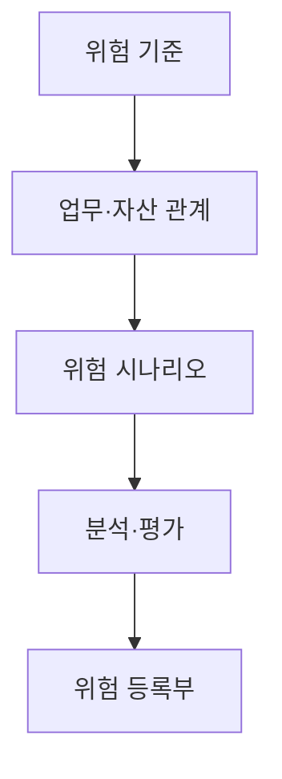
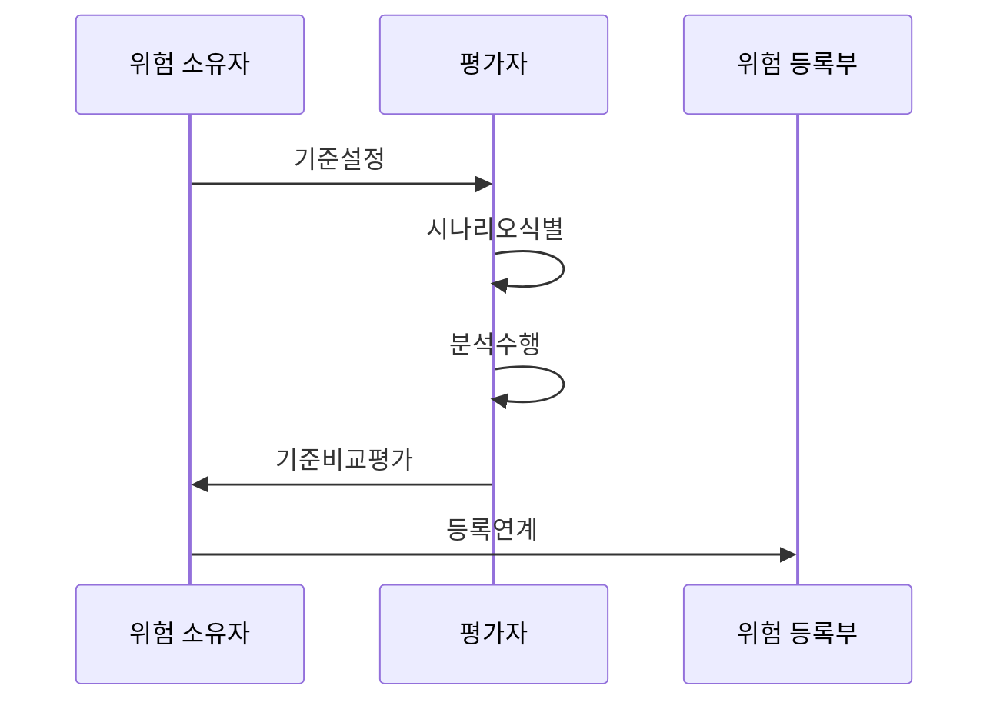

---
sidebar:
  order: 108
  label: "108. 정보 보호 위험 평가 — 자산·위협·취약점 (Information Security Risk Assessment)"
  badge:
    text: "기출 · 50%"
    variant: note
title: "정보 보호 위험 평가 — 자산·위협·취약점 (Information Security Risk Assessment)"
date: "2026-07-27T23:59:59+09:00"
tags:
  - "notes-security"
weight: 108
extra:
  question_no: "108"
  source_status: "기출"
  source_history: "122회"
  priority: 50
  priority_note: "122회 기출이며 위험관리 전 과정의 선행 분석임"
---

## 미리 알고가기

- **국제표준화기구(International Organization for Standardization, ISO)**: “아이에스오”로 읽고 국제 표준을 제정하는 기구의 영문 명칭을 약칭한 표기임
- **국제전기기술위원회(International Electrotechnical Commission, IEC)**: “아이이시”로 읽고 영문 머리글자로 표기하며, ISO와 함께 정보보호 표준을 제정함
- **연간 예상 손실액(Annualized Loss Expectancy, ALE)**: “에이엘이”로 읽고 영문 머리글자로 표기하며, 발생 빈도와 손실액을 이용해 위험의 연간 기대 손실을 추정함
- **위험 시나리오(Risk Scenario)**: 위협이 취약점을 이용해 사건과 업무 피해를 일으키는 인과를 기술한 상황임

## Ⅰ. 개요

- 정의/개념: 위험을 식별·분석·평가해 처리 우선순위를 결정
- **배경/필요성**: 직관적 판단만으로 위험 간 영향과 우선순위 비교 곤란

### 쉽게 이해하기 (학습용)

- 무엇이 어떻게 잘못되어 어느 정도 피해가 생길지를 비교해 먼저 막을 대상을 고르는 과정임

## Ⅱ. 특징

- 위험 기준과 허용 수준을 먼저 정한다.
- 자산·위협·취약점을 업무 영향 시나리오로 연결한다.
- 자료 품질에 맞는 평가 방식을 선택하고 변경 시 재평가한다.

### 쉽게 이해하기 (학습용)

- 같은 취약점도 연결된 업무와 예상 피해가 다르면 위험 등급이 달라질 수 있음

## Ⅲ. 아키텍처 및 구성요소

| 설계 요소 | 설명 |
|:---|:---|
| 위험 기준 | 가능성·결과 척도와 허용 수준 |
| 업무·자산 관계 | 핵심 업무와 지원 자산의 의존성 |
| 위험 시나리오 | 원인·취약점·사건·결과의 인과 |
| 분석·평가 | 가능성·결과를 기준과 비교 |
| 위험 등록부 | 위험·소유자·등급·재평가 조건 |

### 쉽게 이해하기 (학습용)

- 자산과 약점을 나열하는 데서 끝내지 않고 실제 사건과 업무 피해까지 이어 써야 함

## Ⅳ. 원리 및 절차 흐름도

| 절차 | 설명 |
|:---|:---|
| 기준설정 | 범위·척도·허용 수준 설정 |
| 시나리오식별 | 자산·위협·취약점·결과 연결 |
| 분석수행 | 통제 상태로 가능성·결과 산정 |
| 기준비교평가 | 분석값으로 처리 순서 결정 |
| 등록연계 | 소유자·재평가 조건 기록 |

> 요약: 시나리오를 기준과 비교해 우선순위/소유자를 정함

### 쉽게 이해하기 (학습용)

- 같은 기준으로 위험을 비교한 뒤 담당자와 다음 조치까지 정해야 평가가 실행으로 이어짐

## Ⅴ. 위험 평가 방식 비교

| 판단 기준 | 정성 평가 | 반정량 평가 | 정량 평가 |
|:---|:---|:---|:---|
| 적용 기준 | 자료가 적은 초기 분류에 적용함 | 조직 내 우선순위 비교에 적용함 | 신뢰 자료로 비용 효과를 판단함 |
| 핵심 특징 | 높음·중간·낮음 등급 사용 | 점수와 가중치 사용 | 확률·금액·손실량 사용 |
| 한계 | 평가자별 등급 편차 | 가중치가 정밀도를 과장 | 부족한 자료로 허위 정밀성 발생 |

### 쉽게 이해하기 (학습용)

- 정확한 자료가 부족한데 숫자를 세밀하게 만들면 정량 평가처럼 보여도 신뢰도는 높아지지 않음

## Ⅵ. 실무 사례

1. 클라우드 자산 변경의 **미평가 위험 자동 식별**

### 쉽게 이해하기 (학습용)

- 새로 공개된 클라우드 자산을 자산대장과 대조해 위협·취약성·업무 영향을 평가하고 통제 적용 후 잔여위험을 다시 산정한다.

## Ⅶ. 결론

- 제한된 보안 자원의 우선순위를 정하기 위해 자산·위협 시나리오·취약성·영향·가능성·불확실성을 검토하여, 일관된 위험평가로 처리 순서를 결정해야 한다.

### 쉽게 이해하기 (학습용)

- 좋은 위험 평가는 가장 정교한 숫자보다 실제 보호 순서를 바꾸는 신뢰할 만한 근거를 제공함
