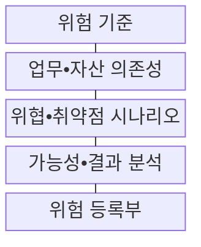
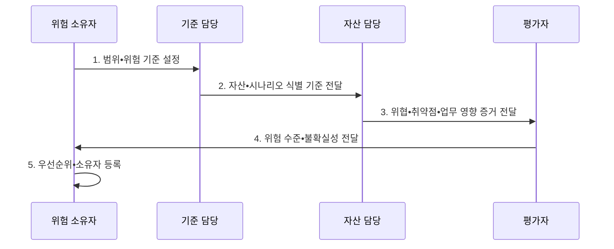

---
sidebar:
  order: 108
  label: "108. 정보 보호 위험 평가 — 자산•위협•취약점 (Information Security Risk Assessment)"
  badge:
    text: "기출 • 50%"
    variant: note
title: "정보 보호 위험 평가 — 자산•위협•취약점 (Information Security Risk Assessment)"
date: "2026-08-03T08:48:47+09:00"
tags:
  - "notes-security"
weight: 108
extra:
  question_no: "108"
  source_status: "기출"
  source_history: "122회"
  priority: 50
  priority_note: "122회 기출이며 위험관리 전 과정의 선행 분석임"
---

## Ⅰ. 개요

핵심 용어

- **정보보호 위험평가**: 업무•자산에서 무엇이 어떻게 잘못되어 어떤 피해를 만들지 식별•분석•평가해 처리 우선순위를 정하는 활동이다.
- **위험 시나리오**: 위협이 취약점을 이용해 보안 사건을 일으키고 업무 손실로 이어지는 인과 관계이다.

- 정의/개념: **정보보호 위험평가** 는 위험을 식별•분석•평가하여 처리 우선순위를 결정하는 활동
- 배경/필요성: 자산•취약점 목록만으로는 업무 손실 기반 **보호 우선순위 산정 곤란**

#### 한줄 요약

- 무엇이 어떻게 잘못될지 비교해 먼저 막을 대상을 고른다.

## Ⅱ. 특징

핵심 용어

- **위험 기준**: 가능성•결과의 척도와 수용 수준, 평가 범위를 사전에 정의해 서로 다른 위험을 일관되게 비교하는 기준이다.
- **정성•반정량•정량 평가**: 자료 수준과 의사결정 목적에 따라 등급, 가중 점수, 확률•금액을 사용하는 평가 방식이다.

- 가능성•결과•수용기준의 **사전 정의**
- 자산•위협•취약점의 **시나리오 연결**
- 정성•반정량•정량의 **자료 기반 선택**

#### 한줄 요약

- 같은 취약점도 업무 영향이 다르면 위험 등급이 달라진다.

## Ⅲ. 구조 및 구성요소

핵심 용어

- **업무•자산 의존성**: 핵심 업무가 어떤 정보•시스템•인력•공급자에 의존하는지 연결하여 손실 영향을 계산하는 관계이다.
- **위험 등록부**: 위험 시나리오•등급•소유자•처리 상태•불확실성•재평가 조건을 지속 추적하는 기록이다.

| 구성요소 | 책임 |
|:---|:---|
| 위험 기준 | **가능성•결과 척도•허용 수준** |
| 업무•자산 의존성 | **핵심 업무•지원 자산** 연결 |
| 위협•취약점 시나리오 | **원인•사건•업무 결과** 연결 |
| 가능성•결과 분석 | **위험 수준•불확실성** 산정 |
| 위험 등록부 | **위험•소유자•등급•재평가 조건** |

#### 한줄 요약

- 자산과 약점을 실제 사건•업무 피해까지 이어서 평가한다.

## Ⅳ. 흐름도

핵심 용어

- **위험 수준•불확실성**: 가능성과 결과를 기준에 따라 산정한 등급과 자료 부족•가정 변화가 결론에 미치는 정도이다.
- **위험 소유자**: 평가 결과와 처리 순위를 검토하고 수용•처리 책임 및 재평가 조건을 승인하는 주체이다.

**동작 원리**

1. **범위•위험 기준 설정**: 척도•수용 수준•대상 확정
2. **자산•시나리오 식별 기준 전달**: 업무 의존성과 분석 범위 제공
3. **위협•취약점•업무 영향 증거 전달**: 위험 시나리오와 통제 상태 제공
4. **위험 수준•불확실성 전달**: 수용기준 비교와 처리 순위 근거 제공
5. **우선순위•소유자 등록**: 재평가 조건•책임자 기록

#### 한줄 요약

- 같은 기준으로 위험을 비교하고 담당자와 다음 조치를 정한다.

## Ⅴ. 종류 및 비교

핵심 용어

- **정성•반정량•정량**: 자료가 적은 초기 분류는 등급, 내부 순위는 점수, 비용•효과 판단은 확률•손실액을 사용하되 허위 정밀성을 피한다.

| 위험평가 방식 | 정성 평가 | 반정량 평가 | 정량 평가 |
|:---|:---|:---|:---|
| 적용 기준 | **자료가 적은 초기 분류** | 조직 내 **우선순위 비교** | **비용•효과 판단** |
| 핵심 특징 | **높음•중간•낮음 등급** | **점수•가중치** 사용 | **확률•금액•손실량** 사용 |
| 한계 | 평가자별 **등급 편차** | 가중치의 **정밀도 과장** | 자료 부족 시 **허위 정밀성** |

#### 한줄 요약

- 자료가 부족하면 정교한 숫자도 신뢰도를 높이지 못한다.

## Ⅵ. 실무 고려사항 및 대책

핵심 용어

- **ISO/IEC 27005:2022•IEC 31010:2019**: 정보보안 위험의 평가•처리•소통•감시 절차와 상황별 평가 기법 선택 지침을 각각 제공한다.
- **ALE(Annual Loss Expectancy) = SLE(Single Loss Expectancy) × ARO(Annualized Rate of Occurrence)**: 한 번의 예상 손실액과 연간 예상 발생 빈도를 곱해 연간 기대 손실을 추정하는 정량식이다.

| 문제 | 대책 | 효과 |
|:---|:---|:---|
| **정보보안 위험 절차** | **ISO/IEC 27005:2022 적용** | **ISMS 위험** 연계 |
| **평가 기법 선택** | **IEC 31010:2019 참조** | 상황별 **기법 적합성** 확보 |
| **정량 손실 산정** | **ALE = SLE × ARO 적용** | 투자 **우선순위 수치화** |

#### 한줄 요약

- 신규 클라우드 자산의 위협•취약점•업무 영향을 다시 평가한다.

## Ⅶ. 결론

핵심 용어

- **의사결정 가능한 위험 근거**: 숫자의 정밀함보다 실제 보호 우선순위•예산•담당자의 행동을 바꿀 만큼 신뢰할 수 있는 시나리오와 자료이다.

- 자료 부족은 **정성**, 내부 순위는 **반정량**, 비용•효과는 ALE 정량평가

#### 한줄 요약

- 좋은 평가는 실제 보호 순서를 바꿀 신뢰 근거를 제공한다.
