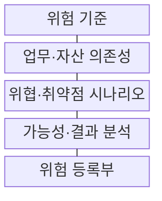
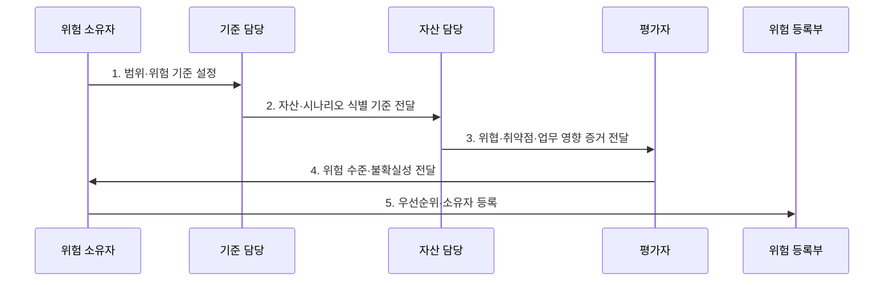

---
sidebar:
  order: 108
  label: "108. 정보 보호 위험 평가 — 자산·위협·취약점 (Information Security Risk Assessment)"
  badge:
    text: "기출 · 50%"
    variant: note
title: "정보 보호 위험 평가 — 자산·위협·취약점 (Information Security Risk Assessment)"
date: "2026-07-31T02:07:21+09:00"
tags:
  - "notes-security"
weight: 108
extra:
  question_no: "108"
  source_status: "기출"
  source_history: "122회"
  priority: 50
  priority_note: "122회 기출이며 위험관리 전 과정의 선행 분석임"
---

## 미리 알고가기

- **국제표준화기구(International Organization for Standardization, ISO)**: 산업·기술·경영 분야의 국제 표준을 제정하는 비정부 국제기구이다.
- **국제전기기술위원회(International Electrotechnical Commission, IEC)**: ISO와 함께 정보보호·전기·전자 분야의 국제 표준을 제정하는 기관이다.
- **연간 예상 손실액(Annualized Loss Expectancy, ALE)**: 사고 발생 빈도와 건당 손실액을 이용하여 위험의 연간 기대 손실을 추정한 값이다.
- **단일 손실 예상액(Single Loss Expectancy, SLE)**: 한 번의 위험 사건으로 예상되는 손실액이다.
- **연간 발생률(Annualized Rate of Occurrence, ARO)**: 위험 사건이 1년 동안 발생할 것으로 예상되는 빈도이다.
- **위험 시나리오(Risk Scenario)**: 위협이 취약점을 이용해 사건과 업무 피해를 만드는 인과 관계이다.
- **ISO/IEC 27005:2022**: ISO/IEC 27001 기반 정보보안 위험의 평가·처리·소통·감시 지침이다.
- **IEC 31010:2019**: 위험평가 기법의 선택과 적용 방법을 안내하는 국제표준이다.

> **키워드:** 정보 보호 위험 평가 — 자산·위협·취약점 (Information Security Risk Assessment)

## Ⅰ. 개요

- 정의/개념: 위험 **식별·분석·평가**로 처리 순위 결정
- 배경/필요성: 자산·취약점 목록만으로는 업무 손실 기반 **보호 우선순위 산정 곤란**

### 쉽게 이해하기 (학습용)

- 무엇이 어떻게 잘못될지 비교해 먼저 막을 대상을 고른다.

## Ⅱ. 특징

- 가능성·결과·수용기준의 **사전 정의**
- 자산·위협·취약점의 **시나리오 연결**
- 정성·반정량·정량의 **자료 기반 선택**

### 쉽게 이해하기 (학습용)

- 같은 취약점도 업무 영향이 다르면 위험 등급이 달라진다.

## Ⅲ. 구조 및 구성요소

| 구성요소 | 책임 |
|:---|:---|
| 위험 기준 | **가능성·결과 척도·허용 수준** |
| 업무·자산 의존성 | **핵심 업무·지원 자산** 연결 |
| 위협·취약점 시나리오 | **원인·사건·업무 결과** 연결 |
| 가능성·결과 분석 | **위험 수준·불확실성** 산정 |
| 위험 등록부 | **위험·소유자·등급·재평가 조건** |

### 쉽게 이해하기 (학습용)

- 자산과 약점을 실제 사건·업무 피해까지 이어서 평가한다.

## Ⅳ. 흐름도

**동작 원리**

1. **범위·위험 기준 설정**: 척도·수용 수준·대상 확정
2. **자산·시나리오 식별 기준 전달**: 업무 의존성과 분석 범위 제공
3. **위협·취약점·업무 영향 증거 전달**: 위험 시나리오와 통제 상태 제공
4. **위험 수준·불확실성 전달**: 수용기준 비교와 처리 순위 근거 제공
5. **우선순위·소유자 등록**: 재평가 조건·책임자 기록

### 쉽게 이해하기 (학습용)

- 같은 기준으로 위험을 비교하고 담당자와 다음 조치를 정한다.

## Ⅴ. 종류 및 비교

| 위험평가 방식 | 정성 평가 | 반정량 평가 | 정량 평가 |
|:---|:---|:---|:---|
| 적용 기준 | **자료가 적은 초기 분류** | 조직 내 **우선순위 비교** | **비용·효과 판단** |
| 핵심 특징 | **높음·중간·낮음 등급** | **점수·가중치** 사용 | **확률·금액·손실량** 사용 |
| 한계 | 평가자별 **등급 편차** | 가중치의 **정밀도 과장** | 자료 부족 시 **허위 정밀성** |

### 쉽게 이해하기 (학습용)

- 자료가 부족하면 정교한 숫자도 신뢰도를 높이지 못한다.

## Ⅵ. 실무 고려사항 및 대책

| 고려사항 | 대책 | 효과 |
|:---|:---|:---|
| **정보보안 위험 절차** | **ISO/IEC 27005:2022 적용** | **ISMS 위험** 연계 |
| **평가 기법 선택** | **IEC 31010:2019 참조** | 상황별 **기법 적합성** 확보 |
| **정량 손실 산정** | **ALE = SLE × ARO 적용** | 투자 **우선순위 수치화** |

### 쉽게 이해하기 (학습용)

- 신규 클라우드 자산의 위협·취약점·업무 영향을 다시 평가한다.

## Ⅶ. 결론

- 자료 부족은 **정성**, 내부 순위는 **반정량**, 비용·효과는 ALE 정량평가

### 쉽게 이해하기 (학습용)

- 좋은 평가는 실제 보호 순서를 바꿀 신뢰 근거를 제공한다.
