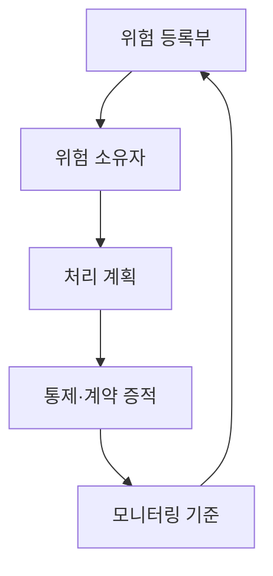
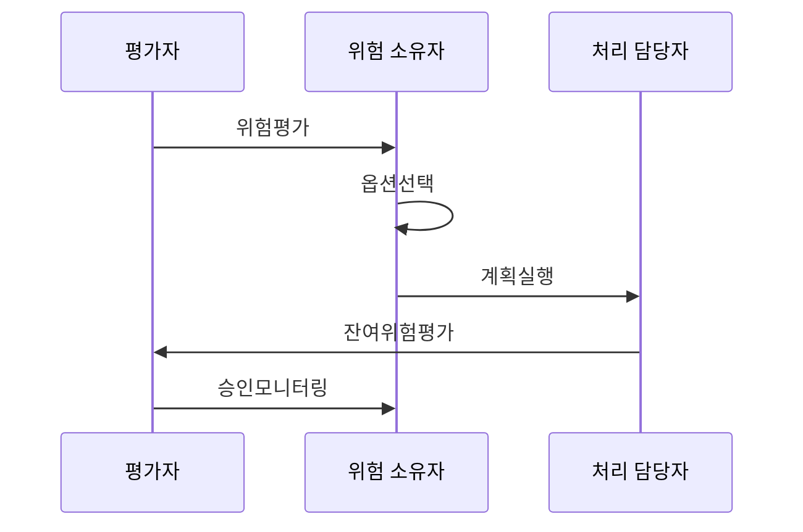

---
sidebar:
  order: 109
  label: "109. 위험 처리 전략 — 수용·회피·전가·감소 (Risk Treatment)"
  badge:
    text: "기출 · 50%"
    variant: note
title: "위험 처리 전략 — 수용·회피·전가·감소 (Risk Treatment)"
date: "2026-07-25T01:05:00+09:00"
tags:
  - "notes-security"
weight: 109
extra:
  question_no: "109"
  source_status: "기출"
  source_history: "122회"
  priority: 50
  priority_note: "122회 기출이며 수용·감소·전가 선택의 기본축임"
---

## 미리 알고가기

- **위험 처리(Risk Treatment)**: “리스크 트리트먼트”로 읽으며, 평가한 위험에 수용·회피·전가·감소 전략을 적용하는 과정임
- **위험 소유자**: 위험 처리 전략과 처리 후 남은 위험의 수용 여부를 승인하는 책임자임
- **잔여위험**: 통제를 적용한 뒤에도 남아 수용 여부를 판단하고 계속 감시해야 하는 위험임

## Ⅰ. 개요

- **정의/개념**: 네 전략 적용과 잔여위험 승인·감시
- **배경/필요성**: 위험·가치·비용·법적 의무의 균형

### 쉽게 이해하기 (학습용)

- 위험을 없애기 어려울 때 감당하거나 일을 멈추거나 나누거나 통제로 낮추는 선택임

## Ⅱ. 특징

- 위험 평가 결과를 예산, 통제, 계약과 업무 변경으로 연결한다.
- 위험 소유자가 옵션, 기한, 자원과 수용 기준을 승인한다.
- 여러 전략을 조합하고 신규 위험도 평가한다.
- 잔여위험 초과 시 추가 조치·상향 보고한다.

### 쉽게 이해하기 (학습용)

- 보험에 가입하면서 접근 통제도 강화하듯 한 위험에 여러 방법을 함께 쓸 수 있음

## Ⅲ. 아키텍처 및 구성요소

| 설계 요소 | 설명 |
|:---|:---|
| 위험 등록부 | 시나리오·등급·처리 상태 추적 |
| 위험 소유자 | 처리 옵션과 잔여위험 승인 |
| 처리 계획 | 조치·책임·자원·기한·목표 |
| 통제·계약 증적 | 통제 효과와 분담 조건 입증 |
| 모니터링 기준 | 변경·사고별 재평가 조건 |

### 쉽게 이해하기 (학습용)

- 위험 담당자가 계획을 실행하고 업무 책임자가 남은 위험을 받아들일지 판단하는 구조임

## Ⅳ. 원리 및 절차 흐름도

| 절차 | 설명 |
|:---|:---|
| 위험평가 | 등급·허용 수준·법적 의무 확인 |
| 옵션선택 | 비용·효과·사업 영향으로 선택 |
| 계획실행 | 책임·기한·자원에 따라 조치 |
| 잔여위험평가 | 처리 효과와 신규 위험 재산정 |
| 승인모니터링 | 수용 승인과 재평가 조건 감시 |

> 요약: 처리 실행 후 잔여위험을 재평가해 승인함

### 쉽게 이해하기 (학습용)

- 조치를 했다는 사실보다 조치 뒤 위험이 허용 가능한지 다시 확인해야 절차가 끝남

## Ⅴ. 종류 및 비교

| 판단 기준 | 수용·회피 | 전가 | 감소 |
|:---|:---|:---|:---|
| 핵심 특징 | 위험을 보유하거나 원인 활동을 제거함 | 보험·계약으로 손실을 분담함 | 통제로 가능성·결과를 낮춤 |
| 적용 기준 | 소유자 승인·사업 영향을 확인함 | 법적 책임·감독 의무를 유지함 | 효과·잔여위험을 재평가함 |
| 주요 위험 | 과도한 수용 또는 사업 기회 상실 | 책임까지 이전됐다고 오해 | 통제 비용이 감소 효과를 초과 |

### 쉽게 이해하기 (학습용)

- 네 전략은 위험 크기와 사업 필요에 따라 선택하며 전가는 책임의 완전한 소멸이 아님

## Ⅵ. 실무 사례

- 법적·안전 위험은 비용만으로 수용하지 않음
- 계약 전가 후 접근 통제·공급자 감독 유지
- 기한·잔여위험 초과를 상향 보고

### 쉽게 이해하기 (학습용)

- 법적 의무·안전 위험은 비용만으로 수용하지 않음
- 클라우드 계약으로 손실을 나눠도 접근 통제와 공급자 감독은 유지함
- 처리 기한·잔여위험 임계값을 넘으면 경영진에게 상향 보고함

## Ⅶ. 결론

- 전략 실행 후 잔여위험 소유자 승인

### 쉽게 이해하기 (학습용)

- 위험을 누가 어떤 근거로 얼마나 남기기로 했는지 설명할 수 있어야 함
