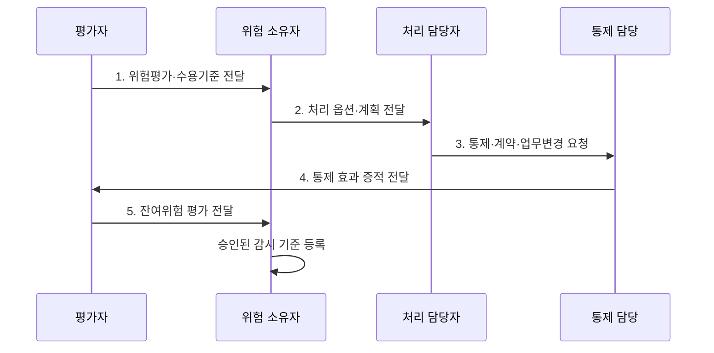

---
sidebar:
  order: 109
  label: "109. 위험 처리 전략 — 수용·회피·전가·감소 (Risk Treatment)"
  badge:
    text: "기출 · 50%"
    variant: note
title: "위험 처리 전략 — 수용·회피·전가·감소 (Risk Treatment)"
date: "2026-08-02T13:36:00+09:00"
tags:
  - "notes-security"
weight: 109
extra:
  question_no: "109"
  source_status: "기출"
  source_history: "122회"
  priority: 50
  priority_note: "122회 기출이며 수용·감소·전가 선택의 기본축임"
---

## Ⅰ. 개요

핵심 용어

- **위험 처리**: 평가한 위험 수준과 조직의 수용 기준에 따라 수용·회피·전가·감소 전략을 선택·실행하고 결과를 재평가하는 과정이다.
- **잔여위험**: 통제·계약·업무 변경을 적용한 뒤에도 남아 위험 소유자의 승인과 지속 감시가 필요한 위험이다.

- 정의/개념: **위험 처리**는 수용·회피·전가·감소 전략을 실행하고 잔여위험을 승인·감시하는 과정
- 배경/필요성: 위험평가만으로는 위험의 가능성·영향을 **실제로 감소·분담·회피할 수 없음**

#### 한줄 요약

- 위험을 감당·회피·분담하거나 통제로 낮추는 선택이다.

## Ⅱ. 특징

핵심 용어

- **위험 소유자**: 처리 전략·예산·사업 영향과 처리 후 잔여위험의 수용 여부를 명시적으로 승인하는 책임자이다.
- **수용기준 초과**: 남은 위험이 조직의 허용 수준을 넘으면 추가 통제·회피·상향 보고를 요구하는 상태이다.

- 평가 결과의 **예산·통제·계약 연계**
- 위험 소유자의 **전략·잔여위험 승인**
- 수용기준 초과 시 **추가 처리·상향 보고**

#### 한줄 요약

- 보험과 접근통제를 함께 쓰듯 여러 전략을 조합할 수 있다.

## Ⅲ. 구조 및 구성요소

핵심 용어

- **위험 처리계획**: 선택한 조치·책임자·자원·기한·목표·완료 증거를 기록한 실행계획이다.
- **통제·계약 증적**: 위험 감소 통제의 효과와 보험·공급자 계약의 손실 분담 조건이 실제 유효함을 입증하는 자료이다.

| 구성요소 | 책임 |
|:---|:---|
| 위험 등록부 | **시나리오·등급·처리 상태** 추적 |
| 위험 소유자 | **처리 옵션·잔여위험** 승인 |
| 위험 처리계획 | **조치·책임·자원·기한·목표** |
| 통제·계약 증적 | **통제 효과·분담 조건** 입증 |
| 잔여위험·감시 기준 | **수용 수준·재평가 조건** |

#### 한줄 요약

- 담당자가 계획을 실행하고 소유자가 남은 위험을 승인한다.

## Ⅳ. 흐름도

핵심 용어

- **처리 옵션 선정**: 법적 의무·비용·효과·사업 기회·실행 가능성을 비교해 하나 이상의 처리 전략을 조합하는 활동이다.
- **재평가·감시 기준**: 조치 후 위험 수준을 다시 계산하고 어떤 변화·사고·기간에 재검토할지를 정한 조건이다.

**동작 원리**

1. **위험평가·수용기준 전달**: 등급·법적 의무·처리 한계 제공
2. **처리 옵션·계획 전달**: 비용·효과·사업 영향 기반 승인안 제공
3. **통제·계약·업무변경 요청**: 책임·기한·자원에 따른 조치 지시
4. **통제 효과 증적 전달**: 적용 결과와 손실 분담 조건 제공
5. **잔여위험 평가 전달**: 처리 후 수준과 재평가 조건 제공

#### 한줄 요약

- 조치 후 위험이 허용 가능한지 다시 확인해야 끝난다.

## Ⅴ. 종류 및 비교

핵심 용어

- **수용·회피·전가·감소**: 위험을 의도적으로 보유하거나 원인 활동을 중단하고, 손실을 계약으로 분담하거나 통제로 가능성·영향을 낮추는 전략이다.

| 위험 처리 전략 | 수용 | 회피 | 전가 | 감소 |
|:---|:---|:---|:---|:---|
| 적용 기준 | **기준 이내 위험** | **활동 중단 가능** | **손실 분담 가능** | **통제 효과 우수** |
| 핵심 특징 | 위험의 **의도적 보유** | **위험 원인 제거** | **보험·계약 분담** | **가능성·결과 저감** |
| 한계 | **과도한 수용** | **사업 기회 상실** | 법적 **책임 잔존** | **통제 비용 증가** |

#### 한줄 요약

- 전가는 손실을 나눌 뿐 법적 책임까지 없애지는 않는다.

## Ⅵ. 실무 고려사항 및 대책

핵심 용어

- **ISO/IEC 27005:2022**: 정보보안 위험평가 결과를 처리·소통·감시와 지속적인 재평가로 연결하는 국제지침이다.
- **SoA(Statement of Applicability)·명시적 승인**: 적용성 선언서의 통제 선택·제외 근거를 처리계획과 연결하고 잔여위험은 이름이 지정된 소유자가 기록으로 수용한다.

| 문제 | 대책 | 효과 |
|:---|:---|:---|
| **정보보안 위험 처리** | **ISO/IEC 27005:2022 적용** | 처리 절차 **일관성** 확보 |
| **통제 선택 근거** | **SoA와 처리계획 연결** | **적용·제외 근거** 증명 |
| **잔여위험 책임** | **위험 소유자 명시적 승인** | **무책임한 수용** 방지 |

#### 한줄 요약

- 클라우드 손실을 전가해도 접근통제와 공급자 감독은 유지한다.

## Ⅶ. 결론

핵심 용어

- **설명 가능한 위험 수용**: 누가 어떤 기준·기간·감시 조건으로 위험을 남겼는지 감사와 이해관계자에게 설명할 수 있는 상태이다.

- 기준 이내는 **수용**, 활동 중단은 **회피**, 손실 분담은 **전가**, 통제 효과 우수는 **감소**

#### 한줄 요약

- 누가 어떤 근거로 위험을 남겼는지 설명할 수 있어야 한다.
