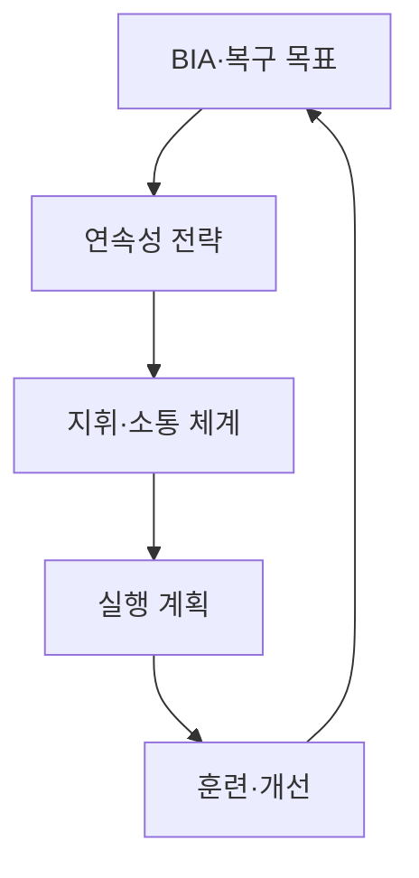
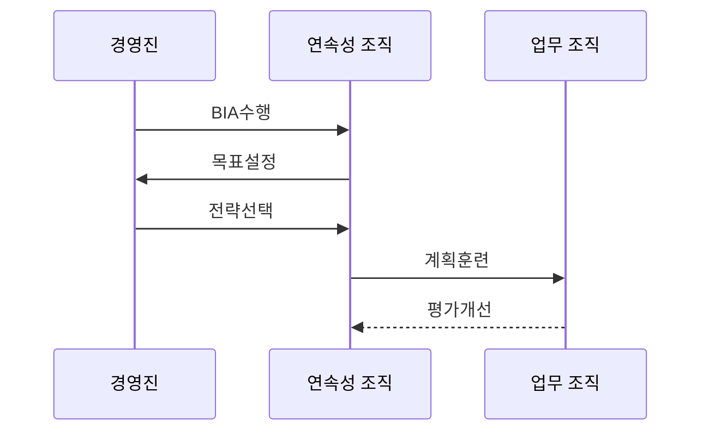

---
sidebar:
  order: 110
  label: "110. BCP 업무 연속성 계획 (Business Continuity Plan)"
  badge:
    text: "미출제 · 50%"
    variant: note
title: "BCP 업무 연속성 계획 (Business Continuity Plan)"
date: "2026-07-25T01:05:00+09:00"
tags:
  - "notes-security"
weight: 110
extra:
  question_no: "110"
  source_status: "미출제"
  source_history: ""
  priority: 50
  priority_note: "업무영향·연속전략·훈련을 묶는 독립 계획 주제임"
---

## 미리 알고가기

- **업무 연속성 계획(Business Continuity Plan, BCP)**: “비시피”로 읽고 영문 머리글자로 표기하며, 중단 중에도 우선 업무를 목표 수준으로 유지·복귀시키는 계획임
- **업무 영향 분석(Business Impact Analysis, BIA)**: “비아이에이”로 읽고 영문 머리글자로 표기하며, 업무 중단의 시간별 영향과 자원 의존성을 분석함
- **복구 시간 목표(Recovery Time Objective, RTO)**: “알티오”로 읽고 영문 머리글자로 표기하며, 업무나 시스템을 복구해야 하는 목표 시간을 뜻함
- **복구 시점 목표(Recovery Point Objective, RPO)**: “알피오”로 읽고 영문 머리글자로 표기하며, 복구 시 허용하는 데이터 손실 시점을 뜻함
- **최대 허용 중단시간(Maximum Tolerable Period of Disruption, MTPD)**: “엠티피디”로 읽고 영문 머리글자로 표기하며, 업무가 견딜 수 있는 중단의 시간 한계임
- **업무 연속성 관리체계(Business Continuity Management System, BCMS)**: “비시엠에스”로 읽고 영문 머리글자로 표기하며, ISO 22301에 따라 연속성 계획·훈련·개선을 운영하는 체계임
- **IT 서비스 연속성 관리(IT Service Continuity Management, ITSCM)**: “아이티에스시엠”으로 읽고 영문 머리글자로 표기하며, 업무 복구 목표를 IT 복구 설계와 연결함
- **재해복구 계획(Disaster Recovery Plan, DRP)**: “디알피”로 읽고 영문 머리글자로 표기하며, 재해 후 IT 서비스와 데이터를 복구하는 계획임

## Ⅰ. 개요

- 정의/개념: 우선 업무를 지속·복귀시키는 계획
- **배경/필요성**: 인력·시설·공급자의 전사 대응 준비

### 쉽게 이해하기 (학습용)

- 전산 복구뿐 아니라 사람과 장소, 협력사까지 준비해 중요한 업무를 계속하는 계획임

## Ⅱ. 특징

- BIA로 우선 업무·의존 자원·복구 목표를 도출한다.
- RTO는 MTPD 안에서 달성하도록 설정한다.
- ITSCM은 업무 RTO·RPO를 IT 복구 설계와 연결한다.
- BCMS는 ISO 22301에 따라 훈련·검토·개선을 반복한다.
- 인력·시설·기술·공급자와 내외부 소통을 연속성 전략에 포함한다.
- 훈련 결과와 조직 변경을 반영해 계획의 실행 가능성을 유지한다.

### 쉽게 이해하기 (학습용)

- 업무가 견딜 수 있는 최대 중단 시간보다 먼저 복구하도록 목표 시간을 정해야 함

## Ⅲ. 아키텍처 및 구성요소

| 구성요소 | 설명 |
|:---|:---|
| BIA·복구 목표 | 우선 업무·영향·MTPD·RTO |
| 연속성 전략 | 대체 인력·장소·기술·공급자 |
| 지휘·소통 체계 | 발동 권한·역할·연락망·통지 |
| 실행 계획 | 업무별 발동·운영·복귀 기준 |
| 훈련·개선 | 훈련으로 목표·계획 누락 검증 |

### 쉽게 이해하기 (학습용)

- 중단 영향을 먼저 분석하고 그 결과에 맞춰 대체 자원과 실행 절차를 준비함

## Ⅳ. 원리 및 절차 흐름도

| 절차 | 설명 |
|:---|:---|
| BIA수행 | 중단 영향·의존 자원·한계 분석 |
| 목표설정 | MTPD 안에서 RTO·서비스 수준 결정 |
| 전략선택 | 대체 자원과 기술 복구 방식 선택 |
| 계획훈련 | 발동·운영·소통·복귀 절차 실행 |
| 평가개선 | 목표 미달 원인 시정·변경 반영 |

> 요약: BIA 후 목표를 설정하고 전략 선택·훈련·개선함

### 쉽게 이해하기 (학습용)

- 실제 훈련에서 목표 시간 안에 업무가 돌아오지 않으면 전략과 자원을 다시 설계해야 함

## Ⅴ. 종류 및 비교

| 판단 기준 | BCP | DRP |
|:---|:---|:---|
| 핵심 특징 | 우선 업무를 지속하고 정상화함 | IT 서비스와 데이터를 복구함 |
| 적용 기준 | 인력·시설·공급자까지 연속성이 필요할 때 | 시스템·네트워크·데이터 복구가 필요할 때 |
| 주요 위험 | 업무·공급자 의존 관계 누락 | 시스템 복구 후 업무 재개가 지연됨 |

### 쉽게 이해하기 (학습용)

- DRP는 BCP 안에서 IT를 되살리는 계획이고 BCP는 업무 전체가 계속되게 하는 계획임

## Ⅵ. 실무 사례

- 업무 목표와 IT 복구 목표 연결
- 공급자 RTO·통보를 계약·훈련에 포함
- 단계별 훈련 시간과 결함 기록
- DRP는 격리 백업·대체 환경·의존 순서·복귀를 훈련함

### 쉽게 이해하기 (학습용)

- 업무 RTO와 IT 복구 순서를 연결해 시스템 복구 후 업무 지연을 줄임
- 공급자의 RTO·통보 절차를 계약과 훈련에서 함께 검증함
- 토의형부터 실제 전환형까지 훈련해 목표 시간과 결함을 기록함
- DRP는 격리 백업·대체 환경·복구 순서·복귀를 실제로 시험함

## Ⅶ. 결론

- BIA 목표를 자원 전략과 훈련으로 달성함

### 쉽게 이해하기 (학습용)

- 계획서가 아니라 중단 중에도 중요한 업무를 목표 수준으로 수행한 훈련 결과가 핵심임
