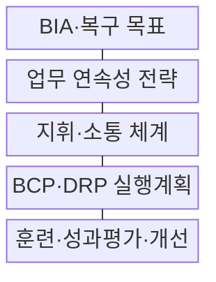
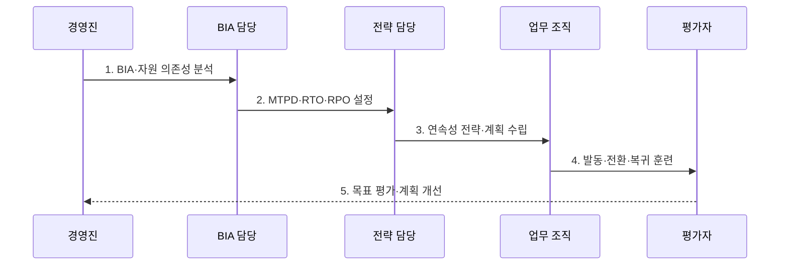

---
sidebar:
  order: 110
  label: "110. BCP 업무 연속성 계획 (Business Continuity Plan)"
  badge:
    text: "미출제 · 50%"
    variant: note
title: "BCP 업무 연속성 계획 (Business Continuity Plan)"
date: "2026-07-30T20:00:00+09:00"
tags:
  - "notes-security"
weight: 110
extra:
  question_no: "110"
  source_status: "미출제"
  source_history: ""
  priority: 50
  priority_note: "업무영향·연속전략·훈련을 묶는 독립 계획 주제임"
---

## 미리 알고가기

- **업무 연속성 계획(Business Continuity Plan, BCP)**: 중단 상황에서도 우선 업무를 목표 수준으로 유지하고 복구하기 위한 계획이다.
- **업무 영향 분석(Business Impact Analysis, BIA)**: 업무 중단의 시간별 영향과 자원 의존성을 분석하여 복구 우선순위와 목표를 정하는 활동이다.
- **복구 시간 목표(Recovery Time Objective, RTO)**: 중단된 업무나 시스템을 복구해야 하는 목표 시간이다.
- **복구 시점 목표(Recovery Point Objective, RPO)**: 복구 시 허용할 수 있는 데이터 손실의 기준 시점이다.
- **최대 허용 중단시간(Maximum Tolerable Period of Disruption, MTPD)**: 업무가 회복 불가능한 피해 없이 견딜 수 있는 최대 중단시간이다.
- **업무 연속성 관리체계(Business Continuity Management System, BCMS)**: 연속성 계획·훈련·점검·개선을 지속해서 운영하는 관리체계이다.
- **IT 서비스 연속성 관리(IT Service Continuity Management, ITSCM)**: 업무 복구 목표를 정보시스템과 데이터의 복구 설계·운영에 연결하는 관리 활동이다.
- **재해복구 계획(Disaster Recovery Plan, DRP)**: 재해로 중단된 정보시스템과 데이터를 목표 시간과 시점에 맞춰 복구하는 계획이다.
- **ISO 22301:2019**: 업무 중단 중 허용 수준의 제품·서비스 제공을 위한 BCMS 요구사항 국제표준이다.
- **ISO/TS 22317:2021**: 조직에 적합한 공식 BIA 절차의 수립·유지 지침을 제공하는 기술시방서이다.

## Ⅰ. 개요

- 정의/개념: 중단 시 우선 업무의 **지속·복귀 계획**
- 배경/필요성: 인력·시설·IT·공급망의 **통합 회복력 확보**

### 쉽게 이해하기 (학습용)

- 전산뿐 아니라 사람·장소·협력사까지 준비하는 계획이다.

## Ⅱ. 특징

- BIA 기반 **우선 업무·복구 목표 도출**
- MTPD 내 **RTO·RPO·최소수준 설정**
- 훈련·경영검토 기반 **BCMS 지속 개선**

### 쉽게 이해하기 (학습용)

- 업무가 견딜 최대 시간보다 이르게 RTO를 정해야 한다.

## Ⅲ. 구조 및 구성요소

| 구성요소 | 책임 |
|:---|:---|
| BIA·복구 목표 | 우선 업무·영향·MTPD·RTO |
| 업무 연속성 전략 | 대체 인력·장소·기술·공급자 |
| 지휘·소통 체계 | 발동 권한·역할·연락망·통지 |
| BCP·DRP 실행계획 | 업무·IT 발동·운영·복귀 기준 |
| 훈련·성과평가·개선 | 목표 달성·계획 누락 검증 |

### 쉽게 이해하기 (학습용)

- 중단 영향을 분석한 뒤 대체 자원과 실행 절차를 준비한다.

## Ⅳ. 흐름도

**동작 원리**

1. **BIA·자원 의존성 분석**: 영향·우선 업무·필수 자원 식별
2. **MTPD·RTO·RPO 설정**: 허용 중단·복구 목표 확정
3. **연속성 전략·계획 수립**: 대체 자원·발동 기준 설계
4. **발동·전환·복귀 훈련**: 업무·IT·소통 절차 실행
5. **목표 평가·계획 개선**: 미달 원인 시정·변경 반영

### 쉽게 이해하기 (학습용)

- 훈련이 목표시간을 넘으면 전략과 자원을 다시 설계한다.

## Ⅴ. 종류 및 비교

| 연속성 계획 | BCP | DRP |
|:---|:---|:---|
| 적용 기준 | 업무 전체 연속성 | IT·데이터 복구 |
| 핵심 특징 | 인력·시설·공급망 포함 | 시스템·네트워크 중심 |
| 한계 | 자원 의존성 누락 | 업무 재개 지연 가능 |

### 쉽게 이해하기 (학습용)

- DRP는 BCP 안에서 IT와 데이터를 복구하는 계획이다.

## Ⅵ. 실무 고려사항 및 대책

| 고려사항 | 대책 | 효과 |
|:---|:---|:---|
| BCMS 요구사항 | **ISO 22301:2019 적용** | 연속성 체계 인증 |
| BIA 절차 품질 | **ISO/TS 22317:2021 참조** | 복구 목표 근거 확보 |
| IT 비상대응 | **NIST SP 800-34 Rev.1 참조** | DRP·훈련 구체화 |

### 쉽게 이해하기 (학습용)

- 업무 RTO와 IT 복구 순서를 연결해 실제 전환·복귀를 시험한다.

## Ⅶ. 결론

- **BIA·RTO·RPO·자원 의존성**으로 연속성 전략을 결정한다.

### 쉽게 이해하기 (학습용)

- 계획서보다 목표 수준을 달성한 실제 훈련 결과가 중요하다.
