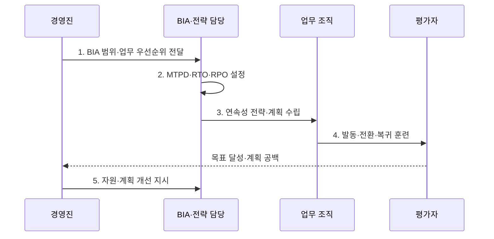

---
sidebar:
  order: 110
  label: "110. BCP 업무 연속성 계획 (Business Continuity Plan)"
  badge:
    text: "미출제 · 50%"
    variant: note
title: "BCP 업무 연속성 계획 (Business Continuity Plan)"
date: "2026-08-02T13:38:00+09:00"
tags:
  - "notes-security"
weight: 110
extra:
  question_no: "110"
  source_status: "미출제"
  source_history: ""
  priority: 50
  priority_note: "업무영향·연속전략·훈련을 묶는 독립 계획 주제임"
---

## Ⅰ. 개요

핵심 용어

- **BCP(Business Continuity Plan)**: 중단 상황에서도 우선 업무를 최소 허용 수준으로 유지하고 목표 시간 안에 정상 수준으로 복귀하기 위한 업무 연속성 계획이다.
- **BCMS(Business Continuity Management System)**: 업무 영향 분석·연속성 전략·계획·훈련·성과평가·개선을 지속 운영하는 업무 연속성 관리체계이다.

- 정의/개념: **BCP**는 중단 시 우선 업무를 유지하고 목표 시간 안에 복귀하기 위한 계획
- 배경/필요성: IT 재해복구만으로는 인력·시설·공급망 중단에 대한 **업무 연속성 확보가 어려움**

#### 한줄 요약

- 전산뿐 아니라 사람·장소·협력사까지 준비하는 계획이다.

## Ⅱ. 특징

핵심 용어

- **BIA(Business Impact Analysis)·MTPD(Maximum Tolerable Period of Disruption)·RTO(Recovery Time Objective)·RPO(Recovery Point Objective)**: 업무 영향을 분석해 최대 허용 중단시간, 목표 복구시간, 허용 데이터 손실 시점을 정한다.
- **훈련·지속 개선**: 계획의 발동·전환·복귀를 실제로 실행해 목표 달성 여부와 공백을 확인하고 자원·절차를 보완한다.

- BIA 기반 **우선 업무·복구 목표 도출**
- MTPD 내 **RTO·RPO·최소수준 설정**
- 훈련·경영검토 기반 **BCMS 지속 개선**

#### 한줄 요약

- 업무가 견딜 최대 시간보다 이르게 RTO를 정해야 한다.

## Ⅲ. 구조 및 구성요소

핵심 용어

- **연속성 전략**: 대체 인력·장소·기술·공급자와 최소 업무 수준을 조합하여 정해진 복구 목표를 달성하는 방식이다.
- **지휘·소통·복귀 기준**: 계획 발동 권한·역할·연락망·이해관계자 통지와 대체 상태에서 정상 운영으로 돌아갈 조건이다.

| 구성요소 | 책임 |
|:---|:---|
| BIA·복구 목표 | **우선 업무·영향·MTPD·RTO** |
| 업무 연속성 전략 | **대체 인력·장소·기술·공급자** |
| 지휘·소통 체계 | **발동 권한·역할·연락망·통지** |
| BCP·DRP 실행계획 | **업무·IT 발동·운영·복귀 기준** |
| 훈련·성과평가·개선 | **목표 달성·계획 누락** 검증 |

#### 한줄 요약

- 중단 영향을 분석한 뒤 대체 자원과 실행 절차를 준비한다.

## Ⅳ. 흐름도

핵심 용어

- **BIA 기반 복구 목표**: 업무 중단 영향과 의존 자원을 근거로 MTPD보다 이른 RTO와 허용 가능한 RPO를 확정한 것이다.
- **발동·전환·복귀 훈련**: 비상 계획을 시작하고 대체 자원으로 업무를 운영한 뒤 정상 환경으로 안전하게 되돌리는 전 과정을 시험한다.

**동작 원리**

1. **BIA 범위·업무 우선순위 전달**: 분석 대상·영향 기준·책임자 지정
2. **MTPD·RTO·RPO 설정**: 허용 중단·복구 목표 확정
3. **연속성 전략·계획 수립**: 대체 자원·발동 기준 설계
4. **발동·전환·복귀 훈련**: 업무·IT·소통 절차 실행
5. **자원·계획 개선 지시**: 목표 미달 원인과 환경 변경사항 반영

#### 한줄 요약

- 훈련이 목표시간을 넘으면 전략과 자원을 다시 설계한다.

## Ⅴ. 종류 및 비교

핵심 용어

- **BCP·DRP(Disaster Recovery Plan)**: BCP는 인력·시설·공급망을 포함한 업무 전체 연속성 계획이고 DRP는 그 안에서 정보시스템과 데이터를 복구하는 재해복구 계획이다.

| 연속성 계획 | BCP | DRP |
|:---|:---|:---|
| 적용 기준 | **업무 전체 연속성** | **IT·데이터 복구** |
| 핵심 특징 | **인력·시설·공급망** 포함 | **시스템·네트워크** 중심 |
| 한계 | **자원 의존성** 누락 | 업무 재개 **지연 가능** |

#### 한줄 요약

- DRP는 BCP 안에서 IT와 데이터를 복구하는 계획이다.

## Ⅵ. 실무 고려사항 및 대책

핵심 용어

- **ISO 22301:2019·ISO/TS 22317:2021**: BCMS 요구사항과 조직에 적합한 BIA 절차 수립·유지 지침을 각각 제공한다.
- **ITSCM(IT Service Continuity Management)·NIST SP 800-34**: 업무 복구 목표를 IT·데이터 복구 설계와 훈련에 연결하고 정보시스템 비상계획을 구체화한다.

| 문제 | 대책 | 효과 |
|:---|:---|:---|
| **BCMS 요구사항** | **ISO 22301:2019 적용** | 연속성 체계 **인증** |
| **BIA 절차 품질** | **ISO/TS 22317:2021 참조** | **복구 목표 근거** 확보 |
| **IT 비상대응** | **NIST SP 800-34 Rev.1 참조** | **DRP·훈련** 구체화 |

#### 한줄 요약

- 업무 RTO와 IT 복구 순서를 연결해 실제 전환·복귀를 시험한다.

## Ⅶ. 결론

핵심 용어

- **훈련 기반 연속성 증명**: 계획서 보유가 아니라 실제 중단 훈련에서 최소 업무 수준·RTO·RPO·복귀 기준을 달성했음을 보여 주는 결과이다.

- 인력·시설·공급망은 **BCP**, IT·데이터 복구는 **DRP**, 목표는 BIA로 설정

#### 한줄 요약

- 계획서보다 목표 수준을 달성한 실제 훈련 결과가 중요하다.
