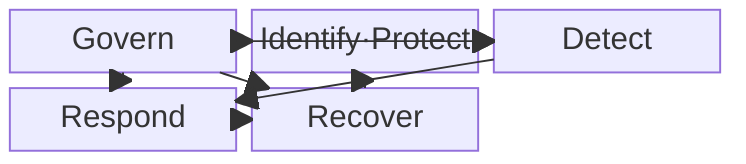
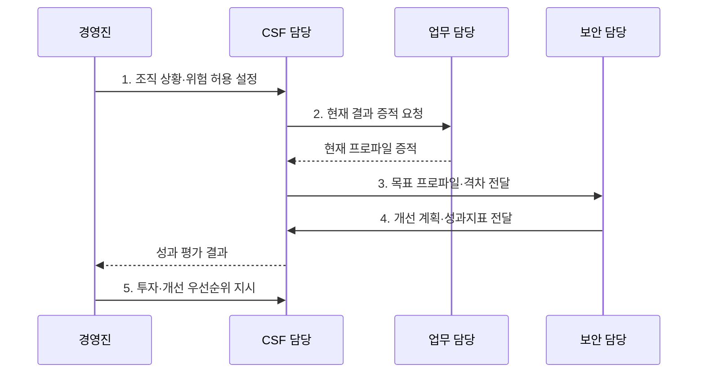

---
sidebar:
  order: 111
  label: "111. NIST Cybersecurity Framework (NIST CSF)"
  badge:
    text: "기출 · 70%"
    variant: note
title: "NIST Cybersecurity Framework (NIST CSF)"
date: "2026-07-31T02:08:48+09:00"
tags:
  - "notes-security"
weight: 111
extra:
  question_no: "111"
  source_status: "기출"
  source_history: "137회"
  priority: 70
  priority_note: "137회 기출에 CSF 2.0 Govern 확장까지 흡수함"
---

## Ⅰ. 개요

핵심 용어

- **미국 국립표준기술연구소(National Institute of Standards and Technology, NIST)**: 미국 상무부 산하의 기술 표준·지침 연구기관이다.
- **사이버보안 프레임워크(Cybersecurity Framework, CSF)**: 사이버보안 위험관리 결과를 공통 언어로 정리한 비규범적 프레임워크이다.

- 정의/개념: **NIST CSF** 는 조직이 거버넌스·식별·보호·탐지·대응·복구 결과를 공통 언어로 정하고 사이버 위험을 우선 관리하게 하는 자발적 프레임워크
- 배경/필요성: 부서별 통제·용어만으로는 경영 위험과 **보안 성과 우선순위 연결 곤란**

#### 한줄 요약

- 달성할 결과를 공유하고 구체적인 수단은 조직이 선택한다.

## Ⅱ. 특징

핵심 용어

- **결과 중심**: 특정 제품보다 조직이 달성할 보안 결과를 기준으로 관리하는 방식이다.
- **조직 프로파일**: 현재·목표 보안 결과를 조직 상황에 맞게 선택한 문서이다.
- **거버넌스(Govern)·구현 계층(Implementation Tier)**: 거버넌스는 전사 위험 방향을 정하고 구현 계층은 위험관리 관행의 엄격성을 네 단계로 설명한다.

- 특정 제품·통제를 강제하지 않는 **결과 중심**
- **거버넌스(Govern)** 포함 6개 기능의 전사 위험 연결
- 프로파일 차이와 **구현 계층(Implementation Tier)** 의 개선 의사결정

#### 한줄 요약

- 현재와 목표 결과의 차이로 예산과 개선 순서를 정한다.

## Ⅲ. 구조 및 구성요소

핵심 용어

- **CSF 핵심부(CSF Core)**: 거버넌스·식별·보호·탐지·대응·복구 결과를 기능·범주·하위범주로 분류한 체계이다.

| 구성요소 | 책임 |
|:---|:---|
| Govern | **전략·정책·역할·공급망 위험** 관리 |
| Identify·Protect | **자산·위험 식별·보호조치** |
| Detect | **지속 감시·분석** 기반 사건 발견 |
| Respond | **사고 관리·완화·보고·소통** |
| Recover | **자산·운영 복원·복구 개선** |

#### 한줄 요약

- 거버넌스 아래 식별·보호·탐지·대응·복구를 지속한다.

## Ⅳ. 흐름도

핵심 용어

- **현재·목표 프로파일**: 현재 달성 결과와 목표 결과를 비교해 개선 격차를 찾는 도구이다.

**동작 원리**

1. **조직 상황·위험 허용 설정**: 임무·위협·요구·자원 확인
2. **현재 결과 증적 요청**: 달성한 CSF 결과와 근거 제출 요구
3. **목표 프로파일·격차 전달**: 우선 목표 결과와 현재 차이 제공
4. **개선 계획·성과지표 전달**: 위험·비용·효과 기반 실행안 제공
5. **투자·개선 우선순위 지시**: 성과 평가에 따른 자원 배분 결정

#### 한줄 요약

- 현재와 목표 프로파일의 차이부터 개선한다.

## Ⅴ. 종류 및 비교

핵심 용어

- **사이버보안 프레임워크 핵심부(Cybersecurity Framework Core, CSF Core)**: 보안 결과를 기능·범주·하위범주로 분류하는 공통 체계이다.
- **조직 프로파일**: 조직이 선택한 현재·목표 보안 결과와 그 차이를 표현하는 문서이다.
- **구현 계층(Implementation Tier)**: 위험 거버넌스·관리 관행의 엄격성을 네 단계로 설명하는 도구이다.

| CSF 요소 | 역할 | 산출물 |
|:---|:---|:---|
| **사이버보안 프레임워크 핵심부(Cybersecurity Framework Core, CSF Core)** | 보안 결과의 **공통 분류·소통** | 기능·범주·하위범주 |
| **조직 프로파일** | 조직별 **현재·목표 결과와 격차** 표현 | 현재 프로파일·목표 프로파일 |
| **구현 계층(Implementation Tier)** | 위험관리 관행의 **엄격성·일관성** 설명 | Tier 1~4의 관행 수준 |

#### 한줄 요약

- Core는 결과, Profile은 목표, Tier는 관행의 엄격성이다.

## Ⅵ. 실무 고려사항 및 대책

핵심 용어

- **NIST CSWP 29**: NIST Cybersecurity Framework 2.0의 공식 문서 식별자이다.
- **NIST SP 1301·1302**: 프로파일 작성과 구현 Tier 활용을 안내하는 지침이다.

| 문제 | 대책 | 효과 |
|:---|:---|:---|
| **CSF 2.0 적용** | **NIST CSWP 29의 6기능 활용** | 위험 소통 **표준화** |
| **프로파일 작성** | **NIST SP 1301 절차 적용** | **목표·격차** 명확화 |
| **Tier 활용** | **NIST SP 1302 지침 적용** | **등급 오용** 방지 |

#### 한줄 요약

- 업무 위험을 가장 크게 줄이는 프로파일 격차부터 투자한다.

## Ⅶ. 결론

핵심 용어

- **공통 결과 기준**: 경영진과 실무자가 같은 보안 성과 언어로 투자 순서를 합의하는 기준이다.

- 보안 결과는 **핵심부(Core)**, 현재·목표 격차는 **프로파일(Profile)**, 관행 엄격성은 **구현 계층(Tier)** 으로 설명

#### 한줄 요약

- 경영진과 실무자가 같은 결과 기준으로 투자 순서를 합의한다.
