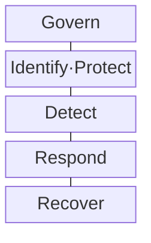
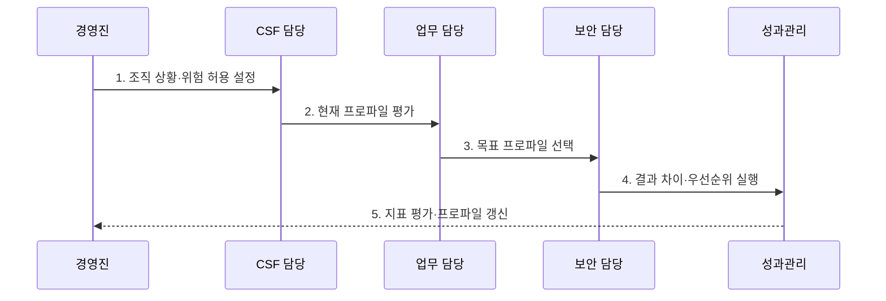

---
sidebar:
  order: 111
  label: "111. NIST Cybersecurity Framework (NIST CSF)"
  badge:
    text: "기출 · 70%"
    variant: note
title: "NIST Cybersecurity Framework (NIST CSF)"
date: "2026-07-30T20:00:00+09:00"
tags:
  - "notes-security"
weight: 111
extra:
  question_no: "111"
  source_status: "기출"
  source_history: "137회"
  priority: 70
  priority_note: "137회 기출에 CSF 2.0 Govern 확장까지 흡수함"
---

## 미리 알고가기

- **미국 국립표준기술연구소(National Institute of Standards and Technology, NIST)**: 미국 상무부 산하의 기술 표준·지침 연구기관이다.
- **사이버보안 프레임워크(Cybersecurity Framework, CSF)**: 사이버보안 위험관리 결과를 공통 언어로 정리한 비규범적 프레임워크이다.
- **CSF Core**: Govern·Identify·Protect·Detect·Respond·Recover의 결과를 기능·범주·하위범주로 분류한 체계이다.
- **조직 프로파일(Organizational Profile)**: 현재 또는 목표 사이버보안 결과를 조직 상황에 맞게 선택한 문서이다.
- **CSF 구현 티어(CSF Implementation Tier)**: 위험 거버넌스·관리 관행의 엄격성을 4단계로 설명하는 도구이다.
- **NIST CSWP 29**: 2024년 2월 발행된 NIST Cybersecurity Framework 2.0의 공식 문서 식별자이다.

## Ⅰ. 개요

- 정의/개념: 사이버보안 **결과 기반 위험관리 프레임워크**
- 배경/필요성: 경영·실무 간 **목표·우선순위 공통 언어**

### 쉽게 이해하기 (학습용)

- 달성할 결과를 공유하고 구체적인 수단은 조직이 선택한다.

## Ⅱ. 특징

- 특정 제품·통제를 강제하지 않는 **결과 중심**
- Govern 포함 6개 기능의 **전사 위험 연결**
- 프로파일 차이와 Tier의 **개선 의사결정**

### 쉽게 이해하기 (학습용)

- 현재와 목표 결과의 차이로 예산과 개선 순서를 정한다.

## Ⅲ. 구조 및 구성요소

| 구성요소 | 책임 |
|:---|:---|
| Govern | 전략·정책·역할·공급망 위험 관리 |
| Identify·Protect | 자산·위험 식별과 보호조치 |
| Detect | 지속 감시·분석으로 사건 발견 |
| Respond | 사고 관리·완화·보고·소통 |
| Recover | 자산·운영 복원·복구 개선 |

### 쉽게 이해하기 (학습용)

- 거버넌스 아래 식별·보호·탐지·대응·복구를 지속한다.

## Ⅳ. 흐름도

**동작 원리**

1. **조직 상황·위험 허용 설정**: 임무·위협·요구·자원 확인
2. **현재 프로파일 평가**: 현재 달성한 CSF 결과 기록
3. **목표 프로파일 선택**: 우선 목표 결과·Tier 설정
4. **결과 차이·우선순위 실행**: 위험·비용·효과로 순서 결정
5. **지표 평가·프로파일 갱신**: 성과 측정·변화 지속 반영

### 쉽게 이해하기 (학습용)

- 현재와 목표 프로파일의 차이부터 개선한다.

## Ⅴ. 종류 및 비교

| CSF 핵심 요소 | CSF Core | 조직 프로파일 | 구현 Tier |
|:---|:---|:---|:---|
| 적용 기준 | 결과 분류·소통 | 현재·목표 차이 관리 | 관리 관행 엄격성 설명 |
| 핵심 특징 | 보안 결과의 공통 분류 | 현재·목표 결과를 조직별 선택 | 관리 관행을 네 단계로 설명 |
| 한계 | 필수 통제로 오인 | 과도한 목표 설정 | 성숙도 점수로 오용 |

### 쉽게 이해하기 (학습용)

- Core는 결과, Profile은 목표, Tier는 관행의 엄격성이다.

## Ⅵ. 실무 고려사항 및 대책

| 고려사항 | 대책 | 효과 |
|:---|:---|:---|
| CSF 2.0 적용 | **NIST CSWP 29의 6기능 활용** | 위험 소통 표준화 |
| 프로파일 작성 | **NIST SP 1301 절차 적용** | 목표·격차 명확화 |
| Tier 활용 | **NIST SP 1302 지침 적용** | 등급 오용 방지 |

### 쉽게 이해하기 (학습용)

- 업무 위험을 가장 크게 줄이는 프로파일 격차부터 투자한다.

## Ⅶ. 결론

- **6개 기능·프로파일 격차·위험 감소**로 개선 순위를 결정한다.

### 쉽게 이해하기 (학습용)

- 경영진과 실무자가 같은 결과 기준으로 투자 순서를 합의한다.
