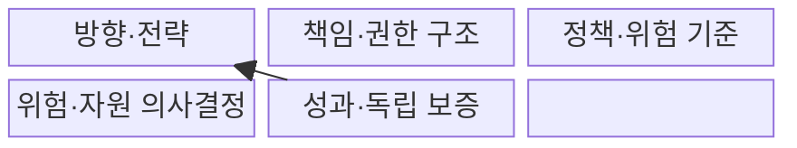
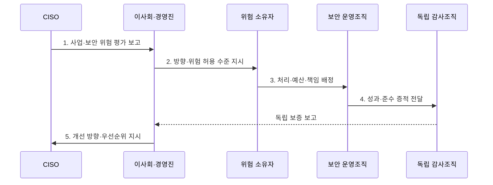

---
sidebar:
  order: 112
  label: "112. 정보보호 거버넌스 (Information Security Governance)"
  badge:
    text: "기출 · 50%"
    variant: note
title: "정보보호 거버넌스 (Information Security Governance)"
date: "2026-07-31T02:09:15+09:00"
tags:
  - "notes-security"
weight: 112
extra:
  question_no: "112"
  source_status: "기출"
  source_history: "120회"
  priority: 50
  priority_note: "120회 기출이며 위험·책임·성과 정렬의 상위축임"
---

## Ⅰ. 개요

핵심 용어

- **정보보호 거버넌스**: 경영진이 보안 방향·위험 수용·투자·감독 책임을 정하는 의사결정 체계이다.

- 정의/개념: **정보보호 거버넌스**는 경영진이 사업 목표와 위험수용 기준에 따라 보안을 평가·지시·감시하고 책임·성과를 소통하는 의사결정 체계
- 배경/필요성: 보안 조직의 통제 운영만으로는 사업 위험의 **수용·투자 책임 결정 불가**

#### 한줄 요약

- 경영진이 보안 위험을 어디까지 감수하고 어디에 투자할지 정한다.

## Ⅱ. 특징

핵심 용어

- **위험 허용 수준**: 조직이 목표를 수행하며 받아들이기로 정한 위험의 한계이다.
- **독립 보증**: 실행 조직과 분리된 감사가 통제 효과와 준수 상태를 확인하는 활동이다.

- 사업 목표·법적 요구의 **보안 전략 연계**
- 승인·실행·감사의 **책임·권한 분리**
- 성과지표·독립 보증의 **경영진 감독**

#### 한줄 요약

- 실무팀이 통제를 운영해도 사업 위험의 수용 책임은 경영진에게 있다.

## Ⅲ. 구조 및 구성요소

핵심 용어

- **평가·지시·감시·소통**: 위험을 판단하고 방향을 정한 뒤 성과를 감독하는 거버넌스 순환이다.

| 구성요소 | 책임 |
|:---|:---|
| 방향·전략 | **사업 목표·위험 허용 수준** 연결 |
| 책임·권한 구조 | **승인·실행·감사 권한** 분리 |
| 정책·위험 기준 | **경영 방향·수용 한계** 구체화 |
| 위험·자원 의사결정 | **처리·예외·투자 우선순위** 승인 |
| 성과·독립 보증 | **지표·감사 기반 효과·준수** 확인 |

#### 한줄 요약

- 경영진이 방향과 책임을 정하고 독립 감사로 실행 결과를 확인한다.

## Ⅳ. 흐름도

핵심 용어

- **위험 소유자**: 담당 업무의 위험 처리와 잔여위험 수용을 승인하는 책임자이다.
- **최고정보보호책임자(Chief Information Security Officer, CISO)**: 정보보호 전략·위험·통제·사고 대응을 총괄하고 경영진에 보고하는 책임자이다.

**동작 원리**

- **1. 사업·보안 위험 평가 보고**: 사업 영향·법적 요구 제시
- **2. 방향·위험 허용 수준 지시**: 목표·수용 한계·우선순위 승인
- **3. 처리·예산·책임 배정**: 통제·자원·책임자를 운영조직에 지정
- **4. 성과·준수 증적 전달**: 지표·통제 효과·준수 근거 제공
- **5. 개선 방향·우선순위 지시**: 감사 결과 기반 전략·투자 조정

#### 한줄 요약

- 위험 보고가 경영진의 투자 승인과 개선 지시로 이어진다.

## Ⅴ. 종류 및 비교

핵심 용어

- **거버넌스와 관리**: 거버넌스는 방향·감독을, 관리는 그 방향에 따른 계획·실행을 담당한다.

| 정보보호 운영축 | 거버넌스 | 관리 |
|:---|:---|:---|
| 적용 기준 | **위험·투자·책임 승인** | **통제 계획·운영** |
| 핵심 특징 | **평가·지시·감시** | **계획·구축·운영·점검** |
| 한계 | **형식적 경영 보고** | 사업 위험과 **통제 분리** |

#### 한줄 요약

- 거버넌스가 방향과 책임을 정하면 관리조직이 통제를 실행한다.

## Ⅵ. 실무 고려사항 및 대책

핵심 용어

- **ISO/IEC 27014**: 정보보안을 평가·지시·감시·소통하는 거버넌스 지침이다.
- **정보·기술(Information and Technology, I&T) 거버넌스 프레임워크 COBIT 2019**: 정보시스템감사통제협회(Information Systems Audit and Control Association, ISACA)가 기업 I&T의 거버넌스와 관리를 구분한 프레임워크이다.
- **평가·지시·모니터링(Evaluate, Direct and Monitor, EDM)**: COBIT에서 경영진의 거버넌스 책임을 평가·방향 설정·감독으로 구분한 영역이다.
- **미국 국립표준기술연구소 사이버보안 프레임워크(NIST Cybersecurity Framework, NIST CSF) 거버넌스(Govern)**: 사이버 위험을 전사 위험관리와 연결하는 기능이다.

| 문제 | 대책 | 효과 |
|:---|:---|:---|
| **보안 거버넌스 절차** | **ISO/IEC 27014:2020 적용** | **평가·지시·감시** 정렬 |
| **I&T 책임 분리** | **COBIT 2019 EDM 연계** | **거버넌스·관리** 구분 |
| **사이버 위험 거버넌스** | **NIST CSF 2.0 Govern 활용** | **전사 위험관리** 연계 |

#### 한줄 요약

- 이사회는 보안 도구 수가 아니라 핵심 업무 위험과 예상 감소 효과·비용·잔여위험을 검토해 투자와 위험 수용을 승인한다.

## Ⅶ. 결론

핵심 용어

- **추적 가능한 위험 수용**: 잔여위험의 판단 근거와 승인 책임을 기록으로 남기는 원칙이다.

- 위험 수용·투자는 **거버넌스**, 통제 계획·운영은 **관리**, 효과는 **독립 보증**

#### 한줄 요약

- 사고 전에 누가 위험을 수용했는지 추적할 수 있어야 한다.
