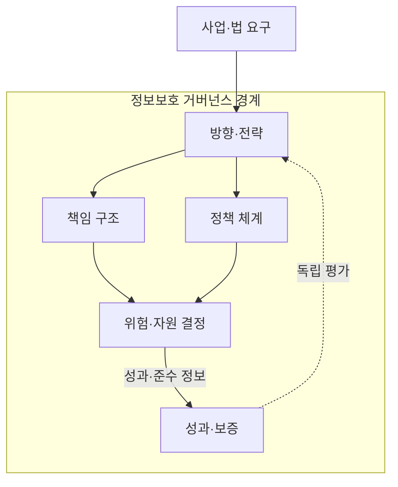
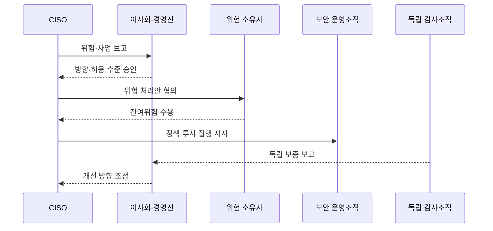

---
sidebar:
  order: 112
  label: "112. 정보보호 거버넌스 (Information Security Governance)"
  badge:
    text: "기출 · 50%"
    variant: note
title: "정보보호 거버넌스 (Information Security Governance)"
date: "2026-07-27T23:59:59+09:00"
tags:
  - "notes-security"
weight: 112
extra:
  question_no: "112"
  source_status: "기출"
  source_history: "120회"
  priority: 50
  priority_note: "120회 기출이며 위험·책임·성과 정렬의 상위축임"
---

## 미리 알고가기

- **정보보호 거버넌스(Information Security Governance)**: 경영진이 보안 방향·위험 수용·투자·감독 책임을 정하는 의사결정 체계
- **위험 허용 수준**: 조직이 목표를 수행하며 받아들이기로 정한 위험의 한계
- **정보보호 최고책임자(Chief Information Security Officer, CISO)**: “시소”로 읽으며 정보보호 전략과 운영을 총괄하는 최고책임자
- **위험 소유자**: 담당 업무의 위험 처리와 잔여위험 수용을 승인하는 책임자
- **독립 보증**: 실행 조직과 분리된 감사가 통제 효과와 준수 상태를 확인하는 활동
- **보완 통제**: 원래 통제를 적용하기 어려울 때 같은 위험을 낮추도록 대신 적용하는 통제

## Ⅰ. 개요

- 정의/개념: 보안 방향·책임·감독의 경영 체계
- **배경/필요성**: 실무 통제 운영만으로 사업 위험 수용과 투자 책임 결정 곤란

### 쉽게 이해하기 (학습용)

- 경영진이 보안 위험을 어디까지 감수하고 어디에 투자할지 정한다.

## Ⅱ. 특징

- 사업 목표·법적 요구를 보안 전략에 연결한다.
- 위험 수용·실행·감사 권한을 분리한다.
- 위험 감소 효과·비용·독립 보증으로 통제 성과를 감독한다.

### 쉽게 이해하기 (학습용)

- 실무팀이 통제를 운영해도 사업 위험의 수용 책임은 경영진에게 있다.

## Ⅲ. 아키텍처 및 구성요소

| 설계 요소 | 설명 |
|:---|:---|
| 방향·전략 | 사업 목표와 위험 허용 수준 연결 |
| 책임 구조 | 승인·실행·감사 권한 분리 |
| 정책 체계 | 경영 방향을 전사 의무로 구체화 |
| 위험·자원 결정 | 위험 처리·예외·투자 우선순위 승인 |
| 성과·보증 | 지표·독립 감사로 효과와 준수 확인 |

### 쉽게 이해하기 (학습용)

- 경영진이 방향과 책임을 정하고 독립 감사로 실행 결과를 확인한다.

## Ⅳ. 원리 및 절차 흐름도

| 절차 | 설명 |
|:---|:---|
| 위험·사업 보고 | 사업 영향과 법적 요구를 경영진에 제시 |
| 방향·허용 수준 승인 | 보안 목표와 수용 가능한 위험 한계 승인 |
| 위험 처리안 협의 | 위험별 완화·회피·전가 대안 검토 |
| 잔여위험 수용 | 통제 후 남은 위험의 책임 있는 승인 |
| 정책·투자 집행 지시 | 승인한 통제와 예산을 운영조직에 전달 |
| 독립 보증 보고 | 감사조직이 통제 효과와 준수를 평가 |
| 개선 방향 조정 | 보증 결과로 전략·통제 우선순위 변경 |

> 요약: 위험 수용·투자는 경영진, 실행은 운영조직이 담당

### 쉽게 이해하기 (학습용)

- 위험 보고가 경영진의 투자 승인과 개선 지시로 이어진다.

## Ⅴ. 거버넌스와 관리 비교

| 판단 기준 | 정보보호 거버넌스 | 정보보호 관리 |
|:---|:---|:---|
| 적용 기준 | 위험 수용·투자·책임을 승인할 때 | 통제 계획·운영 증거를 관리할 때 |
| 핵심 특징 | 경영진이 방향·책임·감독 결정 | 실무 조직이 정책·통제를 실행 |
| 한계 | 형식적 보고로 경영 판단이 지연됨 | 통제 운영이 사업 위험과 분리됨 |

### 쉽게 이해하기 (학습용)

- 거버넌스가 방향과 책임을 정하면 관리조직이 통제를 실행한다.

## Ⅵ. 실무 사례

1. 이사회는 위험 감소·사업 영향 지표로 보안 투자 승인
2. CISO와 감사조직의 보고 경로를 분리해 독립 보증
3. 보안 예외에 보완 통제·만료일·위험 소유자 지정

### 쉽게 이해하기 (학습용)

- 이사회는 통제 개수보다 위험과 사업 영향이 얼마나 줄었는지 보고 투자 순서를 정한다.
- 보안을 운영하는 책임자와 그 운영을 감사하는 조직의 보고선을 나눠 자기평가를 피한다.
- 예외마다 대신 적용할 통제와 종료일·책임자를 두어 위험을 무기한 남기지 않는다.

## Ⅶ. 결론

- 위험 수용·투자는 경영진이 승인하고 독립 감사로 감독

### 쉽게 이해하기 (학습용)

- 사고 후 문책보다 사고 전에 누가 위험을 수용했는지 추적할 수 있어야 함
