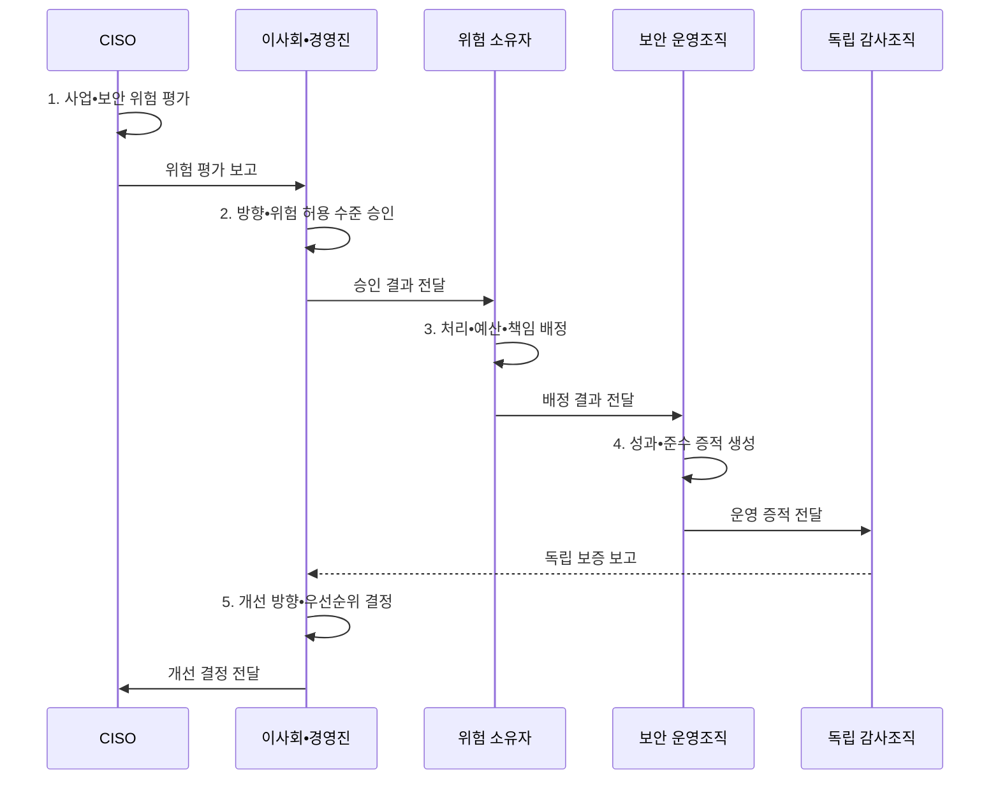

---
sidebar:
  order: 112
  label: "112. 정보보호 거버넌스 (Information Security Governance)"
  badge:
    text: "기출 • 50%"
    variant: note
title: "정보보호 거버넌스 (Information Security Governance)"
date: "2026-08-05T12:24:00+09:00"
tags:
  - "notes-security"
weight: 112
extra:
  question_no: "112"
  source_status: "기출"
  source_history: "120회"
  priority: 50
  priority_note: "120회 기출이며 위험•책임•성과 정렬의 상위축임"
---

## Ⅰ. 개요

<details>
<summary>핵심 용어</summary>

- **정보보호 거버넌스**: 경영진이 보안 방향•위험 수용•투자•감독 책임을 정하는 의사결정 체계이다.

</details>

- 정의/개념: **정보보호 거버넌스** 는 경영진이 사업 목표와 위험수용 기준에 따라 보안을 평가•지시•감시하고 책임•성과를 소통하는 의사결정 체계
- 배경/필요성: 보안 조직의 통제 운영만으로는 사업 위험의 **수용•투자 책임 결정 불가**

#### 한줄 요약

- 경영진이 보안 위험을 어디까지 감수하고 어디에 투자할지 정한다.

## Ⅱ. 특징

<details>
<summary>핵심 용어</summary>

- **위험 허용 수준**: 조직이 목표를 수행하며 받아들이기로 정한 위험의 한계이다.
- **독립 보증**: 실행 조직과 분리된 감사가 통제 효과와 준수 상태를 확인하는 활동이다.

</details>

- 사업 목표•법적 요구의 **보안 전략 연계**
- 승인•실행•감사의 **책임•권한 분리**
- 성과지표•독립 보증의 **경영진 감독**

#### 한줄 요약

- 실무팀이 통제를 운영해도 사업 위험의 수용 책임은 경영진에게 있다.

## Ⅲ. 구조 및 구성요소

<details>
<summary>핵심 용어</summary>

- **평가**: 사업 상황과 보안 위험을 판단하는 활동이다.
- **지시**: 위험 처리 방향과 책임을 정하는 활동이다.
- **감시**: 보안 성과와 준수 상태를 감독하는 활동이다.
- **소통**: 위험과 의사결정 결과를 이해관계자와 공유하는 활동이다.

</details>

```text
                           [방향•전략]
                          /          \
                [책임•권한 구조]  [정책•위험 기준]
                          \          /
                    [위험•자원 의사결정]
                              |
                     [성과•독립 보증]
```

선의 의미: 방향•전략 아래 책임•권한 구조와 정책•위험 기준을 분리하고, 위험•자원 의사결정 및 성과•독립 보증에 연결한 정적 거버넌스 구조

| 구성요소 | 책임 |
|:---|:---|
| 방향•전략 | **사업 목표•위험 허용 수준** 연결 |
| 책임•권한 구조 | **승인•실행•감사 권한** 분리 |
| 정책•위험 기준 | **경영 방향•수용 한계** 구체화 |
| 위험•자원 의사결정 | **처리•예외•투자 우선순위** 승인 |
| 성과•독립 보증 | **지표•감사 기반 효과•준수** 확인 |

#### 한줄 요약

- 경영진이 방향과 책임을 정하고 독립 감사로 실행 결과를 확인한다.

## Ⅳ. 흐름도

<details>
<summary>핵심 용어</summary>

- **위험 소유자**: 담당 업무의 위험 처리와 잔여위험 수용을 승인하는 책임자이다.
- **CISO(Chief Information Security Officer)**: 정보보호 전략•위험•통제를 총괄하는 최고정보보호책임자이다.

</details>



**동작 원리**

- **1. 사업•보안 위험 평가**: 사업 영향•법적 요구 평가
- **2. 방향•위험 허용 수준 승인**: 목표•수용 한계•우선순위 승인
- **3. 처리•예산•책임 배정**: 통제•자원•책임자를 운영조직에 지정
- **4. 성과•준수 증적 생성**: 지표•통제 효과•준수 근거 기록
- **5. 개선 방향•우선순위 결정**: 감사 결과 기반 전략•투자 조정

#### 한줄 요약

- 위험 보고가 경영진의 투자 승인과 개선 지시로 이어진다.

## Ⅴ. 종류 및 비교

<details>
<summary>핵심 용어</summary>

- **거버넌스와 관리**: 거버넌스는 방향•감독을, 관리는 그 방향에 따른 계획•실행을 담당한다.

</details>

| 운영축 | 책임 | 산출•환류 |
|:---|:---|:---|
| **거버넌스** | **위험•투자•책임의 방향 승인과 감독** | 목표•위험 선호•책임자 결정 후 성과 감시 |
| **관리** | **통제 계획•구축•운영•점검** | 실행 결과와 잔여 위험을 거버넌스에 보고 |

#### 한줄 요약

- 거버넌스가 방향과 책임을 정하면 관리조직이 통제를 실행한다.

## Ⅵ. 실무 고려사항 및 대책

<details>
<summary>핵심 용어</summary>

- **ISO(International Organization for Standardization)**: 국제표준화기구이다.
- **IEC(International Electrotechnical Commission)**: 국제전기기술위원회이다.
- **ISO/IEC 27014**: 정보보안의 평가•지시•감시•소통 지침이다.
- **I&T(Information and Technology)**: 기업이 사용하는 정보와 기술이다.
- **COBIT(Control Objectives for Information and Related Technologies)**: I&T 거버넌스와 관리를 구분한 프레임워크이다.
- **ISACA(Information Systems Audit and Control Association)**: COBIT을 개발•관리하는 정보시스템감사통제협회이다.
- **EDM(Evaluate, Direct and Monitor)**: COBIT의 평가•지시•모니터링 거버넌스 영역이다.
- **NIST(National Institute of Standards and Technology)**: 미국 국립표준기술연구소이다.
- **CSF(Cybersecurity Framework)**: 사이버보안 위험관리 결과 프레임워크이다.
- **Govern**: CSF에서 사이버 위험을 전사 위험관리와 연결하는 기능이다.

</details>

| 문제 | 대책 | 효과 |
|:---|:---|:---|
| **보안 거버넌스 절차** | **ISO/IEC 27014:2020 적용** | **평가•지시•감시** 정렬 |
| **I&T 책임 분리** | **COBIT 2019 EDM 연계** | **거버넌스•관리** 구분 |
| **사이버 위험 거버넌스** | **NIST CSF 2.0 Govern 활용** | **전사 위험관리** 연계 |

#### 한줄 요약

- 이사회는 보안 도구 수가 아니라 핵심 업무 위험과 예상 감소 효과•비용•잔여위험을 검토해 투자와 위험 수용을 승인한다.

## Ⅶ. 결론

<details>
<summary>핵심 용어</summary>

- **추적 가능한 위험 수용**: 잔여위험의 판단 근거와 승인 책임을 기록으로 남기는 원칙이다.

</details>

- 위험 수용•투자는 **거버넌스**, 통제 계획•운영은 **관리**, 효과는 **독립 보증**

#### 한줄 요약

- 사고 전에 누가 위험을 수용했는지 추적할 수 있어야 한다.
