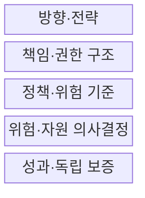
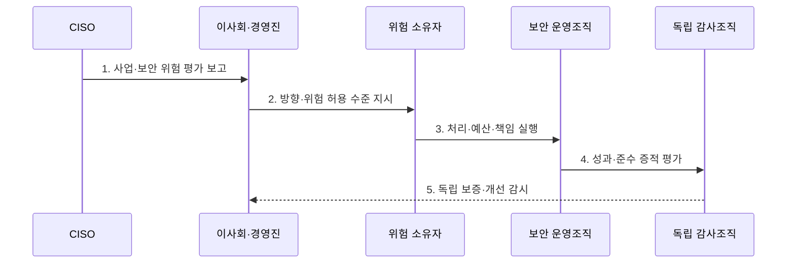

---
sidebar:
  order: 112
  label: "112. 정보보호 거버넌스 (Information Security Governance)"
  badge:
    text: "기출 · 50%"
    variant: note
title: "정보보호 거버넌스 (Information Security Governance)"
date: "2026-07-27T23:59:59+09:00"
tags:
  - "notes-security"
weight: 112
extra:
  question_no: "112"
  source_status: "기출"
  source_history: "120회"
  priority: 50
  priority_note: "120회 기출이며 위험·책임·성과 정렬의 상위축임"
---

## 미리 알고가기

- **정보보호 거버넌스(Information Security Governance)**: 경영진이 보안 방향·위험 수용·투자·감독 책임을 정하는 의사결정 체계이다.
- **위험 허용 수준(Risk Tolerance)**: 조직이 목표를 수행하며 받아들이기로 정한 위험의 한계이다.
- **정보보호 최고책임자(Chief Information Security Officer, CISO)**: 조직의 정보보호 전략·위험·통제·사고 대응을 총괄하고 경영진에 보고하는 최고책임자이다.
- **위험 소유자(Risk Owner)**: 담당 업무의 위험 처리와 잔여위험 수용을 승인하는 책임자이다.
- **독립 보증(Independent Assurance)**: 실행 조직과 분리된 감사가 통제 효과와 준수 상태를 확인하는 활동이다.
- **ISO/IEC 27014:2020**: 정보보안을 평가·지시·감시·소통하는 거버넌스 개념·목표·절차 지침이다.
- **COBIT 2019**: 기업 I&T 거버넌스와 관리를 EDM·APO·BAI·DSS·MEA 영역으로 구분한 ISACA 프레임워크이다.

## Ⅰ. 개요

- 정의: 보안 **평가·지시·감시·소통** 의사결정 체계
- 목적: 사업 목표와 **위험·투자·책임 정렬**

### 쉽게 이해하기 (학습)

- 경영진이 보안 위험을 어디까지 감수하고 어디에 투자할지 정한다.

## Ⅱ. 특징

- 사업 목표·법적 요구의 **보안 전략 연계**
- 승인·실행·감사의 **책임·권한 분리**
- 성과지표·독립 보증의 **경영진 감독**

### 쉽게 이해하기 (학습)

- 실무팀이 통제를 운영해도 사업 위험의 수용 책임은 경영진에게 있다.

## Ⅲ. 구조 및 구성요소

| 설계 요소 | 설명 |
|:---|:---|
| 방향·전략 | 사업 목표와 위험 허용 수준 연결 |
| 책임·권한 구조 | 승인·실행·감사 권한 분리 |
| 정책·위험 기준 | 경영 방향·수용 한계 구체화 |
| 위험·자원 의사결정 | 처리·예외·투자 우선순위 승인 |
| 성과·독립 보증 | 지표·감사로 효과·준수 확인 |

### 쉽게 이해하기 (학습)

- 경영진이 방향과 책임을 정하고 독립 감사로 실행 결과를 확인한다.

## Ⅳ. 흐름도

| 절차 | 설명 |
|:---|:---|
| 1. 사업·보안 위험 평가 보고 | 사업 영향·법적 요구 제시 |
| 2. 방향·위험 허용 수준 지시 | 목표·수용 한계·우선순위 승인 |
| 3. 처리·예산·책임 실행 | 통제·자원·책임자 배정 |
| 4. 성과·준수 증적 평가 | 지표·통제 효과·준수 검증 |
| 5. 독립 보증·개선 감시 | 감사 결과로 방향 조정 |

### 쉽게 이해하기 (학습)

- 위험 보고가 경영진의 투자 승인과 개선 지시로 이어진다.

## Ⅴ. 종류 및 비교

| 정보보호 운영축 | 거버넌스 | 관리 |
|:---|:---|:---|
| 적용 기준 | 위험·투자·책임 승인 | 통제 계획·운영 |
| 핵심 특징 | 평가·지시·감시 | 계획·구축·운영·점검 |
| 한계 | 형식적 경영 보고 | 사업 위험과 통제 분리 |

### 쉽게 이해하기 (학습)

- 거버넌스가 방향과 책임을 정하면 관리조직이 통제를 실행한다.

## Ⅵ. 실무 고려사항 및 대책

| 고려사항 | 대책 | 효과 |
|:---|:---|:---|
| 보안 거버넌스 절차 | **ISO/IEC 27014:2020 적용** | 평가·지시·감시 정렬 |
| I&T 책임 분리 | **COBIT 2019 EDM 연계** | 거버넌스·관리 구분 |
| 사이버 위험 거버넌스 | **NIST CSF 2.0 Govern 활용** | 전사 위험관리 연계 |

### 쉽게 이해하기 (학습)

- 이사회는 보안 도구 수가 아니라 핵심 업무 위험과 예상 감소 효과·비용·잔여위험을 검토해 투자와 위험 수용을 승인한다.

## Ⅶ. 결론

- **사업 목표·위험 소유권·투자 효과**로 보안 방향을 결정한다.

### 쉽게 이해하기 (학습)

- 사고 전에 누가 위험을 수용했는지 추적할 수 있어야 한다.
