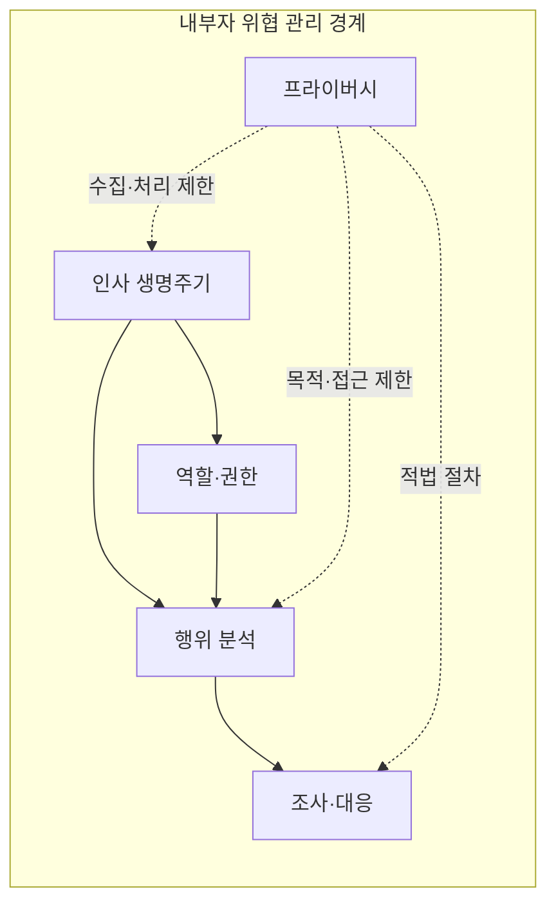
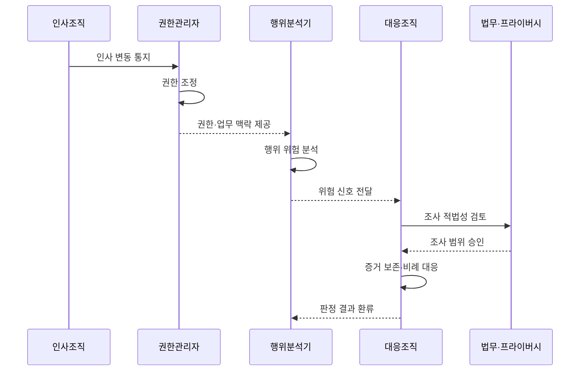

---
sidebar:
  order: 113
  label: "113. 내부자 위협 관리 (Insider Threat Management)"
  badge:
    text: "미출제 · 50%"
    variant: note
title: "내부자 위협 관리 (Insider Threat Management)"
date: "2026-07-25T01:00:00+09:00"
tags:
  - "notes-security"
weight: 113
extra:
  question_no: "113"
  source_status: "미출제"
  source_history: ""
  priority: 50
  priority_note: "행위·권한·데이터를 잇는 내부자 위험 설계가 독립적임"
---

## 미리 알고가기

- **내부자 위협(Insider Threat)**: 조직의 신뢰나 접근 권한을 가진 주체가 고의·실수·계정 탈취로 자산에 피해를 일으킬 위험이다.
- **최소 권한**: 업무 수행에 필요한 최소 범위와 기간만 권한을 부여하는 원칙
- **직무 분리**: 한 사람이 중요 업무의 승인과 실행을 모두 맡지 못하게 권한을 나누는 통제
- **행위 기준선**: 사용자·직무의 평소 접근 패턴을 기록해 이상 행위를 비교하는 기준
- **세션**: 로그인 후 로그아웃까지 이어지는 한 번의 연결·작업 상태
- **오탐**: 정상 행위를 위협으로 잘못 경고한 결과

## Ⅰ. 개요

- 정의/개념: 신뢰된 접근의 오용을 관리하는 체계
- **배경/필요성**: 정상 권한을 악용한 은밀한 피해 대응

### 쉽게 이해하기 (학습용)

- 허가된 계정도 사람의 의도·실수·탈취 여부를 살펴 피해를 줄인다.

## Ⅱ. 특징

- 정상 권한의 업무 맥락과 행위 변화를 비교한다.
- 고의·실수·계정 탈취를 구분해 대응한다.
- 보안·인사·법무가 조사·권한 조정 협업한다.
- 목적 제한·비례성에 맞춰 행위를 관찰한다.

### 쉽게 이해하기 (학습용)

- 대량 내려받기도 담당 업무와 승인 여부에 따라 정상 또는 위험으로 판정한다.

## Ⅲ. 아키텍처 및 구성요소

| 설계 요소 | 설명 |
|:---|:---|
| 인사 생명주기 | 입사·이동·휴직·퇴사와 권한 회수 연계 |
| 역할·권한 | 최소 권한·직무 분리·정기 재검토 |
| 행위 분석 | 업무 기준선과 로그로 위험 신호 선별 |
| 조사·대응 | 법무 검토·증거 보존·세션 제한 |
| 프라이버시 | 수집 목적·보관·접근·이의 절차 제한 |

### 쉽게 이해하기 (학습용)

- 인사 변동과 권한·행위 정보를 연결하고 정해진 범위에서 의심 신호를 조사한다.

## Ⅳ. 원리 및 절차 흐름도

| 절차 | 설명 |
|:---|:---|
| 인사 변동 통지 | 입사·이동·휴직·퇴사 상태 전달 |
| 권한 조정 | 직무와 재직 상태에 맞춰 접근권한 변경 |
| 권한·업무 맥락 제공 | 정상 업무 범위와 보유 권한 전달 |
| 행위 위험 분석 | 기준선과 현재 행위 차이로 위험 선별 |
| 위험 신호 전달 | 조사할 계정·행위·근거를 대응조직에 전달 |
| 조사 적법성 검토 | 목적·비례성·노동법·개인정보 요건 확인 |
| 조사 범위 승인 | 허용된 증거·기간·접근자를 지정 |
| 증거 보존·비례 대응 | 증거를 보존하고 위험에 맞춰 권한 제한 |
| 판정 결과 환류 | 오탐·확정 결과로 분석 기준 조정 |

> 요약: 권한·행위 맥락으로 선별하고 적법 절차로 조사

### 쉽게 이해하기 (학습용)

- 경고가 나면 업무상 필요한 행동인지와 계정이 탈취됐는지를 먼저 확인한다.

## Ⅴ. 종류 및 비교

| 판단 기준 | 악의적 내부자 | 부주의 내부자 | 탈취된 내부 계정 |
|:---|:---|:---|:---|
| 핵심 특징 | 권한을 의도적으로 남용 | 실수로 정보·절차를 노출 | 외부자가 정상 계정을 악용 |
| 적용 기준 | 반출 의도·조작 정황이 확인될 때 | 오발송·절차 누락이 발생할 때 | 위치·기기·접속 패턴이 급변할 때 |
| 주요 위험 | 증거 훼손과 추가 피해 | 같은 실수의 반복 | 정상 사용자로 위장해 탐지 지연 |

### 쉽게 이해하기 (학습용)

- 같은 계정의 행동도 고의·실수·탈취에 따라 조사와 조치가 달라진다.

## Ⅵ. 실무 사례

1. 퇴직 예정자의 대량 자료 조회를 인사 변동 정보와 함께 분석하고, 조사 승인 후 접근 권한을 회수하며 확정 결과를 행동 기준선에 반영한다.

### 쉽게 이해하기 (학습용)

- 관리자 작업은 기록하고 긴급 작업이나 개인정보를 볼 수 있는 범위와 시간을 좁힌다.
- 직무가 바뀌거나 퇴사하면 계정과 기기를 회수하고 남은 자료 접근도 끊는다.
- 조사에서 확인된 위험과 잘못 울린 경고를 반영해 평소 행동의 기준을 다시 맞춘다.

## Ⅶ. 결론

- 내부자의 고의·실수·계정 탈취로 인한 피해를 줄이기 위해 권한·행위 편차·인사 맥락·업무 필요성을 검토하여, 적법한 조사와 비례적 접근 통제를 내부자 위협 관리에 활용해야 한다.

### 쉽게 이해하기 (학습용)

- 필요한 정보만 수집해 내부 사고를 줄이면서 직원의 프라이버시도 보호함
