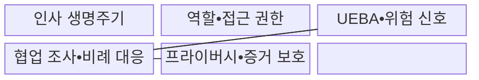
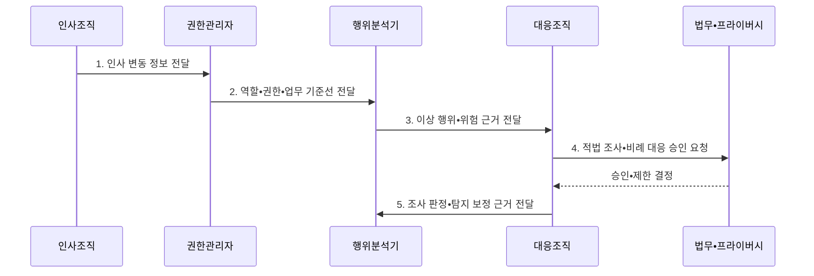

---
sidebar:
  order: 113
  label: "113. 내부자 위협 관리 (Insider Threat Management)"
  badge:
    text: "미출제 • 50%"
    variant: note
title: "내부자 위협 관리 (Insider Threat Management)"
date: "2026-08-04T15:41:00+09:00"
tags:
  - "notes-security"
weight: 113
extra:
  question_no: "113"
  source_status: "미출제"
  source_history: ""
  priority: 50
  priority_note: "행위•권한•데이터를 잇는 내부자 위험 설계가 독립적임"
---

## Ⅰ. 개요

핵심 용어

- **내부자 위협**: 신뢰나 접근 권한을 가진 주체가 고의•실수•계정 탈취로 자산에 피해를 일으킬 위험이다.

- 정의/개념: **내부자 위협 관리** 는 임직원•협력자•탈취 계정처럼 신뢰된 접근에서 발생하는 고의•실수•강요•도용 위험을 식별•예방•대응하는 관리 체계
- 배경/필요성: 외부 공격 시그니처만으로는 정상 권한의 **고의•실수•탈취 구분 곤란**

#### 한줄 요약

- 허가된 계정도 사람의 의도•실수•탈취 여부를 살펴 피해를 줄인다.

## Ⅱ. 특징

핵심 용어

- **고의 행위**: 신뢰된 권한을 의도적으로 남용하는 내부자 위협이다.
- **실수 행위**: 오발송•절차 누락으로 피해를 만드는 내부자 위협이다.
- **계정 탈취**: 외부자가 내부자의 계정 통제권을 빼앗은 위협이다.
- **업무 기준선**: 역할•기기•시간•승인 상태에 따른 정상 행위 기준이다.
- **맥락 비교**: 현재 행위를 업무 기준선과 비교해 위험도를 판단하는 방식이다.

- 업무 기준선과 현재 행위의 **맥락 비교**
- 고의•실수•계정 탈취의 **원인별 대응**
- 보안•인사•법무의 **협업•적법 조사**

#### 한줄 요약

- 대량 내려받기도 담당 업무와 승인 여부에 따라 정상 또는 위험으로 판정한다.

## Ⅲ. 구조 및 구성요소

핵심 용어

- **최소 권한**: 업무에 필요한 최소 범위와 기간만 권한을 부여하는 원칙이다.
- **직무 분리**: 한 사람이 중요 업무의 승인과 실행을 모두 맡지 못하게 권한을 나누는 통제이다.
- **UEBA(User and Entity Behavior Analytics)**: 사용자•개체의 기준선과 현재 행위를 비교하는 분석 기법이다.

| 구성요소 | 책임 |
|:---|:---|
| 인사 생명주기 | **입사•이동•휴직•퇴사•권한 회수** 연계 |
| 역할•접근 권한 | **최소 권한•직무 분리•정기 검토** |
| UEBA•위험 신호 | **기준선•로그 기반 조사 대상** 선별 |
| 협업 조사•비례 대응 | **적법 검토•증거 보존•권한 제한** |
| 프라이버시•증거 보호 | **목적•보관•접근•이의 절차** 제한 |

#### 한줄 요약

- 인사 변동과 권한•행위 정보를 연결하고 정해진 범위에서 의심 신호를 조사한다.

## Ⅳ. 흐름도

핵심 용어

- **비례적 조사**: 위험 신호의 신뢰도와 영향에 맞춰 적법한 범위에서 조사 강도를 정하는 원칙이다.

**동작 원리**

- **1. 인사 변동 정보 전달**: 입사•이동•퇴사 상태와 시점 제공
- **2. 역할•권한•업무 기준선 전달**: 정상 접근•기기•시간대 제공
- **3. 이상 행위•위험 근거 전달**: 기준선 편차•업무 문맥 제공
- **4. 적법 조사•비례 대응 승인 요청**: 증거•기간•접근 범위 검토 요청
- **5. 조사 판정•탐지 보정 근거 전달**: 오탐•확정 결과를 UEBA에 환류

#### 한줄 요약

- 경고가 나면 업무상 필요한 행동인지와 계정이 탈취됐는지를 먼저 확인한다.

## Ⅴ. 종류 및 비교

핵심 용어

- **악의적 내부자**: 권한을 의도적으로 남용하는 내부자이다.
- **부주의 내부자**: 실수로 정보 노출이나 절차 누락을 일으킨 내부자이다.
- **탈취 계정**: 외부자가 지배하며 내부자처럼 위장한 계정이다.

| 내부자 위협 유형 | 악의적 내부자 | 부주의 내부자 | 탈취 계정 |
|:---|:---|:---|:---|
| 적용 기준 | **반출 의도•조작 정황** | **오발송•절차 누락** | **위치•기기 급변** |
| 핵심 특징 | **권한의 의도적 남용** | 실수로 **정보 노출** | 외부자의 **계정 악용** |
| 한계 | **의도 입증** 곤란 | 반복 실수 **탐지 지연** | 정상 사용자 **위장** |

#### 한줄 요약

- 같은 계정의 행동도 고의•실수•탈취에 따라 조사와 조치가 달라진다.

## Ⅵ. 실무 고려사항 및 대책

핵심 용어

- **NIST(National Institute of Standards and Technology)**: 미국 국립표준기술연구소이다.
- **SP(Special Publication)**: NIST의 특별간행물이다.
- **PM(Program Management)**: NIST 통제의 프로그램 관리 계열이다.
- **NIST SP 800-53 PM-12**: 협업형 내부자 위협 프로그램을 요구하는 통제이다.
- **CERT(Computer Emergency Response Team)**: 컴퓨터 침해사고 대응 조직이다.
- **SEI(Software Engineering Institute)**: CERT 가이드를 발행한 소프트웨어공학연구소이다.
- **CERT 완화 가이드**: 사례 기반 내부자 위험 완화 실무 지침이다.
- **AC(Access Control)**: NIST 통제의 접근통제 계열이다.
- **AC-5**: 중요 업무의 직무 분리를 요구하는 통제이다.
- **AC-6**: 사용자와 시스템에 최소 권한을 요구하는 통제이다.

| 문제 | 대책 | 효과 |
|:---|:---|:---|
| **전사 내부자 프로그램** | **NIST 800-53 PM-12 적용** | 부서 간 **협업 대응** |
| **권한 오용 예방** | **AC-5•AC-6 통제 적용** | **직무 분리•최소 권한** |
| **사례 기반 완화** | **CERT 가이드 제7판 활용** | **22개 실무** 적용 |

#### 한줄 요약

- 퇴직 예정자의 대량 조회를 인사 맥락과 함께 조사한다.

## Ⅶ. 결론

핵심 용어

- **개인정보 보호**: 탐지•조사 과정에서 목적 제한과 최소 수집을 지키는 원칙이다.

- 고의는 **권한 제한•증거 보존**, 실수는 **교육•절차 개선**, 탈취 계정은 **세션 회수**

#### 한줄 요약

- 필요한 정보만 수집해 사고와 직원 프라이버시를 함께 보호한다.
