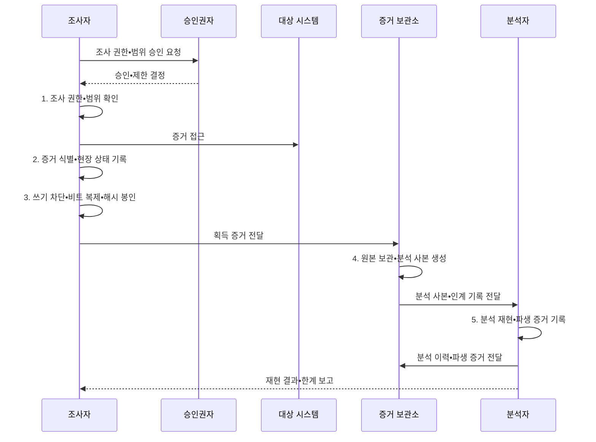

---
sidebar:
  order: 114
  label: "114. 디지털 포렌식 — 증거 수집•체인 오브 커스터디 (Digital Forensics)"
  badge:
    text: "기출 • 70%"
    variant: note
title: "디지털 포렌식 — 증거 수집•체인 오브 커스터디 (Digital Forensics)"
date: "2026-08-05T12:26:00+09:00"
tags:
  - "notes-security"
weight: 114
extra:
  question_no: "114"
  source_status: "기출"
  source_history: "128회, 129회"
  priority: 70
  priority_note: "128•129회 반복된 증거수집•보존 기본 주제임"
---

## Ⅰ. 개요

<details>
<summary>핵심 용어</summary>

- **디지털 포렌식**: 디지털 데이터를 적법하게 식별•수집•보존•분석해 사실관계를 밝히는 조사 절차이다.

</details>

- 정의/개념: 전자 매체 증거를 적법하게 식별•획득•보존•분석하고 재현 가능한 결과로 보고하는 **디지털 포렌식**
- 배경/필요성: 원본 직접 분석•취급 기록 누락 시 **무결성•연계보관성 입증 불가**

#### 한줄 요약

- 누가 어떤 방법으로 증거를 다뤘는지 남겨 조사 결과를 다시 확인할 수 있게 한다.

## Ⅱ. 특징

<details>
<summary>핵심 용어</summary>

- **휘발성 정보**: 전원 차단이나 시간 경과로 사라지는 메모리•프로세스•연결 정보이다.
- **원본 보존**: 원본 변경을 막고 검증된 사본으로 분석하는 증거 처리 원칙이다.

</details>

- 조사 권한•범위•최소 수집의 **적법성**
- 휘발성•상태 변경 기반 **획득 순서**
- 원본 보존•사본 분석의 **무결성•재현성**

#### 한줄 요약

- 전원을 끄면 사라질 정보와 수집 중 바뀔 상태를 비교해 증거 획득 순서를 정한다.

## Ⅲ. 구조 및 구성요소

<details>
<summary>핵심 용어</summary>

- **증거물 연계 관리**: 증거의 수집•인수•처리•인계를 연속 기록해 신뢰성을 보장하는 절차이다.
- **해시값**: 원본과 사본의 동일성과 획득 후 무결성을 검사하는 고정 길이 값이다.

</details>

```text
                         [조사 권한•범위]
                         /            \
              [원본•잠재적 증거]  [검증된 분석 환경]
                         \            /
                    [포렌식 이미지•해시]
                               |
                    [연계보관•분석 이력]
```

선의 의미: 조사 권한•범위가 원본 증거와 분석 환경의 경계를 제한하고, 포렌식 이미지•해시 및 연계보관•분석 이력이 증거 무결성과 재현성을 뒷받침하는 구조

| 구성요소 | 책임 |
|:---|:---|
| 조사 권한•범위 | **조사 근거•대상•기간•최소 수집** 한계 |
| 원본•잠재적 증거 | **쓰기 차단•원래 상태** 보존 |
| 포렌식 이미지•해시 | **비트 복제•동일성 검증** |
| 검증된 분석 환경 | **추출•검색•교차 분석** 수행 |
| 연계보관•분석 이력 | **접근•인계•도구•명령** 기록 |

#### 한줄 요약

- 원본은 봉인하고 검증된 사본만 분석하며 모든 접근과 인계를 기록한다.

## Ⅳ. 흐름도

<details>
<summary>핵심 용어</summary>

- **증거 취급 기록**: 증거의 상태•담당자•시간•작업 내용을 단계마다 남긴 기록이다.

</details>



**동작 원리**

- **1. 조사 권한•범위 확인**: 근거•대상•기간•도구 제한 확인
- **2. 증거 식별•현장 상태 기록**: 장치•연결•시각•휘발성 판단
- **3. 쓰기 차단•비트 복제•해시 봉인**: 원본 변경 방지와 무결성 확보
- **4. 원본 보관•분석 사본 생성**: 검증된 사본과 인계 기록 생성
- **5. 분석 재현•파생 증거 기록**: 도구•명령•산출물과 분석 이력 보존

#### 한줄 요약

- 다른 분석자가 같은 사본과 기록을 따라 같은 결론에 이르는지 확인한다.

## Ⅴ. 종류 및 비교

<details>
<summary>핵심 용어</summary>

- **라이브 포렌식**: 실행 중인 시스템에서 휘발성 정보를 수집하는 방식이다.
- **데드 포렌식**: 전원 차단 후 저장 매체를 복제해 분석하는 방식이다.

</details>

| 포렌식 방식 | 라이브 포렌식 | 데드 포렌식 |
|:---|:---|:---|
| 적용 기준 | **메모리•프로세스•연결** 보존 | **파일•메타데이터•삭제 흔적** 분석 |
| 핵심 특징 | **실행 중 시스템 상태** 수집 | 정지 매체의 **복제본 분석** |
| 한계 | 수집 행위의 **시스템 상태 변경** | 종료 과정의 **휘발성 정보 소실** |

#### 한줄 요약

- 실행 중 정보가 필요하면 라이브, 원본 변경을 줄이려면 데드 방식을 택한다.

## Ⅵ. 실무 고려사항 및 대책

<details>
<summary>핵심 용어</summary>

- **ISO(International Organization for Standardization)**: 국제표준화기구이다.
- **IEC(International Electrotechnical Commission)**: 국제전기기술위원회이다.
- **ISO/IEC 27037**: 디지털 증거의 식별•수집•획득•보존 표준이다.
- **ISO/IEC 27042**: 디지털 증거의 분석•해석 표준이다.
- **NIST(National Institute of Standards and Technology)**: 미국 국립표준기술연구소이다.
- **SP(Special Publication)**: NIST가 발행하는 특별간행물이다.
- **NIST SP 800-86**: 포렌식 기법을 사고대응에 통합하는 지침이다.

</details>

| 문제 | 대책 | 효과 |
|:---|:---|:---|
| **증거 취급 절차** | **ISO/IEC 27037:2012 적용** | 획득•보존 **신뢰성** 확보 |
| **분석•해석 품질** | **ISO/IEC 27042:2015 적용** | **재현성•반복성** 확보 |
| **사고대응 연계** | **NIST SP 800-86 참조** | 조사•대응 **일관성** 확보 |

#### 한줄 요약

- 침해 서버는 확산 위험과 메모리•네트워크 연결 정보의 소실 가능성을 비교해 초기 조치와 수집 순서를 정하고 모든 취급 이력을 기록한다.

## Ⅶ. 결론

<details>
<summary>핵심 용어</summary>

- **무결성**: 수집 이후 증거가 변하지 않았음을 입증하는 조건이다.
- **연계보관성**: 증거의 취급•인계 이력이 끊기지 않았음을 입증하는 조건이다.

</details>

- 휘발 정보 필요 시 **라이브**, 원본 변경 최소화 시 **데드**, 모두 해시•연계보관 기록

#### 한줄 요약

- 수집•인계 기록이 끊기면 분석 결과의 신뢰가 약해진다.
