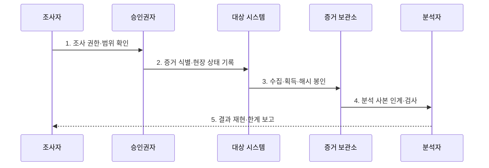

---
sidebar:
  order: 114
  label: "114. 디지털 포렌식 — 증거 수집·체인 오브 커스터디 (Digital Forensics)"
  badge:
    text: "기출 · 70%"
    variant: note
title: "디지털 포렌식 — 증거 수집·체인 오브 커스터디 (Digital Forensics)"
date: "2026-07-27T23:59:59+09:00"
tags:
  - "notes-security"
weight: 114
extra:
  question_no: "114"
  source_status: "기출"
  source_history: "128회, 129회"
  priority: 70
  priority_note: "128·129회 반복된 증거수집·보존 기본 주제임"
---

## 미리 알고가기

- **디지털 포렌식(Digital Forensics)**: 디지털 데이터를 적법하게 식별·수집·보존·분석해 사실관계를 밝히는 조사 절차이다.
- **증거물 연계 관리(Chain of Custody)**: 디지털 증거를 누가 언제 수집·인수·처리·인계했는지 연속적으로 기록하여 법적 신뢰성을 보장하는 관리 절차이다.
- **해시값(Hash Value)**: 원본과 사본의 동일성과 획득 후 무결성을 검사하는 고정 길이 값이다.
- **휘발성 정보(Volatile Data)**: 전원 차단이나 시간 경과로 사라지는 메모리·프로세스·연결 정보이다.
- **ISO/IEC 27037:2012**: 잠재적 디지털 증거의 식별·수집·획득·보존 지침을 규정한 국제표준이다.
- **ISO/IEC 27042:2015**: 디지털 증거 분석·해석의 유효성·재현성·반복성 지침을 규정한 국제표준이다.
- **NIST SP 800-86**: 포렌식 기법을 정보보안 사고대응에 통합하는 실무 지침이다.

## Ⅰ. 개요

- 정의: 디지털 증거의 **적법한 획득·보존·분석**
- 목적: 무결성·연계보관성·재현성의 **증거 신뢰 확보**

### 쉽게 이해하기 (학습)

- 누가 어떤 방법으로 증거를 다뤘는지 남겨 조사 결과를 다시 확인할 수 있게 한다.

## Ⅱ. 특징

- 조사 권한·범위·최소 수집의 **적법성**
- 휘발성·상태 변경 기반 **획득 순서**
- 원본 보존·사본 분석의 **무결성·재현성**

### 쉽게 이해하기 (학습)

- 전원을 끄면 사라질 정보와 수집 중 바뀔 상태를 비교해 증거 획득 순서를 정한다.

## Ⅲ. 구조 및 구성요소

| 설계 요소 | 설명 |
|:---|:---|
| 권한·범위 | 조사 근거·대상·기간·최소 수집 한계 |
| 원본·잠재적 증거 | 쓰기 차단·원래 상태 보존 |
| 포렌식 이미지·해시 | 비트 복제·동일성 검증 |
| 검증된 분석 환경 | 도구로 추출·검색·교차 분석 |
| 연계보관·분석 이력 | 접근·인계·도구·명령 기록 |

### 쉽게 이해하기 (학습)

- 원본은 봉인하고 검증된 사본만 분석하며 모든 접근과 인계를 기록한다.

## Ⅳ. 흐름도

| 절차 | 설명 |
|:---|:---|
| 1. 조사 권한·범위 확인 | 근거·대상·기간·도구 승인 |
| 2. 증거 식별·현장 상태 기록 | 장치·연결·시각·휘발성 판단 |
| 3. 수집·획득·해시 봉인 | 쓰기 차단·비트 복제·원본 보존 |
| 4. 분석 사본 인계·검사 | 인계 기록·검증된 사본 분석 |
| 5. 결과 재현·한계 보고 | 도구·명령·근거·오차 기록 |

### 쉽게 이해하기 (학습)

- 다른 분석자가 같은 사본과 기록을 따라 같은 결론에 이르는지 확인한다.

## Ⅴ. 종류 및 비교

| 포렌식 방식 | 라이브 포렌식 | 데드 포렌식 |
|:---|:---|:---|
| 적용 기준 | 메모리·프로세스·연결을 보존할 때 | 파일·메타데이터·삭제 흔적을 분석할 때 |
| 핵심 특징 | 실행 중인 시스템 상태 수집 | 정지 매체의 복제본 분석 |
| 한계 | 수집 행위가 시스템 상태를 변경 | 종료 과정에서 휘발성 정보가 소실 |

### 쉽게 이해하기 (학습)

- 실행 중 정보가 필요하면 라이브, 원본 변경을 줄이려면 데드 방식을 택한다.

## Ⅵ. 실무 고려사항 및 대책

| 고려사항 | 대책 | 효과 |
|:---|:---|:---|
| 증거 취급 절차 | **ISO/IEC 27037:2012 적용** | 획득·보존 신뢰성 |
| 분석·해석 품질 | **ISO/IEC 27042:2015 적용** | 재현성·반복성 확보 |
| 사고대응 연계 | **NIST SP 800-86 참조** | 조사·대응 일관성 |

### 쉽게 이해하기 (학습)

- 침해 서버는 확산 위험과 메모리·네트워크 연결 정보의 소실 가능성을 비교해 초기 조치와 수집 순서를 정하고 모든 취급 이력을 기록한다.

## Ⅶ. 결론

- **조사 권한·휘발성·해시·연계보관성**으로 획득 방식을 결정한다.

### 쉽게 이해하기 (학습)

- 수집·인계 기록이 끊기면 분석 결과의 신뢰가 약해진다.
