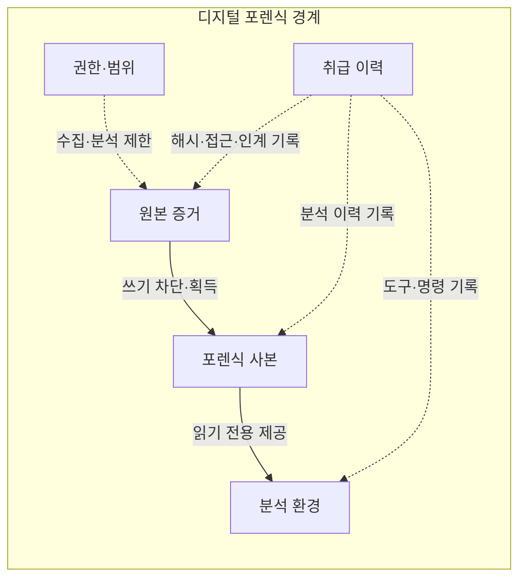
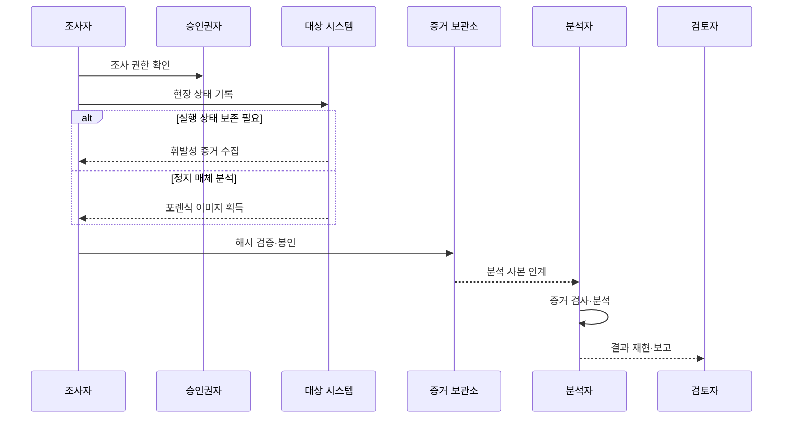

---
sidebar:
  order: 114
  label: "114. 디지털 포렌식 — 증거 수집·체인 오브 커스터디 (Digital Forensics)"
  badge:
    text: "기출 · 70%"
    variant: note
title: "디지털 포렌식 — 증거 수집·체인 오브 커스터디 (Digital Forensics)"
date: "2026-07-27T23:59:59+09:00"
tags:
  - "notes-security"
weight: 114
extra:
  question_no: "114"
  source_status: "기출"
  source_history: "128회, 129회"
  priority: 70
  priority_note: "128·129회 반복된 증거수집·보존 기본 주제임"
---

## 미리 알고가기

- **디지털 포렌식(Digital Forensics)**: 디지털 데이터를 적법하게 식별·수집·보존·분석해 사실관계를 밝히는 조사 절차
- **증거물 연계 관리(Chain of Custody)**: “체인 오브 커스터디”로 읽으며 증거를 누가 언제 인수·처리·인계했는지 끊김 없이 기록하는 관리
- **해시값**: 데이터로 계산한 고정 길이 값으로, 원본과 사본의 값 비교를 통해 획득 후 무결성을 검사하는 데 사용함
- **휘발성 정보**: 전원 차단이나 시간 경과로 사라지는 메모리·프로세스·네트워크 연결 정보
- **라이브 포렌식**: 실행 중인 시스템에서 휘발성 정보와 현재 상태를 수집하는 방식
- **데드 포렌식**: 전원을 끈 저장 매체나 복제 이미지에서 데이터를 분석하는 방식

## Ⅰ. 개요

- **정의/개념**: 디지털 증거를 적법하게 식별·수집·보존·분석하는 조사 절차
- **배경/필요성**: 일반 데이터 복사만으로 증거 무결성·취급 이력·재현성 입증 곤란

### 쉽게 이해하기 (학습용)

- 누가 어떤 방법으로 증거를 다뤘는지 남겨 조사 결과를 다시 확인할 수 있게 한다.

## Ⅱ. 특징

- 조사 전 권한·범위와 최소 수집 원칙 확인한다.
- 휘발성과 상태 변경 위험으로 획득 순서 결정한다.
- 원본을 보존하고 도구·명령·인계 기록이 있는 사본을 분석한다.

### 쉽게 이해하기 (학습용)

- 전원을 끄면 사라질 정보와 수집 중 바뀔 상태를 비교해 증거 획득 순서를 정한다.

## Ⅲ. 아키텍처 및 구성요소

| 설계 요소 | 설명 |
|:---|:---|
| 권한·범위 | 조사 근거·대상·기간·최소 수집 한계 |
| 원본 증거 | 변경을 차단하고 원래 상태로 보존 |
| 포렌식 사본 | 해시로 검증한 분석용 비트 단위 복제본 |
| 분석 환경 | 검증 도구로 추출·검색·교차 분석 |
| 취급 이력 | 해시·도구·접근·인계·보관 이력 |

### 쉽게 이해하기 (학습용)

- 원본은 봉인하고 검증된 사본만 분석하며 모든 접근과 인계를 기록한다.

## Ⅳ. 원리 및 절차 흐름도

| 절차 | 설명 |
|:---|:---|
| 조사 권한 확인 | 조사 근거·범위·역할·도구 승인 확인 |
| 현장 상태 기록 | 장치·연결·시각·접근 상태를 촬영·기록 |
| 휘발성 증거 수집 | 메모리·프로세스·연결을 소실 전 획득 |
| 포렌식 이미지 획득 | 쓰기 차단 후 저장매체를 비트 단위 복제 |
| 해시 검증·봉인 | 원본·사본 해시를 기록하고 원본 봉인 |
| 분석 사본 인계 | 인계 시각·담당자·목적을 취급 이력에 기록 |
| 증거 검사·분석 | 사본에서 데이터를 추출해 가설과 대조 |
| 결과 재현·보고 | 도구·명령·근거와 한계를 함께 보고 |

> 요약: 원본 보존·사본 분석·취급 이력으로 증거 신뢰 입증

### 쉽게 이해하기 (학습용)

- 다른 분석자가 같은 사본과 기록을 따라 같은 결론에 이르는지 확인한다.

## Ⅴ. 포렌식 수집 방식 비교

| 판단 기준 | 라이브 포렌식 | 데드 포렌식 |
|:---|:---|:---|
| 적용 기준 | 메모리·프로세스·연결을 보존할 때 | 파일·메타데이터·삭제 흔적을 분석할 때 |
| 핵심 특징 | 실행 중인 시스템 상태 수집 | 정지 매체의 복제본 분석 |
| 한계 | 수집 행위가 시스템 상태를 변경 | 종료 과정에서 휘발성 정보가 소실 |

### 쉽게 이해하기 (학습용)

- 실행 중 정보가 필요하면 라이브, 원본 변경을 줄이려면 데드 방식을 택한다.

## Ⅵ. 실무 사례

1. 침해 서버는 격리·종료 전 휘발성 증거 손실 평가
2. 클라우드 로그의 보존 기간·기준 시각·제공 출처 확인
3. 포렌식 사본 해시와 취급 이력을 함께 제시

### 쉽게 이해하기 (학습용)

- 침해 확산을 끊기 전에 메모리와 연결 정보가 사라질 위험을 함께 따져 수집 순서를 정한다.
- 클라우드 로그는 언제까지 남고 어느 시계를 따르며 누가 제공했는지 확인한다.
- 사본의 동일성은 해시로 검사하고 증거의 출처와 인계 과정은 별도 기록으로 입증한다.

## Ⅶ. 결론

- 조사 권한·원본 보존·취급 이력으로 증거 신뢰 입증

### 쉽게 이해하기 (학습용)

- 분석이 맞아도 수집·인계 기록이 끊기면 증거의 신뢰성을 입증하기 어려움
