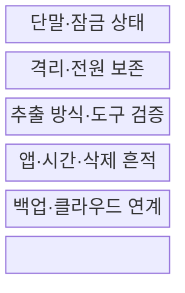
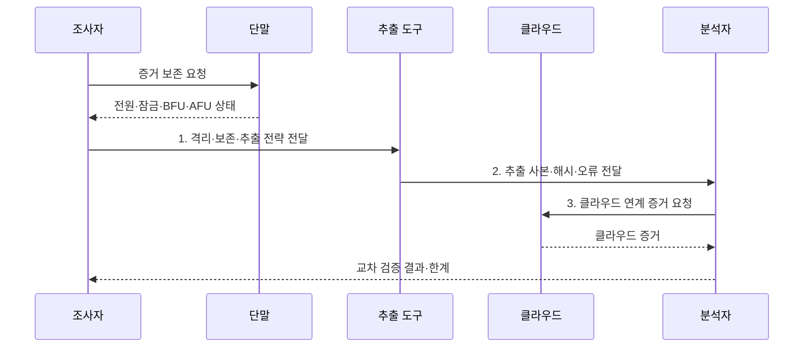

---
sidebar:
  order: 115
  label: "115. 모바일 포렌식 (Mobile Forensics)"
  badge:
    text: "기출 · 70%"
    variant: note
title: "모바일 포렌식 (Mobile Forensics)"
date: "2026-07-31T02:10:49+09:00"
tags:
  - "notes-security"
weight: 115
extra:
  question_no: "115"
  source_status: "기출"
  source_history: "137회"
  priority: 70
  priority_note: "137회 기출이며 암호화 단말 증거수집 난도가 높음"
---

## 미리 알고가기

- **모바일 포렌식(Mobile Forensics)**: 모바일 기기·앱·백업·클라우드에서 디지털 증거를 적법하게 획득·분석하는 절차이다.
- **최초 잠금 해제 전(Before First Unlock, BFU)**: 기기를 켠 뒤 처음 잠금을 풀기 전으로, 암호화 키 접근과 데이터 추출이 제한된 상태이다.
- **최초 잠금 해제 후(After First Unlock, AFU)**: 처음 잠금을 푼 뒤 일부 암호화 키가 메모리에 남아 더 많은 데이터에 접근할 수 있는 상태이다.
- **응용 프로그래밍 인터페이스(Application Programming Interface, API)**: 운영체제가 허용한 방식으로 애플리케이션 데이터와 기능에 접근하는 호출 경계이다.
- **데이터베이스(Database, DB)**: 애플리케이션이 메시지·계정·설정 같은 구조화 데이터를 저장·조회하는 공간이다.
- **논리 추출(Logical Acquisition)**: 운영체제 API·백업 기능이 허용하는 데이터를 수집하는 방식이다.
- **파일시스템 추출(File System Acquisition)**: 디렉터리와 앱 데이터베이스를 포함한 파일 체계를 수집하는 방식이다.
- **물리 추출(Physical Acquisition)**: 저장장치 비트열을 낮은 수준에서 복제하는 방식이다.
- **NIST SP 800-101 Rev.1**: 모바일 증거의 검증·보존·획득·검사·분석·보고 지침이다.
- **NIST CFTT(Computer Forensics Tool Testing)**: 포렌식 도구의 기능·정확성을 규격과 시험결과로 검증하는 프로그램이다.

## Ⅰ. 개요

- 정의/개념: 모바일·앱·클라우드 증거의 **적법한 획득·분석**
- 배경/필요성: 디스크 복제만으로는 암호화 키·클라우드·원격 삭제의 **증거 보존 곤란**

### 쉽게 이해하기 (학습용)

- 전원과 잠금 상태를 바꾸면 열 수 있는 자료도 달라지므로 처음 상태부터 기록한다.

## Ⅱ. 특징

- BFU·AFU별 **암호화 키 접근 차이**
- 격리·전원 유지 간 **상태 보존 상충**
- 단말·백업·클라우드의 **교차 검증**

### 쉽게 이해하기 (학습용)

- 같은 기기도 잠금이 처음 풀렸는지와 운영체제 상태에 따라 꺼낼 수 있는 자료가 달라진다.

## Ⅲ. 구조 및 구성요소

| 구성요소 | 책임 |
|:---|:---|
| 단말·잠금 상태 | **화면·전원·BFU·AFU** 기록 |
| 격리·전원 보존 | **원격 변경·키 소실 위험** 비교 |
| 추출 방식·도구 검증 | **획득 범위·해시·오류** 기록 |
| 앱·시간·삭제 흔적 | **DB·타임스탬프 관계** 해석 |
| 백업·클라우드 연계 | 별도 권한 기반 **교차 확인** |

### 쉽게 이해하기 (학습용)

- 로컬 데이터와 클라우드 흔적을 별도 권한으로 확보하여 교차 확인

## Ⅳ. 흐름도

**동작 원리**

- **1. 격리·보존·추출 전략 전달**: 원격 명령·키·배터리 위험 기반 지시
- **2. 추출 사본·해시·오류 전달**: 논리·파일·물리 획득 결과 제공
- **3. 클라우드 연계 증거 요청**: 별도 권한으로 백업·동기화 자료 요구

### 쉽게 이해하기 (학습용)

- 기기 조작은 증거를 변경하므로 이유와 결과를 모두 기록

## Ⅴ. 종류 및 비교

| 모바일 추출 방식 | 논리 추출 | 파일시스템 추출 | 물리 추출 |
|:---|:---|:---|:---|
| 적용 기준 | 신속한 **최소 변경 수집** | **앱 관계·메타데이터** 분석 | **비할당 영역** 확보 |
| 핵심 특징 | **API·백업 허용 데이터** 수집 | **디렉터리·앱 DB 구조** 수집 | 저장 영역의 **비트열 복제** |
| 한계 | **삭제·보호 데이터** 누락 | **권한·암호화**로 파일 누락 | 키 없이는 **내용 판독 불가** |

### 쉽게 이해하기 (학습용)

- 저수준 추출을 수행해도 암호화 키 없으면 내용 판독 불가

## Ⅵ. 실무 고려사항 및 대책

| 고려사항 | 대책 | 효과 |
|:---|:---|:---|
| **모바일 포렌식 절차** | **NIST SP 800-101 Rev.1 적용** | 획득·분석 **일관성** 확보 |
| **디지털 증거 취급** | **ISO/IEC 27037:2012 적용** | 보존·인계 **신뢰성** 확보 |
| **추출 도구 정확성** | **NIST CFTT 시험결과 확인** | **도구 오류·누락** 파악 |

### 쉽게 이해하기 (학습용)

- 켜진 단말은 잠금 상태와 암호키 접근 가능성, 원격 삭제 위험을 함께 평가해 전원·통신 상태를 보존할 초기 조치를 결정한다.

## Ⅶ. 결론

- 최소 변경은 **논리 추출**, 앱 구조는 **파일시스템 추출**, 비할당 영역은 물리 추출

### 쉽게 이해하기 (학습용)

- 초기 상태를 함부로 바꾸지 않아야 증거 접근성을 보존한다.
