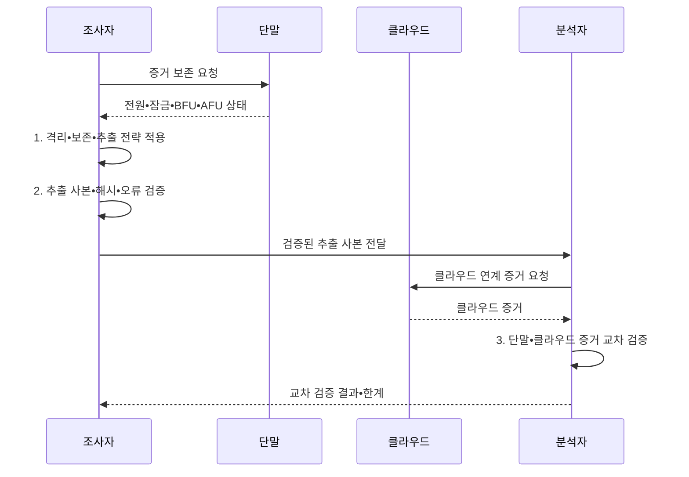

---
sidebar:
  order: 115
  label: "115. 모바일 포렌식 (Mobile Forensics)"
  badge:
    text: "기출 • 70%"
    variant: note
title: "모바일 포렌식 (Mobile Forensics)"
date: "2026-08-05T00:00:00+09:00"
tags:
  - "notes-security"
weight: 115
extra:
  question_no: "115"
  source_status: "기출"
  source_history: "137회"
  priority: 70
  priority_note: "137회 기출이며 암호화 단말 증거수집 난도가 높음"
---

## Ⅰ. 개요

핵심 용어

- **모바일 포렌식**: 모바일 기기•앱•백업•클라우드에서 디지털 증거를 적법하게 획득•분석하는 절차이다.

- 정의/개념: 스마트폰과 앱•가입자 식별 모듈•백업•연계 클라우드의 디지털 증거를 보존하며 획득•분석하는 **모바일 포렌식**
- 배경/필요성: 디스크 복제만으로는 암호화 키•클라우드•원격 삭제의 **증거 보존 곤란**

#### 한줄 요약

- 전원과 잠금 상태를 바꾸면 열 수 있는 자료도 달라지므로 처음 상태부터 기록한다.

## Ⅱ. 특징

핵심 용어

- **BFU(Before First Unlock)**: 부팅 후 한 번도 잠금을 해제하지 않은 상태이다.
- **AFU(After First Unlock)**: 부팅 후 한 번 이상 잠금을 해제한 상태이다.

- BFU•AFU별 **암호화 키 접근 차이**
- 통신 격리로 **원격 삭제 차단**, 전원 유지로 **암호화 키 보존**
- 단말•백업•클라우드의 **교차 검증**

#### 한줄 요약

- 같은 기기도 잠금이 처음 풀렸는지와 운영체제 상태에 따라 꺼낼 수 있는 자료가 달라진다.

## Ⅲ. 구조 및 구성요소

핵심 용어

- **API(Application Programming Interface)**: 운영체제가 허용한 기능과 데이터의 호출 경계이다.
- **DB(Database)**: 앱의 구조화 데이터를 저장하는 저장소이다.
- **도구 검증**: 사용한 도구의 기능•정확성과 결과 재현성을 사전에 확인하는 절차이다.

| 구성요소 | 책임 |
|:---|:---|
| 단말•잠금 상태 | **화면•전원•BFU•AFU** 기록 |
| 격리•전원 보존 | **원격 변경•키 소실 위험** 비교 |
| 추출 방식•도구 검증 | **획득 범위•해시•오류** 기록 |
| 앱•시간•삭제 흔적 | **DB•타임스탬프 관계** 해석 |
| 백업•클라우드 연계 | 별도 권한 기반 **교차 확인** |

#### 한줄 요약

- 로컬 데이터와 클라우드 흔적을 별도 권한으로 확보하여 교차 확인

## Ⅳ. 흐름도

핵심 용어

- **획득 전략**: 기기 상태•잠금•암호화•법적 범위에 따라 추출 순서와 방법을 정하는 계획이다.

**동작 원리**

- **1. 격리•보존•추출 전략 적용**: 원격 명령•키•배터리 위험을 고려해 획득 절차 실행
- **2. 추출 사본•해시•오류 검증**: 논리•파일•물리 획득 결과 검증
- **3. 단말•클라우드 증거 교차 검증**: 별도 권한의 자료와 단말 증거 대조

#### 한줄 요약

- 기기 조작은 증거를 변경하므로 이유와 결과를 모두 기록

## Ⅴ. 종류 및 비교

핵심 용어

- **논리 추출**: API나 백업이 허용한 데이터를 수집하는 방식이다.
- **파일시스템 추출**: 파일 계층과 앱 DB 구조를 수집하는 방식이다.
- **물리 추출**: 저장 영역의 비트열을 복제하는 방식이다.

| 모바일 추출 방식 | 논리 추출 | 파일시스템 추출 | 물리 추출 |
|:---|:---|:---|:---|
| 적용 기준 | 신속한 **최소 변경 수집** | **앱 관계•메타데이터** 분석 | **비할당 영역** 확보 |
| 핵심 특징 | **API•백업 허용 데이터** 수집 | **디렉터리•앱 DB 구조** 수집 | 저장 영역의 **비트열 복제** |
| 한계 | **삭제•보호 데이터** 누락 | **권한•암호화** 로 파일 누락 | 키 없이는 **내용 판독 불가** |

#### 한줄 요약

- 저수준 추출을 수행해도 암호화 키 없으면 내용 판독 불가

## Ⅵ. 실무 고려사항 및 대책

핵심 용어

- **NIST(National Institute of Standards and Technology)**: 미국 국립표준기술연구소이다.
- **SP(Special Publication)**: NIST가 발행하는 특별간행물이다.
- **NIST SP 800-101**: 모바일 증거의 획득•분석•보고 지침이다.
- **CFTT(Computer Forensics Tool Testing)**: 포렌식 도구의 기능과 정확성을 검증하는 NIST 프로그램이다.
- **ISO(International Organization for Standardization)**: 국제표준화기구이다.
- **IEC(International Electrotechnical Commission)**: 국제전기기술위원회이다.
- **ISO/IEC 27037**: 디지털 증거의 식별•수집•획득•보존 표준이다.

| 문제 | 대책 | 효과 |
|:---|:---|:---|
| **모바일 포렌식 절차** | **NIST SP 800-101 Rev.1 적용** | 획득•분석 **일관성** 확보 |
| **디지털 증거 취급** | **ISO/IEC 27037:2012 적용** | 보존•인계 **신뢰성** 확보 |
| **추출 도구 정확성** | **NIST CFTT 시험결과 확인** | **도구 오류•누락** 파악 |

#### 한줄 요약

- 켜진 단말은 잠금 상태와 암호키 접근 가능성, 원격 삭제 위험을 함께 평가해 전원•통신 상태를 보존할 초기 조치를 결정한다.

## Ⅶ. 결론

핵심 용어

- **초기 상태 보존**: 격리•전원•잠금 상태를 기록하고 불필요한 상태 변화를 막는 원칙이다.

- 최소 변경은 **논리 추출**, 앱 구조는 **파일시스템 추출**, 비할당 영역은 **물리 추출**

#### 한줄 요약

- 초기 상태를 함부로 바꾸지 않아야 증거 접근성을 보존한다.
