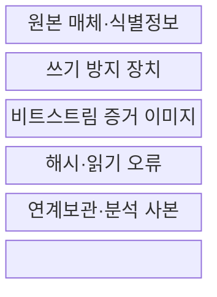
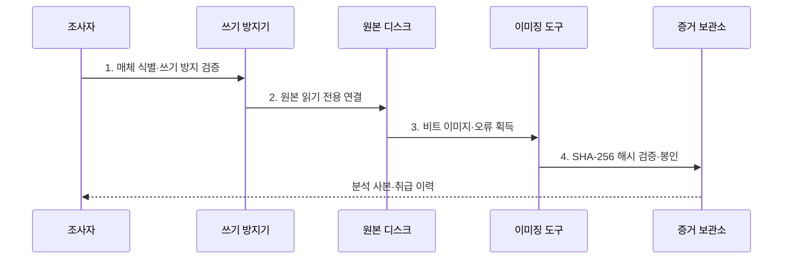

---
sidebar:
  order: 116
  label: "116. 디스크 이미징·해시 무결성 (Disk Imaging Hash Integrity)"
  badge:
    text: "기출 · 50%"
    variant: note
title: "디스크 이미징·해시 무결성 (Disk Imaging Hash Integrity)"
date: "2026-07-31T11:22:43+09:00"
tags:
  - "notes-security"
weight: 116
extra:
  question_no: "116"
  source_status: "기출"
  source_history: "129회"
  priority: 50
  priority_note: "129회 기출이며 포렌식 무결성의 핵심 절차임"
---

## 미리 알고가기

- **디스크 이미징(Disk Imaging)**: 매체의 주소 가능한 전체 영역을 비트 단위로 복제하는 절차이다.
- **보안 해시 알고리즘 256(Secure Hash Algorithm 256, SHA-256)**: 입력 데이터에서 256비트 해시값을 생성하여 원본과 사본의 동일성과 무결성을 검증하는 알고리즘이다.
- **솔리드 스테이트 드라이브(Solid-State Drive, SSD)**: 플래시 메모리 기반 저장장치이다.
- **트림 명령(TRIM Command)**: 운영체제가 SSD에 삭제 블록의 해제를 알리는 명령이다.
- **쓰기 방지(Write Blocking)**: 분석 장비에서 원본 매체로 향하는 쓰기 명령을 차단하는 통제이다.
- **비할당 영역(Unallocated Space)**: 파일에 배정되지 않아 삭제 데이터 조각이 남을 수 있는 공간이다.
- **FIPS PUB 180-4**: SHA-224·SHA-256·SHA-384·SHA-512 등 보안 해시 알고리즘을 규정한 NIST 표준이다.

## Ⅰ. 개요

- 정의/개념: 매체의 **비트 단위 복제·해시 동일성 검증**
- 배경/필요성: 파일 단위 복사로는 비할당 영역과 **원본 무변경 입증 불가**

### 쉽게 이해하기 (학습용)

- 파일만 복사하지 않고 디스크 전체를 복제해 삭제 흔적까지 남김

## Ⅱ. 특징

- 주소 가능한 전체 영역의 **비트스트림 획득**
- 쓰기 방지·해시의 **원본·사본 무결성**
- 오류·도구·인계 기록의 **재현성·출처성**

### 쉽게 이해하기 (학습용)

- 해시가 같다는 사실은 두 데이터가 같다는 뜻이지 그 데이터의 주인이 누구인지는 말하지 않음

## Ⅲ. 구조 및 구성요소

| 구성요소 | 책임 |
|:---|:---|
| 원본 매체·식별정보 | **종류·일련번호·연결 방식** 기록 |
| 쓰기 방지 장치 | 원본 **쓰기 명령 차단·시험** |
| 비트스트림 증거 이미지 | **전체 영역·메타데이터** 복제 |
| 해시·읽기 오류 | **동일성·누락 범위** 기록 |
| 연계보관·분석 사본 | **접근·복사·보관 이력** 추적 |

### 쉽게 이해하기 (학습용)

- 원본은 보호하고 복제본으로 분석함

## Ⅳ. 흐름도

**동작 원리**

- **1. 매체 식별·쓰기 방지 검증**: 일련번호·차단 기능 확인
- **2. 원본 읽기 전용 연결**: 원본 상태 변경 방지
- **3. 비트 이미지·오류 획득**: 전체 영역·읽기 실패 기록
- **4. SHA-256 해시 검증·봉인**: 이미지 동일성·원본 보존

### 쉽게 이해하기 (학습용)

- 읽지 못한 영역이 있으면 숨기지 말고 위치와 재시도 결과를 보고서에 남겨야 함

## Ⅴ. 종류 및 비교

| 포렌식 획득 방식 | 논리 획득 | 물리 이미징 |
|:---|:---|:---|
| 적용 기준 | **범위 제한 수집** | **전체 영역 보존** |
| 핵심 특징 | **선택 파일·디렉터리** 수집 | 주소 가능한 **매체 전체 복제** |
| 한계 | **메타데이터·삭제 흔적** 누락 | **시간·용량·암호화 한계** |

### 쉽게 이해하기 (학습용)

- 필요한 파일만 빠르게 얻는 방식과 디스크 전체 흔적을 보존하는 방식의 목적이 다름

## Ⅵ. 실무 고려사항 및 대책

| 고려사항 | 대책 | 효과 |
|:---|:---|:---|
| **증거 획득·보존** | **ISO/IEC 27037:2012 적용** | 원본·사본 **신뢰성** 확보 |
| **해시 알고리즘** | **FIPS PUB 180-4 SHA-256 적용** | 이미지 **동일성** 검증 |
| **이미징 도구 품질** | **NIST CFTT 시험결과 확인** | **도구 오류·누락** 파악 |
| **SSD 삭제 흔적 소실** | **TRIM·전원 상태 기록** | 비할당 영역 **변경 해석** 지원 |

### 쉽게 이해하기 (학습용)

- 하드웨어 쓰기 방지기를 사용해 원본을 비트 단위로 복제하고 획득 전후 해시와 도구·명령·오류를 기록해 사본의 동일성을 입증한다.

## Ⅶ. 결론

- 범위 파일은 **논리 획득**, 삭제·비할당 영역은 **물리 이미징**, SSD는 TRIM 상태 기록

### 쉽게 이해하기 (학습용)

- 복제 기술보다 원본을 바꾸지 않았고 사본이 같다는 사실을 계속 입증하는 절차가 중요함
