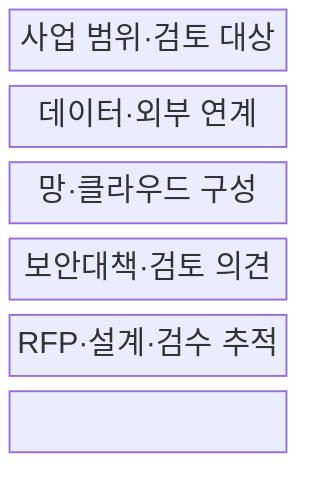
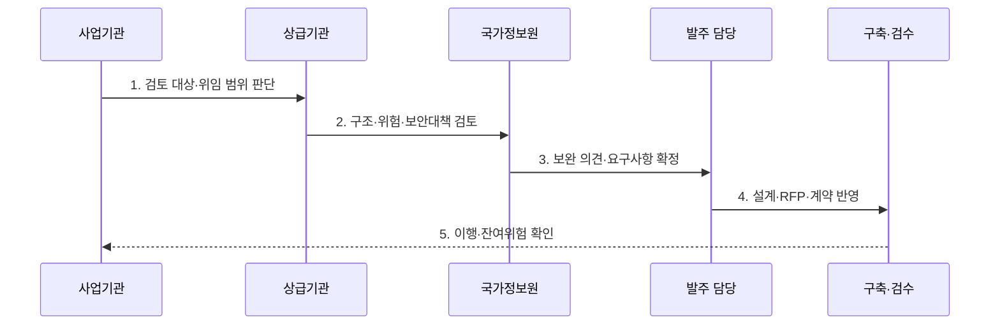

---
sidebar:
  order: 117
  label: "117. 국가정보원 보안성 검토 (NIS Security Review)"
  badge:
    text: "기출 · 50%"
    variant: note
title: "국가정보원 보안성 검토 (NIS Security Review)"
date: "2026-07-30T19:00:00+09:00"
tags:
  - "notes-security"
weight: 117
extra:
  question_no: "117"
  source_status: "기출"
  source_history: "131회"
  priority: 50
  priority_note: "131회 기출이며 공공 정보화 사전 보안검토에 유용함"
---

## 미리 알고가기

- **국가정보원(National Intelligence Service, NIS)**: 국가 정보보안 지침을 수립하고 위임된 정보화사업의 보안 적합성을 검토하는 기관이다.
- **제안요청서(Request for Proposal, RFP)**: 발주할 사업의 기능·보안 요구사항과 평가·검증 기준을 명시한 문서이다.
- **인공지능(Artificial Intelligence, AI)**: 정보화사업에서 데이터를 학습하여 자동화된 판단·분석을 수행하는 기술이다.
- **보안성 검토(Security Review)**: 국가·공공기관 정보화사업의 계획 단계에서 보안대책 적절성을 확인하는 사전 절차이다.
- **보안적합성 검증(Security Conformance Verification)**: 도입 정보보호제품의 안전성과 실제 구성 적합성을 확인하는 절차이다.
- **전자정부법 제56조**: 정보통신망·행정정보의 보안대책 수립과 국가정보원 안전성 확인의 법률 근거이다.
- **전자정부법 시행령 제69조**: 전자문서 보관·유통 보안조치와 사전 보안성 검토 요청을 규정한다.
- **국가 사이버보안 기본지침(2026.5.1.)**: 국가·공공기관의 보안성 검토 대상·절차·위임 기준을 정한 국정원 지침이다.

## Ⅰ. 개요

- 정의/개념: 공공 정보화사업의 **계획 단계 보안대책 검토**
- 배경/필요성: 설계·RFP·계약의 **보안 요구 누락 방지**

### 쉽게 이해하기 (학습용)

- 시스템 설계 전에 발주 단계에서 보안 요구를 확인함

## Ⅱ. 특징

- 사업 공고 전 **설계·보안대책 사전 검토**
- 데이터·망·인증·암호의 **위험 기반 검토**
- 검토 의견의 **RFP·설계·검수 추적**

### 쉽게 이해하기 (학습용)

- 기관이 자체 검토할지 상급기관이나 국가정보원에 의뢰할지는 사업 유형과 위임 기준에 따름

## Ⅲ. 구조 및 구성요소

| 구성요소 | 책임 |
|:---|:---|
| 사업 범위·검토 대상 | 목적·정보·기술·위임 기준 |
| 데이터·외부 연계 | 저장·처리·전송 경로 분석 |
| 망·클라우드 구성 | 보안영역·접점·접근 경로 |
| 보안대책·검토 의견 | 인증·암호·로그·공급망 보완 |
| RFP·설계·검수 추적 | 요구사항·구축 결과 연결 |

### 쉽게 이해하기 (학습용)

- 사업 구조와 정보 흐름을 보여 주고 받은 보완 의견을 발주·설계·검수까지 추적함

## Ⅳ. 흐름도

**동작 원리**

- **1. 검토 대상·위임 범위 판단**: 사업 유형·변경·경계 확인
- **2. 구조·위험·보안대책 검토**: 흐름·망·자산·통제 공백 분석
- **3. 보완 의견·요구사항 확정**: 위험·법률별 보완사항 결정
- **4. 설계·RFP·계약 반영**: 요구와 검수 기준 추적 연결
- **5. 이행·잔여위험 확인**: 구축 결과·미해결 사항 승인

### 쉽게 이해하기 (학습용)

- 검토 의견을 받은 것으로 끝내지 않고 구축 결과가 의견대로 구현됐는지 확인해야 함

## Ⅴ. 종류 및 비교

| 공공 보안 절차 | 보안성 검토 | 보안적합성 검증 |
|:---|:---|:---|
| 적용 기준 | 공고 전 설계·RFP에 보안을 반영할 때 | 제품 적용·운용 전에 구성을 확인할 때 |
| 핵심 특징 | 사업 구조와 보안대책 사전 검토 | 도입 제품·버전·구성의 적합성 검증 |
| 한계 | 검토 의견이 계약·구축에 미반영 | 인증 제품의 설치 설정·버전 불일치 |

### 쉽게 이해하기 (학습용)

- 보안성 검토는 사업 설계, 보안적합성 검증은 실제 도입 제품의 안전성을 확인함

## Ⅵ. 실무 고려사항 및 대책

| 고려사항 | 대책 | 효과 |
|:---|:---|:---|
| 법률상 보안대책 | **전자정부법 제56조 적용** | 안전성 확인 근거 |
| 사전 검토 요청 | **시행령 제69조 준수** | 발주 전 위험 보완 |
| 대상·위임 절차 | **국가 사이버보안 기본지침 적용** | 검토 경로 명확화 |

### 쉽게 이해하기 (학습용)

- 여러 계약으로 나뉜 사업도 전체 시스템·데이터·외부 연계 구조를 기준으로 보안 요구를 검토하고 필요한 통제를 제안요청서와 검수 기준에 반영한다.

## Ⅶ. 결론

- **사업 범위·연계 구조·중요 변경**으로 검토 대상을 결정한다.

### 쉽게 이해하기 (학습용)

- 발주 전에 위험을 찾아 계약에 넣어야 납품 뒤 보안 기능을 추가하는 비용과 공백을 줄일 수 있음
