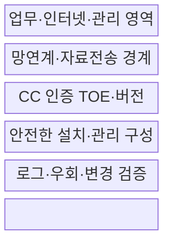
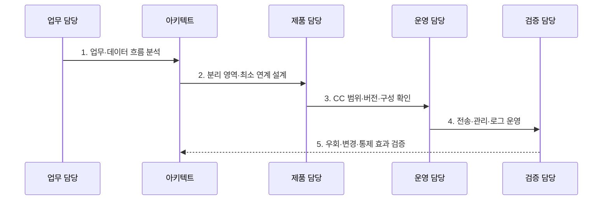

---
sidebar:
  order: 118
  label: "118. 망분리 — CC 인증·보안적합성 (Network Separation CC)"
  badge:
    text: "기출 · 50%"
    variant: note
title: "망분리 — CC 인증·보안적합성 (Network Separation CC)"
date: "2026-07-30T19:00:00+09:00"
tags:
  - "notes-security"
weight: 118
extra:
  question_no: "118"
  source_status: "기출"
  source_history: "125회"
  priority: 50
  priority_note: "125회 기출이며 공공 망분리 정책 비교에 보존함"
---

## 미리 알고가기

- **정보기술 보안성 평가 공통기준(Common Criteria, CC)**: 정보보호제품의 보안기능과 보증수준을 독립적으로 평가·인증하는 공통기준이다.
- **망분리(Network Separation)**: 업무망·인터넷망 등 보안영역을 격리하고 연계 경로를 통제하는 구조이다.
- **가상 데스크톱 인프라(Virtual Desktop Infrastructure, VDI)**: 중앙 가상화 환경에서 업무 실행영역을 논리적으로 분리하는 기술이다.
- **평가대상(Target of Evaluation, TOE)**: CC 평가에서 제품·구성 중 보안성 평가 범위로 정의한 대상이다.
- **보호프로파일(Protection Profile, PP)**: 특정 제품군의 공통 보안문제·목표·요구사항을 정의한 문서이다.
- **ISO/IEC 15408:2022**: CC 보안기능·보증 평가기준을 5개 부로 규정한 국제표준이다.
- **ISO/IEC 18045:2026**: ISO/IEC 15408 평가자의 요구사항과 최소 평가행동을 규정한 방법론이다.

## Ⅰ. 개요

- 정의/개념: 보안영역 격리와 **최소 연계로 침해 확산 제한**
- 배경/필요성: 외부 위협의 **업무망 진입·횡적 이동 차단**

### 쉽게 이해하기 (학습용)

- 망을 나눠도 통로와 제품 설정이 약하면 공격이 가능함

## Ⅱ. 특징

- 영역 격리로 **공격 이동·피해 범위 제한**
- 망연계·관리 경로의 **집중 통제·감사**
- CC 평가와 **보안적합성 검증의 분리**

### 쉽게 이해하기 (학습용)

- 인증 제품도 평가 범위 밖 기능이나 잘못된 설치 설정까지 자동으로 안전해지지는 않음

## Ⅲ. 구조 및 구성요소

| 구성요소 | 책임 |
|:---|:---|
| 업무·인터넷·관리 영역 | 보안등급·업무별 경계 분리 |
| 망연계·자료전송 경계 | 승인·검사·무해화·최소 허용 |
| CC 인증 TOE·버전 | 인증서·평가범위·형상 확인 |
| 안전한 설치·관리 구성 | 계정·패치·관리 경로 통제 |
| 로그·우회·변경 검증 | 전송·예외·정책 효과 점검 |

### 쉽게 이해하기 (학습용)

- 영역 사이에 필요한 통신만 허용하고 모든 예외 전송과 관리 작업을 기록하는 구조임

## Ⅳ. 흐름도

**동작 원리**

- **1. 업무·데이터 흐름 분석**: 서비스·관리·외부 연결 파악
- **2. 분리 영역·최소 연계 설계**: 허용 정보·방향·검사 결정
- **3. CC 범위·버전·구성 확인**: TOE·인증서·형상 대조
- **4. 전송·관리·로그 운영**: 승인·무해화·감사 기록
- **5. 우회·변경·통제 효과 검증**: 예외·패치·공유 기능 점검

### 쉽게 이해하기 (학습용)

- 먼저 필요한 정보 흐름을 그려야 업무를 막지 않으면서 위험한 통로만 통제할 수 있음

## Ⅴ. 종류 및 비교

| 망분리 방식 | 물리적 망분리 | 논리적 망분리 |
|:---|:---|:---|
| 적용 기준 | 강한 격리와 명확한 경계가 필요할 때 | 유연한 전환·중앙 관리가 필요할 때 |
| 핵심 특징 | 장비·회선 등 물리 경로 분리 | VDI 등으로 실행 영역을 논리 분리 |
| 한계 | 이동식 매체·망연계가 우회 경로가 됨 | 가상화 오류·공유 기능으로 경계가 약화됨 |

### 쉽게 이해하기 (학습용)

- 물리 방식은 경로가 분명하고 논리 방식은 유연하지만 둘 다 연계와 관리 통제가 필요함

## Ⅵ. 실무 고려사항 및 대책

| 고려사항 | 대책 | 효과 |
|:---|:---|:---|
| 제품 보안성 평가 | **ISO/IEC 15408:2022 확인** | TOE 보증범위 파악 |
| 평가 방법론 | **ISO/IEC 18045:2026 적용** | 평가 일관성 확보 |
| 공공기관 도입 | **보안적합성 검증 별도 수행** | 설치·운용 안전성 확인 |

### 쉽게 이해하기 (학습용)

- 외부망 파일은 반입 목적과 사용자를 승인하고 악성코드 검사와 무해화를 통과한 자료만 내부망으로 중계하며 전 과정을 감사한다.

## Ⅶ. 결론

- **연계 방식·관리 경로·TOE 범위**로 망분리 통제를 결정한다.

### 쉽게 이해하기 (학습용)

- 벽의 개수보다 벽에 난 문을 누가 어떻게 사용하고 기록하는지가 실제 보안을 결정함
