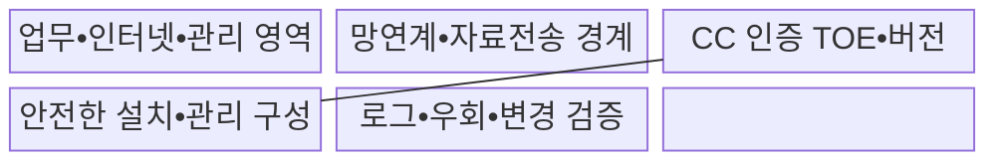
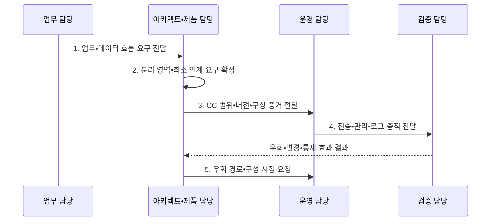

---
sidebar:
  order: 118
  label: "118. 망분리 — CC 인증•보안적합성 (Network Separation CC)"
  badge:
    text: "기출 • 50%"
    variant: note
title: "망분리 — CC 인증•보안적합성 (Network Separation CC)"
date: "2026-08-04T16:09:00+09:00"
tags:
  - "notes-security"
weight: 118
extra:
  question_no: "118"
  source_status: "기출"
  source_history: "125회"
  priority: 50
  priority_note: "125회 기출이며 공공 망분리 정책 비교에 보존함"
---

## Ⅰ. 개요

핵심 용어

- **망분리**: 업무망•인터넷망 등 보안영역을 격리하고 연계 경로를 통제하는 구조이다.

- 정의/개념: 보안영역을 격리하고 필요한 연계와 보안제품 기능을 검증하는 **망분리•공통평가기준 인증**
- 배경/필요성: 평면망•무검사 연계로는 외부 침해의 **업무망 진입•횡적 이동 제한 불가**

#### 한줄 요약

- 망을 나눠도 통로와 제품 설정이 약하면 공격이 가능함

## Ⅱ. 특징

핵심 용어

- **최소 연계**: 분리된 영역 사이에 필요한 경로만 허용하고 데이터 흐름을 검사하는 원칙이다.
- **CC(Common Criteria)**: 정보보호제품의 보안기능과 보증수준을 평가•인증하는 공통평가기준이다.

- 영역 격리로 **공격 이동•피해 범위 제한**
- 망연계•관리 경로의 **집중 통제•감사**
- CC 평가와 **보안적합성 검증의 분리**

#### 한줄 요약

- 인증 제품도 평가 범위 밖 기능이나 잘못된 설치 설정까지 자동으로 안전해지지는 않음

## Ⅲ. 구조 및 구성요소

핵심 용어

- **TOE(Target of Evaluation)**: CC에서 보안성 평가 범위로 정의한 대상이다.
- **PP(Protection Profile)**: 제품군의 공통 보안문제•목표•요구사항을 정의한 문서이다.

| 구성요소 | 책임 |
|:---|:---|
| 업무•인터넷•관리 영역 | **보안등급•업무별 경계** 분리 |
| 망연계•자료전송 경계 | **승인•검사•무해화•최소 허용** |
| CC 인증 TOE•버전 | **인증서•평가범위** 와 PP•형상 확인 |
| 안전한 설치•관리 구성 | **계정•패치•관리 경로** 통제 |
| 로그•우회•변경 검증 | **전송•예외•정책 효과** 점검 |

#### 한줄 요약

- 영역 사이에 필요한 통신만 허용하고 모든 예외 전송과 관리 작업을 기록하는 구조임

## Ⅳ. 흐름도

핵심 용어

- **보안영역 간 흐름**: 망 경계의 승인된 연계 지점에서만 검사•통제되는 데이터 이동이다.
- **CC 평가 범위**: TOE•PP•인증 버전•형상으로 한정된 제품 보증 경계이다.

**동작 원리**

- **1. 업무•데이터 흐름 요구 전달**: 서비스•관리•외부 연결 정보 제공
- **2. 분리 영역•최소 연계 요구 확정**: 허용 정보•방향•검사 기준 결정
- **3. CC 범위•버전•구성 증거 전달**: TOE•인증서•PP•형상 정보 제공
- **4. 전송•관리•로그 증적 전달**: 승인•무해화•감사 기록 제공
- **5. 우회 경로•구성 시정 요청**: 예외•패치•공유 기능 보완 지시

#### 한줄 요약

- 먼저 필요한 정보 흐름을 그려야 업무를 막지 않으면서 위험한 통로만 통제할 수 있음

## Ⅴ. 종류 및 비교

핵심 용어

- **물리적 망분리**: 별도 장비•회선으로 보안영역을 격리하는 방식이다.
- **논리적 망분리**: 가상화로 실행영역을 분리하는 방식이다.
- **VDI(Virtual Desktop Infrastructure)**: 중앙 서버에서 가상 데스크톱을 제공하는 인프라이다.

| 망분리 방식 | 물리적 망분리 | 논리적 망분리 |
|:---|:---|:---|
| 적용 기준 | **강한 격리•명확한 경계** | **유연한 전환•중앙 관리** |
| 핵심 특징 | **장비•회선 물리 경로** 분리 | **VDI 실행 영역** 논리 분리 |
| 한계 | **이동식 매체•망연계 우회** | **가상화 오류•공유 기능** 경계 약화 |

#### 한줄 요약

- 물리 방식은 경로가 분명하고 논리 방식은 유연하지만 둘 다 연계와 관리 통제가 필요함

## Ⅵ. 실무 고려사항 및 대책

핵심 용어

- **ISO(International Organization for Standardization)**: 국제표준화기구이다.
- **IEC(International Electrotechnical Commission)**: 국제전기기술위원회이다.
- **ISO/IEC 15408**: CC의 보안기능•보증 평가기준을 규정한 표준이다.
- **ISO/IEC 18045**: CC의 평가 방법론을 규정한 표준이다.

| 문제 | 대책 | 효과 |
|:---|:---|:---|
| **제품 보안성 평가** | **ISO/IEC 15408:2022 확인** | **TOE 보증범위** 파악 |
| **평가 방법론** | **ISO/IEC 18045:2026 적용** | 평가 **일관성** 확보 |
| **공공기관 도입** | **보안적합성 검증 별도 수행** | 설치•운용 **안전성** 확인 |

#### 한줄 요약

- 외부망 파일은 반입 목적과 사용자를 승인하고 악성코드 검사와 무해화를 통과한 자료만 내부망으로 중계하며 전 과정을 감사한다.

## Ⅶ. 결론

핵심 용어

- **통제 지점 중심 설계**: 분리 방식의 수보다 실제 연계 경로와 우회 가능성을 관리하는 원칙이다.

- 강한 경계는 **물리적 망분리**, 유연한 전환은 **논리적 망분리**, 모두 최소 연계 검증

#### 한줄 요약

- 벽의 개수보다 벽에 난 문을 누가 어떻게 사용하고 기록하는지가 실제 보안을 결정함
