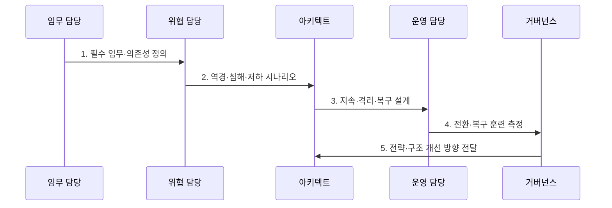

---
sidebar:
  order: 119
  label: "119. 사이버 레질리언스 (Cyber Resilience)"
  badge:
    text: "기출 · 70%"
    variant: note
title: "사이버 레질리언스 (Cyber Resilience)"
date: "2026-07-31T02:12:52+09:00"
tags:
  - "notes-security"
weight: 119
extra:
  question_no: "119"
  source_status: "기출"
  source_history: "137회"
  priority: 70
  priority_note: "137회 기출이며 예방·대응·복구 통합 설계성이 큼"
---

## Ⅰ. 개요

핵심 용어

- **사이버 회복탄력성**: 역경·공격·침해를 예상하고 견디며 복구하고 적응하는 시스템 능력이다.

- 정의/개념: **사이버 복원력**은 사이버 공격과 장애를 예상·견디고 필수 임무를 허용 수준으로 유지·복구한 뒤 학습해 적응하는 조직·시스템 능력
- 배경/필요성: 예방 통제만으로는 침해 성공 후 **필수 임무·허용 성능 유지 불가**

### 쉽게 이해하기 (학습용)

- 공격 중에도 핵심 기능과 성능을 유지하는 능력임

## Ⅱ. 특징

핵심 용어

- **안전한 저하**: 비필수 기능을 줄이면서 핵심 기능을 허용 수준으로 유지하는 방식이다.
- **폭발 반경**: 한 번의 침해·실패가 영향을 미치는 시스템·업무 범위이다.

- 필수 임무·허용 성능의 **우선 정의**
- 격리·다양성·중복의 **폭발 반경 제한**
- 훈련·복구 경험의 **적응적 개선**

### 쉽게 이해하기 (학습용)

- 전체 기능이 멈추는 대신 꼭 필요한 기능만 안전하게 남기는 설계도 레질리언스임

## Ⅲ. 구조 및 구성요소

핵심 용어

- **RTO·RPO**: 업무 복구 목표 시간과 허용 가능한 데이터 손실의 기준 시점이다.

| 구성요소 | 책임 |
|:---|:---|
| 필수 임무·의존성 | **유지 기능·자원·허용 수준** |
| 격리·다양성·안전한 저하 | **피해 범위·단일 실패** 제한 |
| 신뢰 복구 기반 | **격리 백업·대체 환경** 보호 |
| 관측·지휘·소통 | **상태·전환·책임** 통합 |
| 훈련·측정·적응 | **지속·복구·학습 능력** 검증 |

### 쉽게 이해하기 (학습용)

- 공격 전 준비부터 공격 중 버티기, 복구와 재설계까지 하나의 생명주기로 관리함

## Ⅳ. 흐름도

핵심 용어

- **생명주기 회복탄력성**: 설계·구축·운영·사고·복구·개선 전 과정에 회복 능력을 반영하는 접근이다.

**동작 원리**

- **1. 필수 임무·의존성 정의**: 기능·자원·허용 수준 식별
- **2. 역경·침해·저하 시나리오**: 공격·실패·성능 저하 정의
- **3. 지속·격리·복구 설계**: 중복·분할·신뢰 복구 결정
- **4. 전환·복구 훈련 측정**: RTO·RPO·임무 수준 측정
- **5. 전략·구조 개선 방향 전달**: 교훈·위협 변화 기반 설계 보완 지시

### 쉽게 이해하기 (학습용)

- 서버 수를 늘리기 전에 어떤 기능을 어느 수준으로 남겨야 하는지 정해야 함

## Ⅴ. 종류 및 비교

핵심 용어

- **보안과 회복탄력성**: 보안은 침해 예방·탐지에, 회복탄력성은 침해 후 임무 지속·복구·적응까지 초점을 둔다.

| 사이버 위험 대응 | 사이버보안 | 사이버 회복탄력성 |
|:---|:---|:---|
| 적용 기준 | **예방·탐지·대응 통제** 설계 | 침해 가정의 **지속·복구 능력** 확보 |
| 핵심 특징 | **침해 가능성·직접 피해** 저감 | 침해 중 **필수 임무 유지·복구** |
| 한계 | 예방 실패 시 **임무 전체 중단** | 대체 구조의 **신규 취약점** 발생 |

### 쉽게 이해하기 (학습용)

- 보안은 공격 성공 가능성을 낮추고 레질리언스는 성공한 공격의 임무 영향을 제한함

## Ⅵ. 실무 고려사항 및 대책

핵심 용어

- **NIST SP 800-160 Vol.2 Rev.1**: 생명주기 시스템 보안공학으로 사이버 회복탄력성을 설계하는 지침이다.
- **ISO 22301**: 업무연속성 관리체계의 요구사항을 규정한 국제표준이다.

| 문제 | 대책 | 효과 |
|:---|:---|:---|
| **회복탄력성 공학** | **NIST 800-160 V2R1 적용** | **예상·견딤·복구·적응** |
| **업무연속성 관리** | **ISO 22301:2019 연계** | **임무·복구 목표** 정렬 |
| **사이버 위험 생명주기** | **NIST CSF 2.0 연계** | **보호·대응·복구** 통합 |

### 쉽게 이해하기 (학습용)

- 백업을 운영 계정과 네트워크에서 격리하고 랜섬웨어 흔적이 없는 복구 지점에서 핵심 서비스를 목표 시간 안에 재가동할 수 있는지 반복 시험한다.

## Ⅶ. 결론

핵심 용어

- **임무 지속 입증**: 공격 중 유지할 기능과 복구할 기능을 시험·지표로 검증하는 활동이다.

- 침해 가능성 저감은 **사이버보안**, 침해 중 임무 지속·복구는 **사이버 회복탄력성** 적용

### 쉽게 이해하기 (학습용)

- 뚫리지 않겠다는 약속보다 뚫렸을 때 무엇을 지키고 어떻게 회복할지 증명하는 능력임
